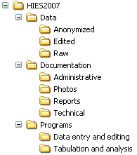
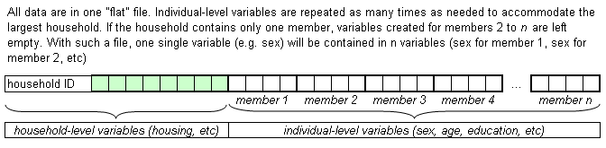
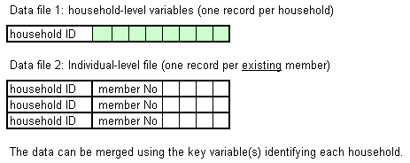
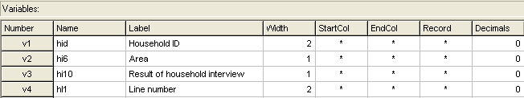
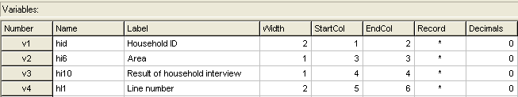
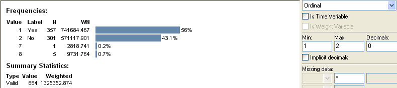
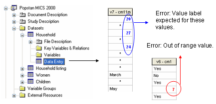
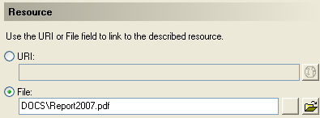
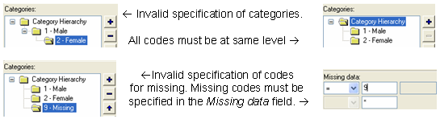
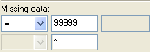

.. image:: media/image1.png

**International Household Survey Network**

**IHSN**

Quick Reference Guide for Data Archivists
=========================================

**DRAFT - Version 2007.03**

June 2007
   Olivier Dupriez (World Bank)
    
   and

   Geoffrey Greenwell (PARIS21)
 
Content
=======

`Introduction 1 <#introduction>`__

`1. Gathering and preparing the data set
2 <#gathering-and-preparing-the-data-set>`__

`2. Gathering and preparing the documentation
5 <#gathering-and-preparing-the-documentation>`__

`3. Importing data and establishing relationships
5 <#importing-data-and-establishing-relationships>`__

`4. Importing external resources 8 <#importing-external-resources>`__

`5. Completing metadata 9 <#completing-metadata>`__

`5.1. Good practices for completing the Document Description
10 <#good-practices-for-completing-the-document-description>`__

`5.2. Good practices for completing the Study Description
11 <#good-practices-for-completing-the-study-description>`__

`5.3. Good practices for completing the File Description
23 <#good-practices-for-completing-the-file-description>`__

`5.4. Good practices for completing the Variables Description
24 <#good-practices-for-completing-the-variables-description>`__

`5.5. Good practices for completing the External Resources description
28 <#good-practices-for-completing-the-external-resources-description>`__

`6. Creating variable groups 29 <#creating-variable-groups>`__

`7. Running validations and diagnostics
30 <#running-validations-and-diagnostics>`__

`8. Generating the survey documentation in PDF
31 <#generating-the-survey-documentation-in-pdf>`__

`9. Producing the final output 31 <#producing-the-final-output>`__

`10. Independent quality review 32 <#independent-quality-review>`__

Acknowledgments
===============

Francois Fonteneau (PARIS21), Chris Rockmore (World Bank) and Jan Smit
(ESCAP) provided valuable input.

Trevor Croft (UNICEF) provided many of the examples of good practices
for completing survey metadata.

Many thanks also to all our colleagues and friends from statistical
agencies in Africa who provided feedback on the Toolkit.

+--------------------------------------------------------------------+
| This document (or an updated version of it) is available at        |
| www.surveynetwork.org.                                             |
|                                                                    |
| Comments and suggestions are always appreciated and can be sent to |
| odupriez@worldbank.org or toolkit@surveynetwork.org                |
+--------------------------------------------------------------------+

Introduction
-------------

This *Quick Reference Guide for Data Archivists* provides data
archivists with guidelines to document a micro-dataset in compliance
with the Data Documentation Initiative (DDI) and the Dublin Core (DCMI)
metadata standards, using the Microdata Management Toolkit provided by
the International Household Survey Network (IHSN) [1]_. It summarizes
the process in 10 chronological steps:

1.  Gathering and preparing the data set

2.  Gathering and preparing the documentation

3.  Importing data and establishing relationships

4.  Importing external resources

5.  Adding metadata

6.  Creating variable groups (optional)

7.  Running diagnostics

8.  Generating the standard survey documentation using the PDF generator

9.  Quality assessment

10. Producing the output for publication

Also provided (in appendix) is the *IHSN DDI Reviewers’ Feedback Form*
which provides a standard tool for the assessment of survey metadata by
an external reviewer.

This Guide is not an IHSN Toolkit reference or training manual. It is
assumed that users are already familiar with the Toolkit. A *Toolkit*
*User’s Guide* is available at www.surveynetwork.org/guidelines.

Before you start: organizing your files
---------------------------------------

Documentation of a dataset will be considerably facilitated if you
organize your data and other files properly. We recommend that, before
anything else, you create the necessary directories as follows:

-  |image1|\ Create a directory for the survey. We suggest you name it
   using the survey’s abbreviated name and year, e.g. “HIES2007” for
   “Household Income and Expenditure Survey 2007”

-  Create various sub-directories for the data files (and for the
   various versions of the dataset if relevant)

-  Create sub-directories for the documentation and for the program
   files if relevant (see example).

Gathering and preparing the data set
====================================

Gathering and preparing data requires great care. Various versions of
the data may have been produced. Before starting to document a dataset,
it is important to ensure that you have the most appropriate version of
all data files. If you are preparing a dataset for public release, you
need the most final, edited, and anonymized version of the data. If you
are documenting a dataset for archiving and internal use only, you may
want to include the raw data (before editing), as well as the final,
fully edited non-anonymized files. The Toolkit provides you with a
possibility to document the specificity of each version of a dataset.

Much of the quality of the output generated by the Toolkit will depend
upon the preparatory work. Although some changes in the data can be made
in the Toolkit, it is highly recommended that the necessary checks and
changes be made in advance using a statistical package. The following
are recommended:

-  Preferably, organize your files in a hierarchical format (not in a
   flat format). Hierarchical files are easier to analyze (as they
   contain less variables to store the same information), and are more
   efficient in terms of data storage (smaller files).

*Flat file:*

   |image2|

   *Hierarchical file:*

   |image3|

-  If a dataset contains multiple related files, each record in each
   file must have a unique identifier. This identifier may be made of
   one or multiple variables. These identifiers are also called “key
   variables”, as they are used by statistical packages such as SPSS or
   Stata when data files need to be merged. [2]_ Identifiers must be
   composed of numeric variables only (some software applications,
   including the IHSN Toolkit, require that identifiers be numeric. The
   reason is that sorting and filtering records is much more efficient
   when variables are numeric).

   For the convenience of users of the data, avoid identifiers made of
   too many variables. For example, in a household survey, the household
   identifier will preferably be a single variable (which you may create
   by concatenating a group of variables [3]_), and the individual
   identifier should be the combination of only two variables (the
   household ID, and the sequential number of each member).

   If you prepare your data files for public dissemination, it may be
   preferable to generate a unique household identification that would
   not be a compilation of geographic codes (because geographic codes
   are highly identifying). In such case, it is recommended to generate
   an ID based on a sequential number.

   Example: Suppose the unique identification of a household is the
   combination of variables PROV (Province), DIST (District), EA
   (Enumeration Area), HHNUM (Household Number). The following options
   are possible:

+-------------------------------------------+-------------+-------------+
| Option 1:                                 | Option 2:   |  Option 3:  |
| Use a combination of four variables       | Generate    |  Generate   |
|                                           |     a       |    a        |
|                                           |concatenaeted| sequential  |
|                                           |    ID       | number      |
|                                           |             |             |
|                                           |             |             |
|                                           |             |             |
+===========+===========+===========+=======+=============+=============+
| PROV      | DIST      | EA        | HHNUM | HHID        | HHID        |
+-----------+-----------+-----------+-------+-------------+-------------+
| 12        | 01        | 014       | 004   | 1201014004  | 1           |
|           |           |           |       |             |             |
+-----------+-----------+-----------+-------+-------------+-------------+
| 12        | 01        | 015       | 001   | 1201015001  | 2           |
|           |           |           |       |             |             |
+-----------+-----------+-----------+-------+-------------+-------------+
| 13        | 07        | 008       | 112   | 1307008112  | 3           |
|           |           |           |       |             |             |
+-----------+-----------+-----------+-------+-------------+-------------+
| Etc       | Etc       | Etc       | Etc   | Etc         | Etc         |
+-----------+-----------+-----------+-------+-------------+-------------+

   Options 2 and 3 are recommended. Note that if option 3 is chosen, it
   is crucial to preserve (but not distribute) a file that would provide
   the mapping between the original codes and the new HHID.

-  Make sure that, in all data files, the identification variable(s)
   provide a unique identifier. Use the duplicate function in SPSS or
   the isid command in Stata to verify this.

-  If your dataset is hierarchical, carefully test the file
   relationships (using the merge command in SPSS and Stata). For a
   household survey for example, verify the all records in the
   individual-level files have a corresponding household in the
   household-level master file. Verify also that all households have at
   least one corresponding record in the household-roster file that
   lists all individuals.

-  Verify that the number of records in each file corresponds to what is
   expected.

-  Do not include string variables if they can be converted into numeric
   variables. Statistical software is very inefficient when working with
   string variables. In Stata, the destring and the encode commands can
   be used to make such conversions.

-  Verify the completeness of your data files by comparing the content
   of these files with the survey questionnaire. Make sure that data
   from all sections of the questionnaire are included in the dataset.

-  Verify that all variables are labelled (variable labels), and that
   the codes for all categorical variables are labelled (value labels).
   The labels should be short but precise; a same label should not be
   used for two different variables.

-  For the convenience of the data users, include the relevant weighting
   coefficient variable(s) in all data files if possible.

-  Avoid repeating a same variable in multiple files unless there is a
   good reason for it (variables identifying the household, variables
   such as geographic codes, and weighting variables should be present
   in all files).

-  Remove all unnecessary or temporary variables from the data files
   (the variables that present no interest for secondary users). To be
   useful, a derived variable must be documented. For example, the
   filtering variables (“FILTER$”) generated by SPSS, or the *\_merge*
   variable generated in Stata are not necessary in the files once the
   analysis is done.

-  For sample surveys, verify that the variables identifying the various
   levels of stratification and the primary sample unit are included and
   easily identified in at least one of the data files. These variables
   are needed for the calculation of sampling errors.

-  Put the variables in a logic sequence (using the order command in
   Stata if needed or the “/KEEP=” option in SPSS when saving a file).

-  Generate descriptive statistics for all variables (frequencies for
   discrete variables; min/max/mean for continuous variables) and verify
   that these statistics look reasonable.

-  Compress the variables to reduce the file size; use the compress
   command in Stata, or the compress option when you save a SPSS data
   file.

-  Sort records by their unique identifier before you save the file.

Gathering and preparing the documentation
==========================================

All information related to the survey may be useful and should be
archived (even if not all will be disseminated to the public). This
includes not only technical documents such as the questionnaires or list
of codes (obviously needed by data users), but also administrative
reports (potentially useful for implementation of future surveys), and
other documents such as a compilation of the comments provided by
stakeholders at the time the questionnaire was designed, etc. Resources
to be included if available include:

-  The survey questionnaire(s); make sure that the cover page and all
   sections are included. If the questionnaire exists in multiple
   languages, provide all versions.

-  All technical, analytical and administrative documents

   -  Sampling information

   -  Interviewers and supervisors manuals

   -  List of codes

   -  Instructions for data editing

   -  Survey report (tabulation and analysis)

   -  Analytical papers and policy briefs that made use of the data

   -  Survey budget and other key planning documents

   -  Powerpoint presentations and other related material

-  Computer programs (used for data entry, editing, tabulation and
   analysis)

-  Photos

-  Tables

-  Maps

-  Survey promotional/informational materials (flyers, videos, posters,
   songs, etc.)

Documents available in electronic format (MS-Word, Excel, and others)
must be preserved in their original format and in PDF format.

All documents available only on hard copy must be scanned. Use low
resolution graphics, and black & white option (unless it is crucial to
preserve colours) to avoid large file sizes. A scanning resolution of
300 dpi is recommended. Save the scanned documents in PDF format. OCR is
useful, although not required.

Scan all resources with an updated virus detection application.

Importing data and establishing relationships
=============================================

After all data and documentation files are gathered and checked, import
the data files in the Toolkit. In the Microdata Management Toolkit,
order the files in a logical fashion (e.g. sequentially through
sections).

   Note: If you are documenting a population census and have very large
   data files, it is recommended to split the files by geographic area.
   Typically, you will have a file at individual level, one at the
   household level, and possibly one at the community level, for each
   State or Province. In such case, import all files for one State or
   Province only. You will import the other data files after you
   complete the documentation of the files. This will considerably
   reduce the time needed to save your files. The Toolkit will allow you
   to replicate the metadata from the documented files to all other data
   files that you will import later.

After all files are imported and ordered in a proper sequence, define
the key variables for each data file. The base key variable(s) in a data
file is (are) the variable(s) that provide the unique identifier of each
record in that specific data file.

Then establish the relations and validate them using the *Tool >
Validate Relationships* in the Toolkit. This automatic validation is a
way to check the structural integrity of the identifier variables and
assure there are no duplicates in the data.

|image4|

If you have imported your data from any format other than fixed ASCII,
re-sequence the data using the Variables > Resequence option in the
Toolkit. This re-sequencing tool will automatically fill the “StartCol”
and “EndCol” columns in the variable description section. This must be
done for each data file.

|image5|

|image6|

Before going further, quickly browse all variables in all data files to
visually check the frequencies. This will allow you to easily spot some
outliers or invalid codes, which will require recoding (which can be
done in the Toolkit or in the source data files which will then have to
be re-imported).

|image7|

Last, view the content of each data files in the “Data Entry” page. All
data should be displayed in black fonts. Data displayed in bold red
indicate out of range values. Data in bold blue fonts indicate that
value labels are missing for that variable.

|image8|

Save the file. The Toolkit saves all data files and the information you
already added (on key relationships, etc) in one single file (Nesstar
format). We recommend you save this file in the survey root directory,
using the survey abbreviation, year and version number as file name
(e.g., HIES2007_v11). Note that it is good practice to avoid using
spaces in a file name (use underscore characters instead).

Importing external resources
============================

Before importing your external resources, create folders in the Toolkit
as necessary (these are directories in the External Resources section in
the Toolkit, not new directories on your hard drive). If you have very
few external resources, all resources can be listed in the root
directory. If you have many, organize them by type of resources (in the
example below, we have created separate directories for the
Questionnaires, Technical Documents, Computer Programs, Reports, Tables,
Photos and Maps).

|image9|\ Create an entry for each resource by entering a label in the
Resource Information field. This label should be short but explicit.
Then identify the resource file in the “Resource” field. The field
“Resource” is used to indicate the filename or URL location (website) of
the external resource. The resource consists of the filename, and a
relative path (relative to the directory where your study Nesstar file
is saved). The reason for entering a relative path is that it will allow
you to move the whole study directory and its subdirectories to another
location or another drive, without having to re-enter the location of
the files.

Example:

Let’s assume your study is a household budget survey conducted in 2007.
If you followed the recommendations made in the introductory chapter
“Before you start – Organizing your files”, you will have created a
directory like C:\HIES2007. Your nesstar file will be saved as
HIES2007.Nesstar in this directory. Suppose also that a document titled
Report2007.pdf is saved in a directory C:\HIES2007\DOCS. When you fill
the resource field in the External Resources page, do NOT enter
“C:\HIES2007\DOCS\Report2007.pdf. Enter the file name as follows:

|image10|

Some resources might be composed of more than one file (for example, the
CSPro data entry application includes multiple files that should not be
separated). In such cases, zip them into one single file, and import it
as a single resource.

For documents available in multiple formats (for example, a
questionnaire available in Excel and in PDF), you may create two
separate resources, or zip the files into one single file. In such case,
list the different formats available in the “Content/ Description”
field.

Completing metadata
===================

The IHSN Toolkit (version 1.n) makes use of the Data Documentation
Initiative (DDI Version 2) and the Dublin Core (DCMI version X) metadata
standards.

A thorough completion of the DDI and DCMI elements will significantly
raise the value of the archiving work by providing users with the
necessary information to put the study into its proper context and to
understand its purpose.

The DDI requires completion of the following sections: Document
Description, Study Description, Data Files Description, Variables
Description, and External Resources Description. Recommendations for
each field included in the IHSN template are provided below.

**Overall recommendations:**

-  As an archivist, you may need to seek assistance from key experts
   involved in some of the technical aspects of the survey.

-  As a general rule, avoid using ALL CAPS when you fill DDI fields.
   Also, check the spelling of all entries. The Toolkit does not provide
   (yet) an automatic spell checker.

-  Some of the examples below present an optimal documentation of some
   fields. In many cases, for past surveys, you will not find such
   detailed information. Try to provide as much detail as possible. For
   future surveys, the information should be compiled and provided
   during the whole life cycle of the survey. This will ensure that the
   best possible documentation is available at completion of that
   survey.

5.1. Good practices for completing the Document Description
-----------------------------------------------------------

Documenting a study using the DDI and DCMI metadata standards consists
of generating a metadata file which will be saved in XML format in what
is called an *XML Document*. The *Document Description* described below
is a description of that XML file. The IHSN Template selected 5 elements
to describe the DDI document.

+-----------------------------------+-----------------------------------+
| Study Title                       | The title is the official name of |
|                                   | the survey as it is stated on the |
|                                   | questionnaire or as it appears in |
|                                   | the design documents. The         |
|                                   | following items should be noted:  |
|                                   |                                   |
|                                   | -  Include the reference year(s)  |
|                                   |    of the survey in the title.    |
|                                   |                                   |
|                                   | -  Do not include the             |
|                                   |    abbreviation of the survey     |
|                                   |    name in the title.             |
|                                   |                                   |
|                                   | -  As the survey title is a       |
|                                   |    proper noun, the first letter  |
|                                   |    of each word should be         |
|                                   |    capitalized (except for        |
|                                   |    prepositions or other          |
|                                   |    conjunctions).                 |
|                                   |                                   |
|                                   | -  Including the country name in  |
|                                   |    the title is optional.         |
|                                   |                                   |
|                                   | Examples: National Household      |
|                                   | Budget Survey 2002-2003*          |
|                                   |                                   |
|                                   | Popstan Multiple Indicator        |
|                                   | Cluster Survey 2002               |
+-----------------------------------+-----------------------------------+
| Metadata Producer                 | Name of the person(s) or          |
|                                   | organization(s) who documented    |
|                                   | the dataset. Use the "role"       |
|                                   | attribute to distinguish          |
|                                   | different stages of involvement   |
|                                   | in the production process.        |
|                                   |                                   |
|                                   | Example:                          |
|                                   |                                   |
|                                   +----------------+------------------+
|                                   |   Name         |Role              |
|                                   +----------------+------------------+
|                                   |  National      |Documentation     |
|                                   |  Statistics    |of the            |
|                                   |  Office        |study             |
|                                   |  (NSO)         |                  |
|                                   +----------------+------------------+
|                                   | International  | Review of        |
|                                   | Household      | the              |
|                                   | Survey         | metadata         |
|                                   | Network        |                  |
|                                   | (IHSN)         |                  |
|                                   |                |                  |
|                                   |                |                  |
+-----------------------------------+----------------+------------------+
| Date of Production                | This is the date (in ISO format   |
|                                   | YYYY-MM-DD) the DDI document was  |
|                                   | produced (not distributed or      |
|                                   | archived). This date will be      |
|                                   | automatically imputed when you    |
|                                   | save the file.                    |
+-----------------------------------+-----------------------------------+
| DDI Document Version              | Documenting a dataset is not a    |
|                                   | trivial exercise. Producing       |
|                                   | “perfect” metadata is probably    |
|                                   | impossible. It may therefore      |
|                                   | happen that, having identified    |
|                                   | errors in a DDI document or       |
|                                   | having received suggestions for   |
|                                   | improvement, you decide to modify |
|                                   | the Document even after a first   |
|                                   | version has been disseminated.    |
|                                   | This element is used to identify  |
|                                   | and describe the current version  |
|                                   | of the document. It is good       |
|                                   | practice to provide a version     |
|                                   | number (and date), and            |
|                                   | information on what distinguishes |
|                                   | this version from the previous    |
|                                   | one(s) if relevant.               |
|                                   |                                   |
|                                   | Example:                          |
|                                   |                                   |
|                                   | Version 1.1 (July 2006). This     |
|                                   | version is identical to version   |
|                                   | 1.0, except for the section on    |
|                                   | Data Appraisal which was          |
|                                   | updated.                          |
+-----------------------------------+-----------------------------------+
| DDI Document ID Number            | The ID number of a DDI document   |
|                                   | is a unique number that is used   |
|                                   | to identify this DDI file. Define |
|                                   | and use a consistent scheme to    |
|                                   | use. Such an ID could be          |
|                                   | constructed as follows:           |
|                                   | DDI-country-producer-survey-year  |
|                                   | where                             |
|                                   |                                   |
|                                   | -  *country* is the 3-letter ISO  |
|                                   |    country abbreviation           |
|                                   |                                   |
|                                   | -  *producer* is the abbreviation |
|                                   |    of the producing agency        |
|                                   |                                   |
|                                   | -  *survey* is the survey         |
|                                   |    abbreviation                   |
|                                   |                                   |
|                                   | -  *year* is the reference year   |
|                                   |    (or the year the survey        |
|                                   |    started)                       |
|                                   |                                   |
|                                   | -  DDI document version number    |
|                                   |                                   |
|                                   | Example:                          |
|                                   |                                   |
|                                   | The DDI file related to the       |
|                                   | Demographic and Health Survey     |
|                                   | documented by staff from the      |
|                                   | Uganda Bureau of Statistics in    |
|                                   | 2005 would have the following     |
|                                   | ID:                               |
|                                   |                                   |
|                                   | DDI-UGA-UBOS-DHS-2005-v01. If     |
|                                   | the same survey is documented by  |
|                                   | a staff from the IHSN, this would |
|                                   | be DDI-UGA-IHSN-DHS-205-v01.      |
+-----------------------------------+-----------------------------------+

5.2. Good practices for completing the Study Description
--------------------------------------------------------

In the DDI standard, the Study Description is the section that contains
all elements needed to describe the study itself (investigators, dates
and methods, scope and coverage, etc.)

+-----------------------------------+-----------------------------------+
| **Identification**                                                    |
+===================================+===================================+
| Title                             | The title is the official name of |
|                                   | the survey as it is stated on the |
|                                   | questionnaire or as it appears in |
|                                   | the design documents. The         |
|                                   | following items should be noted:  |
|                                   |                                   |
|                                   | -  Include the reference year(s)  |
|                                   |    of the survey in the title.    |
|                                   |                                   |
|                                   | -  Do not include the             |
|                                   |    abbreviation of the survey     |
|                                   |    name in the title.             |
|                                   |                                   |
|                                   | -  As the survey title is a       |
|                                   |    proper noun, the first letter  |
|                                   |    of each word should be         |
|                                   |    capitalized (except for        |
|                                   |    prepositions or other          |
|                                   |    conjunctions).                 |
|                                   |                                   |
|                                   | -  Including the country name in  |
|                                   |    the title is optional.         |
|                                   |                                   |
|                                   | The title will in most cases be   |
|                                   | identical to the Document Title   |
|                                   | (see above).                      |
|                                   |                                   |
|                                   | Examples:  National Household     |
|                                   | Budget Survey 2002-2003           |
|                                   |                                   |
|                                   |  Popstan Multiple Indicator       |
|                                   | Cluster Survey 2002               |
+-----------------------------------+-----------------------------------+
| Subtitle                          | Subtitle is optional and rarely   |
|                                   | used. A subtitle can be used to   |
|                                   | add information usually           |
|                                   | associated with a sequential      |
|                                   | qualifier for a survey.           |
|                                   |                                   |
|                                   |  Example: Title: Welfare          |
|                                   | Monitoring Survey 2007            |
|                                   |                                   |
|                                   |  Subtitle: Fifth round            |
+-----------------------------------+-----------------------------------+
| Abbreviation                      | The abbreviation of a survey is   |
|                                   | usually the first letter of each  |
|                                   | word of the titled survey. The    |
|                                   | survey reference year(s) may be   |
|                                   | included.                         |
|                                   |                                   |
|                                   | Examples:                         |
|                                   |                                   |
|                                   | -   DHS 2000 for “Demographic and |
|                                   |    Health Survey 2005”            |
|                                   |                                   |
|                                   | -   HIES 2002-2003 for “Household |
|                                   |    Income and Expenditure Survey  |
|                                   |    2003”                          |
+-----------------------------------+-----------------------------------+
| Study type                        | The study type or *survey type*   |
|                                   | is the broad category defining    |
|                                   | the survey. This item has a       |
|                                   | controlled vocabulary (you may    |
|                                   | customize the IHSN template to    |
|                                   | adjust this controlled vocabulary |
|                                   | if needed).                       |
+-----------------------------------+-----------------------------------+
| Series information                | A survey may be repeated at       |
|                                   | regular intervals (such as an     |
|                                   | annual labour force survey), or   |
|                                   | be part of an international       |
|                                   | survey program (such as the MICS, |
|                                   | CWIQ, DHS, LSMS and others). The  |
|                                   | Series information is a           |
|                                   | description of this “collection”  |
|                                   | of surveys. A brief description   |
|                                   | of the characteristics of the     |
|                                   | survey, including when it         |
|                                   | started, how many rounds were     |
|                                   | already implemented, and who is   |
|                                   | in charge would be provided here. |
|                                   | If the survey does not belong to  |
|                                   | a series, leave this field empty. |
|                                   |                                   |
|                                   | Example:                          |
|                                   |                                   |
|                                   |  The Multiple Indicator Cluster   |
|                                   | Survey, Round 3 (MICS3) is the    |
|                                   | third round of MICS surveys,      |
|                                   | previously conducted around 1995  |
|                                   | (MICS1) and 2000 (MICS2). MICS    |
|                                   | surveys are designed by UNICEF,   |
|                                   | and implemented by national       |
|                                   | agencies in participating         |
|                                   | countries. MICS was designed to   |
|                                   | monitor various indicators        |
|                                   | identified at the World Summit    |
|                                   | for Children and the Millennium   |
|                                   | Development Goals.                |
|                                   | Many questions and indicators in  |
|                                   | MICS3 are consistent and          |
|                                   | compatible with the prior round   |
|                                   | of MICS (MICS2) but less so with  |
|                                   | MICS1, although there have been a |
|                                   | number of changes in definition   |
|                                   | of indicators between rounds.     |
|                                   |                                   |
|                                   | Round 1 covered X countries,      |
|                                   | round 2 covered Y countries, and  |
|                                   | Round Z covered N countries.      |
+-----------------------------------+-----------------------------------+
| Translated title                  | In countries with more than one   |
|                                   | official language, a translation  |
|                                   | of the title may be provided.     |
|                                   | Likewise, the translated title    |
|                                   | may simply be a translation into  |
|                                   | English from a country’s own      |
|                                   | language. Special characters      |
|                                   | should be properly displayed      |
|                                   | (such as accents and other stress |
|                                   | marks or different alphabets).    |
+-----------------------------------+-----------------------------------+
| ID Number                         | The ID number of a dataset is a   |
|                                   | unique number that is used to     |
|                                   | identify a particular survey.     |
|                                   | Define and use a consistent       |
|                                   | scheme to use. Such an ID could   |
|                                   | be constructed as follows:        |
|                                   | country-producer-survey-year-vers |
|                                   | ion                               |
|                                   | where                             |
|                                   |                                   |
|                                   | -  *country* is the 3-letter ISO  |
|                                   |    country abbreviation           |
|                                   |                                   |
|                                   | -  *producer* is the abbreviation |
|                                   |    of the producing agency        |
|                                   |                                   |
|                                   | -  *survey* is the survey         |
|                                   |    abbreviation                   |
|                                   |                                   |
|                                   | -  *year* is the reference year   |
|                                   |    (or the year the survey        |
|                                   |    started)                       |
|                                   |                                   |
|                                   | -  *version* is the number        |
|                                   |    dataset version number (see    |
|                                   |    Version Description below)     |
|                                   |                                   |
|                                   | Example:                          |
|                                   |                                   |
|                                   |  The Demographic and Health       |
|                                   | Survey implemented by the Uganda  |
|                                   | Bureau of Statistics in 2005      |
|                                   | could have the following ID:      |
|                                   |                                   |
|                                   |  UGA-UBOS-DHS-2005-v01.           |
+-----------------------------------+-----------------------------------+
| **Version**                       |                                   |
+-----------------------------------+-----------------------------------+
| Description                       | The version description should    |
|                                   | contain a version number followed |
|                                   | by a version label. The version   |
|                                   | number should follow a standard   |
|                                   | convention to be adopted by the   |
|                                   | institute. We recommend that      |
|                                   | larger series be defined by a     |
|                                   | number to the left of a decimal   |
|                                   | and iterations of the same series |
|                                   | by a sequential number that       |
|                                   | identifies the release. Larger    |
|                                   | series will typically include (0) |
|                                   | the raw, unedited dataset; (1)    |
|                                   | the edited dataset, non           |
|                                   | anonymized, for internal use at   |
|                                   | the data producing agency; and    |
|                                   | (2) the edited dataset, prepared  |
|                                   | for dissemination to secondary    |
|                                   | users (possibly anonymized).      |
|                                   |                                   |
|                                   | Examples:                         |
|                                   |                                   |
|                                   | -   v0.1: Basic raw data,         |
|                                   |    obtained from data entry       |
|                                   |    (before editing).              |
|                                   |                                   |
|                                   | -   v1.2: Edited data, second     |
|                                   |    version, for internal use      |
|                                   |    only.                          |
|                                   |                                   |
|                                   | -   v2.1: Edited, anonymous       |
|                                   |    dataset for public             |
|                                   |    distribution.                  |
|                                   |                                   |
|                                   | A brief description of the        |
|                                   | version should follow the         |
|                                   | numerical identification.         |
+-----------------------------------+-----------------------------------+
| Production date                   | This is the date in ISO format    |
|                                   | (yyyy-mm-dd) of actual and final  |
|                                   | production of the data.           |
|                                   | Production dates of all versions  |
|                                   | should be carefully tracked.      |
|                                   | Provide at least the month and    |
|                                   | year. Use the calendar icon in    |
|                                   | the Metadata editor to assure     |
|                                   | that the date selected is in      |
|                                   | compliance with the ISO format.   |
+-----------------------------------+-----------------------------------+
| Notes                             | Version notes should provide a    |
|                                   | brief report on the changes made  |
|                                   | through the versioning process.   |
|                                   | The note should indicate how this |
|                                   | version differs from other        |
|                                   | versions of the same dataset.     |
+-----------------------------------+-----------------------------------+
| **Overview**                      |                                   |
+-----------------------------------+-----------------------------------+
| Abstract                          | The abstract should provide a     |
|                                   | clear summary of the purposes,    |
|                                   | objectives and content of the     |
|                                   | survey. It should be written by a |
|                                   | researcher or survey statistician |
|                                   | aware of the survey.              |
+-----------------------------------+-----------------------------------+
| Kind of data                      | This field is a broad             |
|                                   | classification of the data and it |
|                                   | is associated with a drop down    |
|                                   | box providing controlled          |
|                                   | vocabulary. That controlled       |
|                                   | vocabulary includes 9 items but   |
|                                   | is not limited to them.           |
+-----------------------------------+-----------------------------------+
| Unit of analysis                  | A survey could have various units |
|                                   | of analysis. These are fairly     |
|                                   | standard and are usually:         |
|                                   |                                   |
|                                   | -  Household (household survey,   |
|                                   |    census)                        |
|                                   |                                   |
|                                   | -  Person (household survey,      |
|                                   |    census)                        |
|                                   |                                   |
|                                   | -  Enterprise (enterprise survey) |
|                                   |                                   |
|                                   | -  Commodity (household survey,   |
|                                   |    price survey)                  |
|                                   |                                   |
|                                   | -  Plots of land (agricultural    |
|                                   |    survey)                        |
+-----------------------------------+-----------------------------------+
| **Scope**                         |                                   |
+-----------------------------------+-----------------------------------+
| Description of scope              | The scope is a description of the |
|                                   | themes covered by the survey. It  |
|                                   | can be viewed as a summary of the |
|                                   | modules that are included in the  |
|                                   | questionnaire. The scope does not |
|                                   | deal with geographic coverage.    |
|                                   |                                   |
|                                   | Example:                          |
|                                   |                                   |
|                                   | The scope of the Multiple         |
|                                   | Indicator Cluster Survey          |
|                                   | includes:                         |
|                                   |                                   |
|                                   | -  HOUSEHOLD: Household           |
|                                   |    characteristics, household     |
|                                   |    listing, orphaned and          |
|                                   |    vulnerable children,           |
|                                   |    education, child labour, water |
|                                   |    and sanitation, household use  |
|                                   |    of insecticide treated         |
|                                   |    mosquito nets, and salt        |
|                                   |    iodization, with optional      |
|                                   |    modules for child discipline,  |
|                                   |    child disability, maternal     |
|                                   |    mortality and security of      |
|                                   |    tenure and durability of       |
|                                   |    housing.*                      |
|                                   |                                   |
|                                   | -  WOMEN: Women's                 |
|                                   |    characteristics, child         |
|                                   |    mortality, tetanus toxoid,     |
|                                   |    maternal and newborn health,   |
|                                   |    marriage, polygyny, female     |
|                                   |    genital cutting,               |
|                                   |    contraception, and HIV/AIDS    |
|                                   |    knowledge, with optional       |
|                                   |    modules for unmet need,        |
|                                   |    domestic violence, and sexual  |
|                                   |    behavior.                      |
|                                   |                                   |
|                                   | -  CHILDREN: Children's           |
|                                   |    characteristics, birth         |
|                                   |    registration and early         |
|                                   |    learning, vitamin A,           |
|                                   |    breastfeeding, care of         |
|                                   |    illness, malaria,              |
|                                   |    immunization, and              |
|                                   |    anthropometry, with an         |
|                                   |    optional module for child      |
|                                   |    development.*                  |
+-----------------------------------+-----------------------------------+
| Topic classifications             | A topic classification            |
|                                   | facilitates referencing and       |
|                                   | searches in electronic survey     |
|                                   | catalogs. Topics should be        |
|                                   | selected from a standard          |
|                                   | thesaurus, preferably an          |
|                                   | international, multilingual       |
|                                   | thesaurus. The IHSN recommends    |
|                                   | the use of the thesaurus used by  |
|                                   | the Council of European Social    |
|                                   | Science Data Archives (CESSDA).   |
|                                   | The CESSDA thesaurus has been     |
|                                   | introduced as a controlled        |
|                                   | vocabulary in the IHSN Study      |
|                                   | Template version 1.3 (available   |
|                                   | at                                |
|                                   | `www.surveynetwork.org/toolkit <h |
|                                   | ttp://www.surveynetwork.org/toolk |
|                                   | it>`__).                          |
+-----------------------------------+-----------------------------------+
| Keywords                          | Keywords summarize the content or |
|                                   | subject matter of the survey. As  |
|                                   | topic classifications, these are  |
|                                   | used to facilitate referencing    |
|                                   | and searches in electronic survey |
|                                   | catalogs. Keywords should be      |
|                                   | selected from a standard          |
|                                   | thesaurus, preferably an          |
|                                   | international, multilingual       |
|                                   | thesaurus. Entering a list of     |
|                                   | keywords is tedious. This option  |
|                                   | is provided for advanced users    |
|                                   | only.                             |
+-----------------------------------+-----------------------------------+
| **Coverage**                      |                                   |
+-----------------------------------+-----------------------------------+
| Country                           | Enter the country name, even in   |
|                                   | cases where the survey did not    |
|                                   | cover the entire country. In the  |
|                                   | field “Abbreviation”, we          |
|                                   | recommend that you enter the      |
|                                   | 3-letter ISO code of the country. |
|                                   | If the dataset you document       |
|                                   | covers more than one country,     |
|                                   | enter all in separate rows.       |
+-----------------------------------+-----------------------------------+
| Geographic coverage               | This filed aims at describing at  |
|                                   | what geographic level the data    |
|                                   | are representative. Typical       |
|                                   | entries will be “National         |
|                                   | coverage”, “Urban (or rural)      |
|                                   | areas only”, “state of …”,        |
|                                   | “Capital city”, etc.              |
|                                   |                                   |
|                                   | Note that we do not describe here |
|                                   | where the data was collected. For |
|                                   | example, as sample survey could   |
|                                   | be declared as “national          |
|                                   | coverage” even in cases where     |
|                                   | some districts where not included |
|                                   | in the sample, as long as the     |
|                                   | sampling strategy was such that   |
|                                   | the representativity is national. |
+-----------------------------------+-----------------------------------+
| Universe                          | We are interested here in the     |
|                                   | survey universe (not the universe |
|                                   | of particular sections of the     |
|                                   | questionnaires or variables),     |
|                                   | i.e. in the identification of the |
|                                   | population of interest in the     |
|                                   | survey. The universe will rarely  |
|                                   | be the entire population of the   |
|                                   | country. Sample household         |
|                                   | surveys, for example, usually do  |
|                                   | not cover homeless, nomads,       |
|                                   | diplomats, community households.  |
|                                   | Population censuses do not cover  |
|                                   | diplomats. Try to provide the     |
|                                   | most detailed information         |
|                                   | possible on the population        |
|                                   | covered by the survey/census.     |
|                                   |                                   |
|                                   | Example:                          |
|                                   |                                   |
|                                   | The survey covered all de jure    |
|                                   | household members (usual          |
|                                   | residents), all women aged 15-49  |
|                                   | years resident in the household,  |
|                                   | and all children aged 0-4 years   |
|                                   | (under age 5) resident in the     |
|                                   | household.                        |
+-----------------------------------+-----------------------------------+

+-----------------------------------+-----------------------------------+
| **Producers and Sponsors**                                            |
+===================================+===================================+
| Primary investigator              | The primary investigator will in  |
|                                   | most cases be an institution, but |
|                                   | could also be an individual in    |
|                                   | the case of small-scale academic  |
|                                   | surveys. The two fields to be     |
|                                   | completed are the Name and the    |
|                                   | Affiliation fields. Generally, in |
|                                   | a survey, the Primary             |
|                                   | Investigator will be the          |
|                                   | institution implementing the      |
|                                   | survey. If various institutions   |
|                                   | have been equally involved as     |
|                                   | main investigators, then all      |
|                                   | should be mentioned. This only    |
|                                   | includes the agencies responsible |
|                                   | for the implementation of the     |
|                                   | survey, not its funding or        |
|                                   | technical assistance. The order   |
|                                   | in which they are listed is       |
|                                   | discretionary. It can be          |
|                                   | alphabetic or by significance of  |
|                                   | contribution. Individual persons  |
|                                   | can also be mentioned. If persons |
|                                   | are mentioned use the appropriate |
|                                   | format of Surname, First name.    |
+-----------------------------------+-----------------------------------+
| Other producers                   | This field is provided to list    |
|                                   | other interested parties and      |
|                                   | persons that have played a        |
|                                   | significant but not the leading   |
|                                   | technical role in implementing    |
|                                   | and producing the data. The       |
|                                   | specific fields to be competed    |
|                                   | are: Name of the organization,    |
|                                   | Abbreviation, Affiliation and     |
|                                   | Role. If any of the fields are    |
|                                   | not applicable these can be left  |
|                                   | blank. The abbreviations should   |
|                                   | be the official abbreviation of   |
|                                   | the organization. The role should |
|                                   | be a short and succinct phrase or |
|                                   | description on the specific       |
|                                   | assistance provided by the        |
|                                   | organization in order to produce  |
|                                   | the data. The roles should be     |
|                                   | standard vocabulary such as:      |
|                                   |                                   |
|                                   | -  [Technical assistance in]      |
|                                   |    questionnaire design           |
|                                   |                                   |
|                                   | -  [Technical assistance in]      |
|                                   |    sampling methodology /         |
|                                   |    selection                      |
|                                   |                                   |
|                                   | -  [Technical assistance in] data |
|                                   |    collection                     |
|                                   |                                   |
|                                   | -  [Technical assistance in] data |
|                                   |    processing                     |
|                                   |                                   |
|                                   | -  [Technical assistance in] data |
|                                   |    analysis                       |
|                                   |                                   |
|                                   | Do not include here the financial |
|                                   | sponsors.                         |
+-----------------------------------+-----------------------------------+
| Funding                           | List the organizations (national  |
|                                   | or international) that have       |
|                                   | contributed, in cash or in kind,  |
|                                   | to the financing of the survey.   |
|                                   | The government institution that   |
|                                   | has provided funding should not   |
|                                   | be forgotten.                     |
+-----------------------------------+-----------------------------------+
| Other acknowledgements            | This optional field can be used   |
|                                   | to acknowledge any other people   |
|                                   | and institutions that have in     |
|                                   | some form contributed to the      |
|                                   | survey.                           |
+-----------------------------------+-----------------------------------+
| **Sampling**                                                          |
+-----------------------------------+-----------------------------------+
| Sampling procedure                | This field only applies to sample |
|                                   | surveys. Information on sampling  |
|                                   | procedure is crucial (although    |
|                                   | not applicable for censuses and   |
|                                   | administrative datasets). This    |
|                                   | section should include summary    |
|                                   | information that includes though  |
|                                   | is not limited to:                |
|                                   |                                   |
|                                   | -  Sample size                    |
|                                   |                                   |
|                                   | -  Selection process (e.g.,       |
|                                   |    probability proportional to    |
|                                   |    size or over sampling)         |
|                                   |                                   |
|                                   | -  Stratification (implicit and   |
|                                   |    explicit)                      |
|                                   |                                   |
|                                   | -  Stages of sample selection     |
|                                   |                                   |
|                                   | -  Design omissions in the sample |
|                                   |                                   |
|                                   | -  Level of representation        |
|                                   |                                   |
|                                   | -  Strategy for absent            |
|                                   |    respondents/not found/refusals |
|                                   |    (replacement or not)           |
|                                   |                                   |
|                                   | -  Sample frame used, and listing |
|                                   |    exercise conducted to update   |
|                                   |    it                             |
|                                   |                                   |
|                                   | It is useful also to indicate     |
|                                   | here what variables in the data   |
|                                   | files identify the various levels |
|                                   | of stratification and the primary |
|                                   | sample unit. These are crucial to |
|                                   | the data users who want to        |
|                                   | properly account for the sampling |
|                                   | design in their analyses and      |
|                                   | calculations of sampling errors.  |
|                                   |                                   |
|                                   | This section accepts only text    |
|                                   | format; formulae cannot be        |
|                                   | entered. In most cases, technical |
|                                   | documents will exist that         |
|                                   | describe the sampling strategy in |
|                                   | detail. In such cases, include    |
|                                   | here a reference                  |
|                                   | (title/author/date) to this       |
|                                   | document, and make sure that the  |
|                                   | document is provided in the       |
|                                   | External Resources.               |
|                                   |                                   |
|                                   | Example:                          |
|                                   |                                   |
|                                   | 5000 households were selected     |
|                                   | for the sample. Of these, 4996    |
|                                   | were occupied households and 4811 |
|                                   | were successfully interviewed for |
|                                   | a response rate of 96.3%. Within  |
|                                   | these households, 7815 eligible   |
|                                   | women aged 15-49 were identified  |
|                                   | for interview, of which 7505 were |
|                                   | successfully interviewed          |
|                                   | (response rate 96.0%), and 3242   |
|                                   | children aged 0-4 were identified |
|                                   | for whom the mother or caretaker  |
|                                   | was successfully interviewed for  |
|                                   | 3167 children (response rate      |
|                                   | 97.7%). These give overall        |
|                                   | response rates (household         |
|                                   | response rate times individual    |
|                                   | response rate) for the women's    |
|                                   | interview of 92.5% and for the    |
|                                   | children's interview of 94.1%.*   |
+-----------------------------------+-----------------------------------+
| Deviation from sample design      | This field only applies to sample |
|                                   | surveys.                          |
|                                   |                                   |
|                                   | Sometimes the reality of the      |
|                                   | field requires a deviation from   |
|                                   | the sampling design (for example  |
|                                   | due to difficulty to access to    |
|                                   | zones due to weather problems,    |
|                                   | political instability, etc). If   |
|                                   | for any reason, the sample design |
|                                   | has deviated, this should be      |
|                                   | reported here.                    |
+-----------------------------------+-----------------------------------+
| Response rates                    | Response rate provides that       |
|                                   | percentage of households (or      |
|                                   | other sample unit) that           |
|                                   | participated in the survey based  |
|                                   | on the original sample size.      |
|                                   | Omissions may occur due to        |
|                                   | refusal to participate,           |
|                                   | impossibility to locate the       |
|                                   | respondent, or other. Sometimes,  |
|                                   | a household may be replaced by    |
|                                   | another by design. Check that the |
|                                   | information provided here is      |
|                                   | consistent with the sample size   |
|                                   | indicated in the “Sampling        |
|                                   | procedure field” and the number   |
|                                   | of records found in the dataset   |
|                                   | (for example, if the sample       |
|                                   | design mention a sample of 5,000  |
|                                   | households and the data on        |
|                                   | contain data on 4,500 households, |
|                                   | the response rate should not be   |
|                                   | 100 percent).                     |
|                                   |                                   |
|                                   | Provide if possible the response  |
|                                   | rates by stratum. If information  |
|                                   | is available on the causes of     |
|                                   | non-response (refusal/not         |
|                                   | found/other), provide this        |
|                                   | information as well.              |
|                                   |                                   |
|                                   | This field can also in some cases |
|                                   | be used to describe non-responses |
|                                   | in population censuses.           |
+-----------------------------------+-----------------------------------+
| Weighting                         | This field only applies to sample |
|                                   | surveys.                          |
|                                   |                                   |
|                                   | Provide here the list of          |
|                                   | variables used as weighting       |
|                                   | coefficient. If more than one     |
|                                   | variable is a weighting variable, |
|                                   | describe how these variables      |
|                                   | differ from each other and what   |
|                                   | the purpose of each one of them   |
|                                   | is.                               |
|                                   |                                   |
|                                   | Example:                          |
|                                   |                                   |
|                                   |  Sample weights were calculated   |
|                                   | for each of the data files.       |
|                                   |                                   |
|                                   |  Sample weights for the household |
|                                   | data were computed as the inverse |
|                                   | of the probability of selection   |
|                                   | of the household, computed at the |
|                                   | sampling domain level             |
|                                   | (urban/rural within each region). |
|                                   | The household weights were        |
|                                   | adjusted for non-response at the  |
|                                   | domain level, and were then       |
|                                   | normalized by a constant factor   |
|                                   | so that the total weighted number |
|                                   | of households equals the total    |
|                                   | unweighted number of households.  |
|                                   | The household weight variable is  |
|                                   | called HHWEIGHT and is used with  |
|                                   | the HH data and the HL data.      |
|                                   |                                   |
|                                   |  Sample weights for the women's   |
|                                   | data used the un-normalized       |
|                                   | household weights, adjusted for   |
|                                   | non-response for the women's      |
|                                   | questionnaire, and were then      |
|                                   | normalized by a constant factor   |
|                                   | so that the total weighted number |
|                                   | of women's cases equals the total |
|                                   | unweighted number of women's      |
|                                   | cases.                            |
|                                   |                                   |
|                                   |  Sample weights for the           |
|                                   | children's data followed the same |
|                                   | approach as the women's and used  |
|                                   | the un-normalized household       |
|                                   | weights, adjusted for             |
|                                   | non-response for the children's   |
|                                   | questionnaire, and were then      |
|                                   | normalized by a constant factor   |
|                                   | so that the total weighted number |
|                                   | of children's cases equals the    |
|                                   | total unweighted number of        |
|                                   | children's cases.                 |
+-----------------------------------+-----------------------------------+
| **Data Collection**               |                                   |
+-----------------------------------+-----------------------------------+
| Dates of data collection          | Enter the dates (at least month   |
|                                   | and year) of the start and end of |
|                                   | the data collection. They should  |
|                                   | be in the standard ISO format of  |
|                                   | YYYY-MM-DD.                       |
|                                   |                                   |
|                                   | In some cases, data collection    |
|                                   | for a same survey can be          |
|                                   | conducted in waves. In such case, |
|                                   | you should enter the start and    |
|                                   | end date of each wave separately, |
|                                   | and identify each wave in the     |
|                                   | “cycle” field.                    |
+-----------------------------------+-----------------------------------+

+-----------------------------------+-----------------------------------+
| Time period                       | This field will usually be left   |
|                                   | empty. Time period differs from   |
|                                   | the dates of collection as they   |
|                                   | represent the period for which    |
|                                   | the data collected are applicable |
|                                   | or relevant.                      |
+-----------------------------------+-----------------------------------+
| Mode of data collection           | The mode of data collection is    |
|                                   | the manner in which the interview |
|                                   | was conducted or information was  |
|                                   | gathered. This field is a         |
|                                   | controlled vocabulary field. Use  |
|                                   | the drop-down button in the       |
|                                   | Toolkit to select one option. In  |
|                                   | most cases, the response will be  |
|                                   | “face to face interview”. But for |
|                                   | some specific kinds of datasets,  |
|                                   | such as for example data on rain  |
|                                   | falls, the response will be       |
|                                   | different.                        |
+-----------------------------------+-----------------------------------+
| Notes on data collection          | This element is provided in order |
|                                   | to document any specific          |
|                                   | observations, occurrences or      |
|                                   | events during data collection.    |
|                                   | Consider stating such items like: |
|                                   |                                   |
|                                   | -  Was a training of enumerators  |
|                                   |    held? (elaborate)              |
|                                   |                                   |
|                                   | -  Any events that could have a   |
|                                   |    bearing on the data quality?   |
|                                   |                                   |
|                                   | -  How long did an interview take |
|                                   |    on average?                    |
|                                   |                                   |
|                                   | -  Was there a process of         |
|                                   |    negotiation between            |
|                                   |    households, the community and  |
|                                   |    the implementing agency?       |
|                                   |                                   |
|                                   | -  Are anecdotal events recorded? |
|                                   |                                   |
|                                   | -  Have the field teams           |
|                                   |    contributed by supplying       |
|                                   |    information on issues and      |
|                                   |    occurrences during data        |
|                                   |    collection?                    |
|                                   |                                   |
|                                   | -  In what language was the       |
|                                   |    interview conducted?           |
|                                   |                                   |
|                                   | -  Was a pilot survey conducted?  |
|                                   |                                   |
|                                   | -  Were there any corrective      |
|                                   |    actions taken by management    |
|                                   |    when problems occurred in the  |
|                                   |    field?                         |
|                                   |                                   |
|                                   | Example:                          |
|                                   |                                   |
|                                   |  The pre-test for the survey took |
|                                   | place from August 15, 2006 -      |
|                                   | August 25, 2006 and included 14   |
|                                   | interviewers who would later      |
|                                   | become supervisors for the main   |
|                                   | survey.                           |
|                                   |                                   |
|                                   |  Each interviewing team comprised |
|                                   | of 3-4 female interviewers (no    |
|                                   | male interviewers were used due   |
|                                   | to the sensitivity of the subject |
|                                   | matter), together with a field    |
|                                   | editor and a supervisor and a     |
|                                   | driver. A total of 52             |
|                                   | interviewers, 14 supervisors and  |
|                                   | 14 field editors were used. Data  |
|                                   | collection took place over a      |
|                                   | period of about 6 weeks from      |
|                                   | September 2, 2006 until October   |
|                                   | 17, 2006. Interviewing took place |
|                                   | everyday throughout the fieldwork |
|                                   | period, although interviewing     |
|                                   | teams were permitted to take one  |
|                                   | day off per week.                 |
|                                   |                                   |
|                                   |  Interviews averaged 35 minutes   |
|                                   | for the household questionnaire   |
|                                   | (excluding salt testing), 23      |
|                                   | minutes for the women's           |
|                                   | questionnaire, and 27 for the     |
|                                   | under five children's             |
|                                   | questionnaire (excluding the      |
|                                   | anthropometry). Interviews were   |
|                                   | conducted primarily in English    |
|                                   | and Mumbo-jumbo, but occasionally |
|                                   | used local translation in         |
|                                   | double-Dutch, when the respondent |
|                                   | did not speak English or          |
|                                   | Mumbo-jumbo.                      |
|                                   |                                   |
|                                   |  Six staff members of GenCenStat  |
|                                   | provided overall fieldwork        |
|                                   | coordination and supervision. The |
|                                   | overall field coordinator was     |
|                                   | Mrs. Doe.                         |
+-----------------------------------+-----------------------------------+
| **Data Processing**               |                                   |
+-----------------------------------+-----------------------------------+
| Questionnaires                    | This element is provided to       |
|                                   | describe the questionnaire(s)     |
|                                   | used for the data collection. The |
|                                   | following should be mentioned:    |
|                                   |                                   |
|                                   | -  List of questionnaires and     |
|                                   |    short description of each (all |
|                                   |    questionnaires must be         |
|                                   |    provided as External           |
|                                   |    Resources)                     |
|                                   |                                   |
|                                   | -  In what language were the      |
|                                   |    questionnaires published?      |
|                                   |                                   |
|                                   | -  Information on the             |
|                                   |    questionnaire design process   |
|                                   |    (based on a previous           |
|                                   |    questionnaire, based on a      |
|                                   |    standard model questionnaire,  |
|                                   |    review by stakeholders). If a  |
|                                   |    document was compiled that     |
|                                   |    contains the comments provided |
|                                   |    by the stakeholders on the     |
|                                   |    draft questionnaire, or a      |
|                                   |    report prepared on the         |
|                                   |    questionnaire testing, a       |
|                                   |    reference to these documents   |
|                                   |    should be provided here and    |
|                                   |    the documents should be        |
|                                   |    provided as External           |
|                                   |    Resources.                     |
|                                   |                                   |
|                                   | Example:                          |
|                                   |                                   |
|                                   | The questionnaires for the        |
|                                   | Generic MICS were structured      |
|                                   | questionnaires based on the MICS3 |
|                                   | Model Questionnaire with some     |
|                                   | modifications and additions. A    |
|                                   | household questionnaire was       |
|                                   | administered in each household,   |
|                                   | which collected various           |
|                                   | information on household members  |
|                                   | including sex, age, relationship, |
|                                   | and orphanhood status. The        |
|                                   | household questionnaire includes  |
|                                   | household characteristics,        |
|                                   | support to orphaned and           |
|                                   | vulnerable children, education,   |
|                                   | child labour, water and           |
|                                   | sanitation, household use of      |
|                                   | insecticide treated mosquito      |
|                                   | nets, and salt iodization, with   |
|                                   | optional modules for child        |
|                                   | discipline, child disability,     |
|                                   | maternal mortality and security   |
|                                   | of tenure and durability of       |
|                                   | housing.*                         |
|                                   |                                   |
|                                   | In addition to a household        |
|                                   | questionnaire, questionnaires     |
|                                   | were administered in each         |
|                                   | household for women age 15-49 and |
|                                   | children under age five. For      |
|                                   | children, the questionnaire was   |
|                                   | administered to the mother or     |
|                                   | caretaker of the child.           |
|                                   |                                   |
|                                   | The women's questionnaire         |
|                                   | include women's characteristics,  |
|                                   | child mortality, tetanus toxoid,  |
|                                   | maternal and newborn health,      |
|                                   | marriage, polygyny, female        |
|                                   | genital cutting, contraception,   |
|                                   | and HIV/AIDS knowledge, with      |
|                                   | optional modules for unmet need,  |
|                                   | domestic violence, and sexual     |
|                                   | behavior.                         |
|                                   |                                   |
|                                   |  The children's questionnaire     |
|                                   | includes children's               |
|                                   | characteristics, birth            |
|                                   | registration and early learning,  |
|                                   | vitamin A, breastfeeding, care of |
|                                   | illness, malaria, immunization,   |
|                                   | and anthropometry, with an        |
|                                   | optional module for child         |
|                                   | development.                      |
|                                   |                                   |
|                                   |  The questionnaires were          |
|                                   | developed in English from the     |
|                                   | MICS3 Model Questionnaires, and   |
|                                   | were translated into Mumbo-jumbo. |
|                                   | After an initial review the       |
|                                   | questionnaires were translated    |
|                                   | back into English by an           |
|                                   | independent translator with no    |
|                                   | prior knowledge of the survey.    |
|                                   | The back translation from the     |
|                                   | Mumbo-jumbo version was           |
|                                   | independently reviewed and        |
|                                   | compared to the English original. |
|                                   | Differences in translation were   |
|                                   | reviewed and resolved in          |
|                                   | collaboration with the original   |
|                                   | translators.                      |
|                                   |                                   |
|                                   |  The English and Mumbo-jumbo      |
|                                   | questionnaires were both piloted  |
|                                   | as part of the survey pretest.    |
|                                   |                                   |
|                                   |  All questionnaires and modules   |
|                                   | are provided as external          |
|                                   | resources.                        |
+-----------------------------------+-----------------------------------+
| Data collectors                   | This element is provided in order |
|                                   | to record information regarding   |
|                                   | the persons and/or agencies that  |
|                                   | took charge of the data           |
|                                   | collection. This element includes |
|                                   | 3 fields: Name, Abbreviation and  |
|                                   | the Affiliation. In most cases,   |
|                                   | we will record here the name of   |
|                                   | the agency, not the name of       |
|                                   | interviewers. Only in the case of |
|                                   | very small-scale surveys, with a  |
|                                   | very limited number of            |
|                                   | interviewers, the name of person  |
|                                   | will be included as well. The     |
|                                   | field Affiliation is optional and |
|                                   | not relevant in all cases.        |
|                                   |                                   |
|                                   | Example:                          |
|                                   |                                   |
|                                   |    Name: Central Statistics       |
|                                   |    Office                         |
|                                   |                                   |
|                                   |    Abbreviation: CSO              |
|                                   |                                   |
|                                   | Affiliation: Ministry of          |
|                                   | Planning                          |
+-----------------------------------+-----------------------------------+
| Supervision                       | This element will provide         |
|                                   | information on the oversight of   |
|                                   | the data collection. The          |
|                                   | following should be considered:   |
|                                   |                                   |
|                                   | -  Were the enumerators organized |
|                                   |    in teams that included a       |
|                                   |    controller and a supervisor?   |
|                                   |    With how many                  |
|                                   |    controllers/supervisors per    |
|                                   |    interviewer?                   |
|                                   |                                   |
|                                   | -  What were the main roles of    |
|                                   |    the controllers/supervisors?   |
|                                   |                                   |
|                                   | -  Were there visits to the field |
|                                   |    by upper management? How       |
|                                   |    often?                         |
|                                   |                                   |
|                                   | Example:                          |
|                                   |                                   |
|                                   | Interviewing was conducted by     |
|                                   | teams of interviewers. Each       |
|                                   | interviewing team comprised of    |
|                                   | 3-4 female interviewers, a field  |
|                                   | editor and a supervisor, and a    |
|                                   | driver. Each team used a 4 wheel  |
|                                   | drive vehicle to travel from      |
|                                   | cluster to cluster (and where     |
|                                   | necessary within cluster).        |
|                                   |                                   |
|                                   | The role of the supervisor was    |
|                                   | to coordinator field data         |
|                                   | collection activities, including  |
|                                   | management of the field teams,    |
|                                   | supplies and equipment, finances, |
|                                   | maps and listings, coordinate     |
|                                   | with local authorities concerning |
|                                   | the survey plan and make          |
|                                   | arrangements for accommodation    |
|                                   | and travel. Additionally, the     |
|                                   | field supervisor assigned the     |
|                                   | work to the interviewers, spot    |
|                                   | checked work, maintained field    |
|                                   | control documents, and sent       |
|                                   | completed questionnaires and      |
|                                   | progress reports to the central   |
|                                   | office.                           |
|                                   |                                   |
|                                   | The field editor was responsible  |
|                                   | for reviewing each questionnaire  |
|                                   | at the end of the day, checking   |
|                                   | for missed questions, skip        |
|                                   | errors, fields incorrectly        |
|                                   | completed, and checking for       |
|                                   | inconsistencies in the data. The  |
|                                   | field editor also observed        |
|                                   | interviews and conducted review   |
|                                   | sessions with interviewers.       |
|                                   |                                   |
|                                   | Responsibilities of the           |
|                                   | supervisors and field editors are |
|                                   | described in the Instructions for |
|                                   | Supervisors and Field Editors,    |
|                                   | together with the different field |
|                                   | controls that were in place to    |
|                                   | control the quality of the        |
|                                   | fieldwork.                        |
|                                   |                                   |
|                                   | Field visits were also made by a  |
|                                   | team of central staff on a        |
|                                   | periodic basis during fieldwork.  |
|                                   | The senior staff of GenCenStat    |
|                                   | also made 3 visits to field teams |
|                                   | to provide support and to review  |
|                                   | progress.                         |
+-----------------------------------+-----------------------------------+
| **Data Processing**               |                                   |
+-----------------------------------+-----------------------------------+
| Data editing                      | The data editing should contain   |
|                                   | information on how the data was   |
|                                   | treated or controlled for in      |
|                                   | terms of consistency and          |
|                                   | coherence. This item does not     |
|                                   | concern the data entry phase but  |
|                                   | only the editing of data whether  |
|                                   | manual or automatic.              |
|                                   |                                   |
|                                   | -  Was a hot deck or a cold deck  |
|                                   |    technique used to edit the     |
|                                   |    data?                          |
|                                   |                                   |
|                                   | -  Were corrections made          |
|                                   |    automatically (by program), or |
|                                   |    by visual control of the       |
|                                   |    questionnaire?                 |
|                                   |                                   |
|                                   | -  What software was used?        |
|                                   |                                   |
|                                   | If materials are available        |
|                                   | (specifications for data editing, |
|                                   | report on data editing, programs  |
|                                   | used for data editing), they      |
|                                   | should be listed here and         |
|                                   | provided as external resources.   |
|                                   |                                   |
|                                   | Example:                          |
|                                   |                                   |
|                                   | Data editing took place at a      |
|                                   | number of stages throughout the   |
|                                   | processing, including:            |
|                                   |                                   |
|                                   | a) Office editing and coding      |
|                                   |                                   |
|                                   | b) During data entry              |
|                                   |                                   |
|                                   | c) Structure checking and         |
|                                   | completeness                      |
|                                   |                                   |
|                                   | d) Secondary editing              |
|                                   |                                   |
|                                   | e) Structural checking of SPSS    |
|                                   | data files                        |
|                                   |                                   |
|                                   | Detailed documentation of the     |
|                                   | editing of data can be found in   |
|                                   | the “Data processing guidelines”  |
|                                   | document provided as an external  |
|                                   | resource.                         |
+-----------------------------------+-----------------------------------+
| Other processing                  | Use this field to provide as much |
|                                   | information as possible on the    |
|                                   | data entry design. This includes  |
|                                   | such details as:                  |
|                                   |                                   |
|                                   | -  Mode of data entry (manual or  |
|                                   |    by scanning, in the field/in   |
|                                   |    regions/at headquarters)       |
|                                   |                                   |
|                                   | -  Computer architecture (laptop  |
|                                   |    computers in the field,        |
|                                   |    desktop computers, scanners,   |
|                                   |    PDA, other; indicate the       |
|                                   |    number of computers used)      |
|                                   |                                   |
|                                   | -  Software used                  |
|                                   |                                   |
|                                   | -  Use (and rate) of double data  |
|                                   |    entry                          |
|                                   |                                   |
|                                   | -  Average productivity of data   |
|                                   |    entry operators; number of     |
|                                   |    data entry operators involved  |
|                                   |    and their work schedule        |
|                                   |                                   |
|                                   | Information on tabulation and     |
|                                   | analysis can also be provided     |
|                                   | here.                             |
|                                   |                                   |
|                                   | All available materials (data     |
|                                   | entry/tabulation/analysis         |
|                                   | programs; reports on data entry)  |
|                                   | should be listed here and         |
|                                   | provided as external resources.   |
|                                   |                                   |
|                                   | Example:                          |
|                                   |                                   |
|                                   | Data were processed in clusters,  |
|                                   | with each cluster being processed |
|                                   | as a complete unit through each   |
|                                   | stage of data processing. Each    |
|                                   | cluster goes through the          |
|                                   | following steps:                  |
|                                   |                                   |
|                                   | 1) Questionnaire reception        |
|                                   |                                   |
|                                   | 2) Office editing and coding      |
|                                   |                                   |
|                                   | 3) Data entry                     |
|                                   |                                   |
|                                   | 4) Structure and completeness     |
|                                   |    checking                       |
|                                   |                                   |
|                                   | 5) Verification entry             |
|                                   |                                   |
|                                   | 6) Comparison of verification     |
|                                   |    data                           |
|                                   |                                   |
|                                   | 7) Back up of raw data            |
|                                   |                                   |
|                                   | 8) Secondary editing              |
|                                   |                                   |
|                                   | 9) Edited data back up            |
|                                   |                                   |
|                                   | After all clusters are            |
|                                   | processed, all data is            |
|                                   | concatenated together and then    |
|                                   | the following steps are completed |
|                                   | for all data files:               |
|                                   |                                   |
|                                   | 10) Export to SPSS in 4 files     |
|                                   |     (hh - household, hl -         |
|                                   |     household members, wm -       |
|                                   |     women, ch - children under    |
|                                   |     5)                            |
|                                   |                                   |
|                                   | 11) Recoding of variables needed  |
|                                   |     for analysis                  |
|                                   |                                   |
|                                   | 12) Adding of sample weights      |
|                                   |                                   |
|                                   | 13)  Calculation of wealth        |
|                                   |     quintiles and merging into    |
|                                   |     data                          |
|                                   |                                   |
|                                   | 14) Structural checking of SPSS   |
|                                   |     files                         |
|                                   |                                   |
|                                   | 15) Data quality tabulations      |
|                                   |                                   |
|                                   | 16) Production of analysis        |
|                                   |     tabulations                   |
|                                   |                                   |
|                                   | Details of each of these steps    |
|                                   | can be found in the data          |
|                                   | processing documentation, data    |
|                                   | editing guidelines, data          |
|                                   | processing programs in CSPro and  |
|                                   | SPSS, and tabulation guidelines.  |
|                                   |                                   |
|                                   | Data entry was conducted by 12    |
|                                   | data entry operators in tow       |
|                                   | shifts, supervised by 2 data      |
|                                   | entry supervisors, using a total  |
|                                   | of 7 computers (6 data entry      |
|                                   | computers plus one supervisors’   |
|                                   | computer). All data entry was     |
|                                   | conducted at the GenCenStat head  |
|                                   | office using manual data entry.   |
|                                   | For data entry, CSPro version     |
|                                   | 2.6.007 was used with a highly    |
|                                   | structured data entry program,    |
|                                   | using system controlled approach  |
|                                   | that controlled entry of each     |
|                                   | variable. All range checks and    |
|                                   | skips were controlled by the      |
|                                   | program and operators could not   |
|                                   | override these. A limited set of  |
|                                   | consistency checks were also      |
|                                   | included in the data entry        |
|                                   | program. In addition, the         |
|                                   | calculation of anthropometric     |
|                                   | Z-scores was also included in the |
|                                   | data entry programs for use       |
|                                   | during analysis. Open-ended       |
|                                   | responses ("Other" answers) were  |
|                                   | not entered or coded, except in   |
|                                   | rare circumstances where the      |
|                                   | response matched an existing code |
|                                   | in the questionnaire.             |
|                                   |                                   |
|                                   | Structure and completeness        |
|                                   | checking ensured that all         |
|                                   | questionnaires for the cluster    |
|                                   | had been entered, were            |
|                                   | structurally sound, and that      |
|                                   | women's and children's            |
|                                   | questionnaires existed for each   |
|                                   | eligible woman and child.         |
|                                   |                                   |
|                                   | 100% verification of all          |
|                                   | variables was performed using     |
|                                   | independent verification, i.e.    |
|                                   | double entry of data, with        |
|                                   | separate comparison of data       |
|                                   | followed by modification of one   |
|                                   | or both datasets to correct       |
|                                   | keying errors by original         |
|                                   | operators who first keyed the     |
|                                   | files.                            |
|                                   |                                   |
|                                   |  After completion of all          |
|                                   | processing in CSPro, all          |
|                                   | individual cluster files were     |
|                                   | backed up before concatenating    |
|                                   | data together using the CSPro     |
|                                   | file concatenate utility.         |
|                                   |                                   |
|                                   | For tabulation and analysis SPSS  |
|                                   | versions 10.0 and 14.0 were used. |
|                                   | Version 10.0 was originally used  |
|                                   | for all tabulation programs,      |
|                                   | except for child mortality. Later |
|                                   | version 14.0 was used for child   |
|                                   | mortality, data quality           |
|                                   | tabulations and other analysis    |
|                                   | activities.                       |
|                                   |                                   |
|                                   |  After transferring all files to  |
|                                   | SPSS, certain variables were      |
|                                   | recoded for use as background     |
|                                   | characteristics in the tabulation |
|                                   | of the data, including grouping   |
|                                   | age, education, geographic areas  |
|                                   | as needed for analysis. In the    |
|                                   | process of recoding ages and      |
|                                   | dates some random imputation of   |
|                                   | dates (within calculated          |
|                                   | constraints) was performed to     |
|                                   | handle missing or "don't know"    |
|                                   | ages or dates. Additionally, a    |
|                                   | wealth (asset) index of household |
|                                   | members was calculated using      |
|                                   | principal components analysis,    |
|                                   | based on household assets, and    |
|                                   | both the score and quintiles were |
|                                   | included in the datasets for use  |
|                                   | in tabulations.                   |
+-----------------------------------+-----------------------------------+

+-----------------------------------+-----------------------------------+
| **Data Appraisal**                |                                   |
+===================================+===================================+
| Estimate of sampling error        | For sampling surveys, it is good  |
|                                   | practice to calculate and publish |
|                                   | sampling error. This field is     |
|                                   | used to provide information on    |
|                                   | these calculations. This          |
|                                   | includes:                         |
|                                   |                                   |
|                                   | -  A list of ratios/indicators    |
|                                   |    for which sampling errors were |
|                                   |    computed.                      |
|                                   |                                   |
|                                   | -  Details regarding the software |
|                                   |    used for computing the         |
|                                   |    sampling error, and reference  |
|                                   |    to the programs used (to be    |
|                                   |    provided as external           |
|                                   |    resources) as the program used |
|                                   |    to perform the calculations.   |
|                                   |                                   |
|                                   | -  Reference to the reports or    |
|                                   |    other document where the       |
|                                   |    results can be found (to be    |
|                                   |    provided as external           |
|                                   |    resources).                    |
|                                   |                                   |
|                                   | Example:                          |
|                                   |                                   |
|                                   | Estimates from a sample survey    |
|                                   | are affected by two types of      |
|                                   | errors: 1) non-sampling errors    |
|                                   | and 2) sampling errors.           |
|                                   | Non-sampling errors are the       |
|                                   | results of mistakes made in the   |
|                                   | implementation of data collection |
|                                   | and data processing. Numerous     |
|                                   | efforts were made during          |
|                                   | implementation of the 2005-2006   |
|                                   | MICS to minimize this type of     |
|                                   | error, however, non-sampling      |
|                                   | errors are impossible to avoid    |
|                                   | and difficult to evaluate         |
|                                   | statistically.                    |
|                                   |                                   |
|                                   | If the sample of respondents had  |
|                                   | been a simple random sample, it   |
|                                   | would have been possible to use   |
|                                   | straightforward formulae for      |
|                                   | calculating sampling errors.      |
|                                   | However, the 2005-2006 MICS       |
|                                   | sample is the result of a         |
|                                   | multi-stage stratified design,    |
|                                   | and consequently needs to use     |
|                                   | more complex formulae. The SPSS   |
|                                   | complex samples module has been   |
|                                   | used to calculate sampling errors |
|                                   | for the 2005-2006 MICS. This      |
|                                   | module uses the Taylor            |
|                                   | linearization method of variance  |
|                                   | estimation for survey estimates   |
|                                   | that are means or proportions.    |
|                                   | This method is documented in the  |
|                                   | SPSS file CSDescriptives.pdf      |
|                                   | found under the Help, Algorithms  |
|                                   | options in SPSS.                  |
|                                   |                                   |
|                                   |  Sampling errors have been        |
|                                   | calculated for a select set of    |
|                                   | statistics (all of which are      |
|                                   | proportions due to the            |
|                                   | limitations of the Taylor         |
|                                   | linearization method) for the     |
|                                   | national sample, urban and rural  |
|                                   | areas, and for each of the five   |
|                                   | regions. For each statistic, the  |
|                                   | estimate, its standard error, the |
|                                   | coefficient of variation (or      |
|                                   | relative error -- the ratio       |
|                                   | between the standard error and    |
|                                   | the estimate), the design effect, |
|                                   | and the square root design effect |
|                                   | (DEFT -- the ratio between the    |
|                                   | standard error using the given    |
|                                   | sample design and the standard    |
|                                   | error that would result if a      |
|                                   | simple random sample had been     |
|                                   | used), as well as the 95 percent  |
|                                   | confidence intervals (+/-2        |
|                                   | standard errors).                 |
|                                   |                                   |
|                                   | Details of the sampling errors    |
|                                   | are presented in the sampling     |
|                                   | errors appendix to the report and |
|                                   | in the sampling errors table      |
|                                   | presented in the external         |
|                                   | resources.                        |
+-----------------------------------+-----------------------------------+
| Other forms data appraisal        | This section can be used to       |
|                                   | report any other action taken to  |
|                                   | assess the reliability of the     |
|                                   | data, or any observations         |
|                                   | regarding data quality. This item |
|                                   | can include:                      |
|                                   |                                   |
|                                   | -  For a population census,       |
|                                   |    information on the post        |
|                                   |    enumeration survey (a report   |
|                                   |    should be provided in external |
|                                   |    resources and mentioned here). |
|                                   |                                   |
|                                   | -  For any survey/census, a       |
|                                   |    comparison with data from      |
|                                   |    another source.                |
|                                   |                                   |
|                                   | -  Etc.                           |
|                                   |                                   |
|                                   | Example:                          |
|                                   |                                   |
|                                   | A series of data quality tables   |
|                                   | and graphs are available to       |
|                                   | review the quality of the data    |
|                                   | and include the following:        |
|                                   |                                   |
|                                   | -  Age distribution of the        |
|                                   |    household population           |
|                                   |                                   |
|                                   | -  Age distribution of eligible   |
|                                   |    women and interviewed women    |
|                                   |                                   |
|                                   | -  Age distribution of eligible   |
|                                   |    children and children for whom |
|                                   |    the mother or caretaker was    |
|                                   |    interviewed                    |
|                                   |                                   |
|                                   | -  Age distribution of children   |
|                                   |    under age 5 by 3 month groups  |
|                                   |                                   |
|                                   | -  Age and period ratios at       |
|                                   |    boundaries of eligibility      |
|                                   |                                   |
|                                   | -  Percent of observations with   |
|                                   |    missing information on         |
|                                   |    selected variables             |
|                                   |                                   |
|                                   | -  Presence of mother in the      |
|                                   |    household and person           |
|                                   |    interviewed for the under 5    |
|                                   |    questionnaire                  |
|                                   |                                   |
|                                   | -  School attendance by single    |
|                                   |    year age                       |
|                                   |                                   |
|                                   | -  Sex ratio at birth among       |
|                                   |    children ever born, surviving  |
|                                   |    and dead by age of respondent  |
|                                   |                                   |
|                                   | -  Distribution of women by time  |
|                                   |    since last birth               |
|                                   |                                   |
|                                   | -  Scatter plot of weight by      |
|                                   |    height, weight by age and      |
|                                   |    height by age                  |
|                                   |                                   |
|                                   | -  Graph of male and female       |
|                                   |    population by single years of  |
|                                   |    age                            |
|                                   |                                   |
|                                   | -  Population pyramid             |
|                                   |                                   |
|                                   | The results of each of these      |
|                                   | data quality tables are shown in  |
|                                   | the appendix of the final report  |
|                                   | and are also given in the         |
|                                   | external resources section.       |
|                                   |                                   |
|                                   | The general rule for              |
|                                   | presentation of missing data in   |
|                                   | the final report tabulations is   |
|                                   | that a column is presented for    |
|                                   | missing data if the percentage of |
|                                   | cases with missing data is 1% or  |
|                                   | more. Cases with missing data on  |
|                                   | the background characteristics    |
|                                   | (e.g. education) are included in  |
|                                   | the tables, but the missing data  |
|                                   | rows are suppressed and noted at  |
|                                   | the bottom of the tables in the   |
|                                   | report (not in the SPSS output,   |
|                                   | however).                         |
+-----------------------------------+-----------------------------------+
| **Data Access**                   |                                   |
+-----------------------------------+-----------------------------------+
| Access authority                  | This section is composed of       |
|                                   | various sections:                 |
|                                   | Name-Affiliation-email-URI. This  |
|                                   | information provides the contact  |
|                                   | person or entity to gain          |
|                                   | authority to access the data. It  |
|                                   | is advisable to use a generic     |
|                                   | email contact such as             |
|                                   | data@popstatsoffice.org whenever  |
|                                   | possible to avoid tying access to |
|                                   | a particular individual whose     |
|                                   | functions may change over time.   |
+-----------------------------------+-----------------------------------+
| Confidentiality                   | If the dataset is not anonymized, |
|                                   | we may indicate here what         |
|                                   | Affidavit of Confidentiality must |
|                                   | be signed before the data can be  |
|                                   | accessed. Another option is to    |
|                                   | include this information in the   |
|                                   | next element (Access conditions). |
|                                   | If there is no confidentiality    |
|                                   | issue, this field can be left     |
|                                   | blank.                            |
|                                   |                                   |
|                                   | An example of statement could be  |
|                                   | the following:                    |
|                                   |                                   |
|                                   | Confidentiality of respondents    |
|                                   | is guaranteed by Articles N to NN |
|                                   | of the National Statistics Act of |
|                                   | [date].                           |
|                                   |                                   |
|                                   | Before being granted access to    |
|                                   | the dataset, all users have to    |
|                                   | formally agree:                   |
|                                   |                                   |
|                                   | 1. To make no copies of any       |
|                                   |    files or portions of files to  |
|                                   |    which s/he is granted access   |
|                                   |    except those authorized by the |
|                                   |    data depositor.                |
|                                   |                                   |
|                                   | 2. Not to use any technique in    |
|                                   |    an attempt to learn the        |
|                                   |    identity of any person,        |
|                                   |    establishment, or sampling     |
|                                   |    unit not identified on public  |
|                                   |    use data files.                |
|                                   |                                   |
|                                   | 3. To hold in strictest           |
|                                   |    confidence the identification  |
|                                   |    of any establishment or        |
|                                   |    individual that may be         |
|                                   |    inadvertently revealed in any  |
|                                   |    documents or discussion, or    |
|                                   |    analysis. Such inadvertent     |
|                                   |    identification revealed in     |
|                                   |    her/his analysis will be       |
|                                   |    immediately brought to the     |
|                                   |    attention of the data          |
|                                   |    depositor.                     |
|                                   |                                   |
|                                   | This statement does not replace a |
|                                   | more comprehensive data agreement |
|                                   | (see Access condition).           |
+-----------------------------------+-----------------------------------+
| Access conditions                 | Each dataset should have an       |
|                                   | “Access policy” attached to it.   |
|                                   | The IHSN recommends three levels  |
|                                   | of accessibility:                 |
|                                   |                                   |
|                                   | -  Public use files, accessible   |
|                                   |    to all                         |
|                                   |                                   |
|                                   | -  Licensed datasets, accessible  |
|                                   |    under conditions               |
|                                   |                                   |
|                                   | -  Datasets only accessible in a  |
|                                   |    data enclave, for the most     |
|                                   |    sensitive and confidential     |
|                                   |    data.                          |
|                                   |                                   |
|                                   | The IHSN has formulated standard, |
|                                   | generic policies and access forms |
|                                   | for each one of these three       |
|                                   | levels (which each country can    |
|                                   | customize to its specific needs). |
|                                   | One of the three policies may be  |
|                                   | copy/pasted in this field once it |
|                                   | has been edited as needed and     |
|                                   | approved by the appropriate       |
|                                   | authority. Before you fill this   |
|                                   | field, a decision has to be made  |
|                                   | by the management of the data     |
|                                   | depositor agency. Avoid writing a |
|                                   | specific statement for each       |
|                                   | dataset.                          |
|                                   |                                   |
|                                   | If the access policy is subject   |
|                                   | to regular changes, you should    |
|                                   | enter here a URL where the user   |
|                                   | will find detailed information on |
|                                   | access policy which applies to    |
|                                   | this specific dataset. If the     |
|                                   | datasets are sold, pricing        |
|                                   | information should also be        |
|                                   | provided on a website instead of  |
|                                   | being entered here.               |
|                                   |                                   |
|                                   | If the access policy is not       |
|                                   | subject to regular changes, you   |
|                                   | may enter more detailed           |
|                                   | information here. For a public    |
|                                   | use file for example, you could   |
|                                   | enter information like:           |
|                                   |                                   |
|                                   | The dataset has been anonymized   |
|                                   | and is available as a Public Use  |
|                                   | Dataset. It is accessible to all  |
|                                   | for statistical and research      |
|                                   | purposes only, under the          |
|                                   | following terms and conditions:   |
|                                   |                                   |
|                                   | 1. The data and other materials   |
|                                   |    will not be redistributed or   |
|                                   |    sold to other individuals,     |
|                                   |    institutions, or organizations |
|                                   |    without the written agreement  |
|                                   |    of the [National Data          |
|                                   |    Archive].                      |
|                                   |                                   |
|                                   | 2. The data will be used for      |
|                                   |    statistical and scientific     |
|                                   |    research purposes only. They   |
|                                   |    will be used solely for        |
|                                   |    reporting of aggregated        |
|                                   |    information, and not for       |
|                                   |    investigation of specific      |
|                                   |    individuals or organizations.  |
|                                   |                                   |
|                                   | 3. No attempt will be made to     |
|                                   |    re-identify respondents, and   |
|                                   |    no use will be made of the     |
|                                   |    identity of any person or      |
|                                   |    establishment discovered       |
|                                   |    inadvertently. Any such        |
|                                   |    discovery would immediately be |
|                                   |    reported to the [National Data |
|                                   |    Archive].                      |
|                                   |                                   |
|                                   | 4. No attempt will be made to     |
|                                   |    produce links among datasets   |
|                                   |    provided by the [National Data |
|                                   |    Archive], or among data from   |
|                                   |    the [National Data Archive]    |
|                                   |    and other datasets that could  |
|                                   |    identify individuals or        |
|                                   |    organizations.                 |
|                                   |                                   |
|                                   | 5. Any books, articles,           |
|                                   |    conference papers, theses,     |
|                                   |    dissertations, reports, or     |
|                                   |    other publications that employ |
|                                   |    data obtained from the         |
|                                   |    [National Data Archive] will   |
|                                   |    cite the source of data in     |
|                                   |    accordance with the Citation   |
|                                   |    Requirement provided with each |
|                                   |    dataset.                       |
|                                   |                                   |
|                                   | 6. An electronic copy of all      |
|                                   |    reports and publications based |
|                                   |    on the requested data will be  |
|                                   |    sent to the [National Data     |
|                                   |    Archive].                      |
|                                   |                                   |
|                                   | 7.  The original collector of the |
|                                   |    data, the [National Data       |
|                                   |    Archive], and the relevant     |
|                                   |    funding agencies bear no       |
|                                   |    responsibility for use of the  |
|                                   |    data or for interpretations or |
|                                   |    inferences based upon such     |
|                                   |    uses.                          |
+-----------------------------------+-----------------------------------+
| Citation requirements             | Citation requirement is the way   |
|                                   | that the dataset should be        |
|                                   | referenced when cited in any      |
|                                   | publication. Every dataset should |
|                                   | have a citation requirement. This |
|                                   | will guarantee that the data      |
|                                   | producer gets proper credit, and  |
|                                   | that analytical results can be    |
|                                   | linked to the proper version of   |
|                                   | the dataset. The Access Policy    |
|                                   | should explicitly mention the     |
|                                   | obligation to comply with the     |
|                                   | citation requirement (in the      |
|                                   | example above, see item 5). The   |
|                                   | citation should include at least  |
|                                   | the primary investigator, the     |
|                                   | name and abbreviation of the      |
|                                   | dataset, the reference year, and  |
|                                   | the version number. Include also  |
|                                   | a website where the data or       |
|                                   | information on the data is made   |
|                                   | available by the official data    |
|                                   | depositor.                        |
|                                   |                                   |
|                                   | Example:                          |
|                                   |                                   |
|                                   | "National Statistics Office of    |
|                                   | Popstan, Multiple Indicators      |
|                                   | Cluster Survey 2000 (MICS 2000),  |
|                                   | Version 1.1 of the public use     |
|                                   | dataset (April 2001), provided by |
|                                   | the National Data Archive.        |
|                                   | www.nda_popstan.org"              |
+-----------------------------------+-----------------------------------+
| **Disclaimer and Copyright**      |                                   |
+-----------------------------------+-----------------------------------+
| Disclaimer                        | A disclaimer limits the liability |
|                                   | that the Statistics Office has    |
|                                   | regarding the use of the data. A  |
|                                   | standard legal statement should   |
|                                   | be used for all datasets from a   |
|                                   | same agency. The IHSN recommends  |
|                                   | the following formulation:        |
|                                   |                                   |
|                                   | The user of the data              |
|                                   | acknowledges that the original    |
|                                   | collector of the data, the        |
|                                   | authorized distributor of the     |
|                                   | data, and the relevant funding    |
|                                   | agency bear no responsibility for |
|                                   | use of the data or for            |
|                                   | interpretations or inferences     |
|                                   | based upon such uses.             |
+-----------------------------------+-----------------------------------+
| Copyright                         | Include here a copyright          |
|                                   | statement on the dataset, such    |
|                                   | as:                               |
|                                   |                                   |
|                                   | c 2007, Popstan Central           |
|                                   | Statistics Agency                 |
+-----------------------------------+-----------------------------------+

+-----------------------------------+-----------------------------------+
| **Contacts**                      |                                   |
+===================================+===================================+
| Contact persons                   | Users of the data may need        |
|                                   | further clarification and         |
|                                   | information. This section may     |
|                                   | include the                       |
|                                   | name-affiliation-email-URI of one |
|                                   | or multiple contact persons.      |
|                                   | Avoid putting the name of         |
|                                   | individuals. The information      |
|                                   | provided here should be valid for |
|                                   | the long term. It is therefore    |
|                                   | preferable to identify contact    |
|                                   | persons by a title. The same      |
|                                   | applies for the email field.      |
|                                   | Ideally, a “generic” email        |
|                                   | address should be provided. It is |
|                                   | easy to configure a mail server   |
|                                   | in such a way that all messages   |
|                                   | sent to the generic email address |
|                                   | would be automatically forwarded  |
|                                   | to some staff members.            |
|                                   |                                   |
|                                   | Example:                          |
|                                   |                                   |
|                                   |    Name: Head, Data Processing    |
|                                   |    Division                       |
|                                   |                                   |
|                                   |    Affiliation: National          |
|                                   |    Statistics Office              |
|                                   |                                   |
|                                   |    *Email: dataproc@cso.org*      |
|                                   |                                   |
|                                   | URI:\ `www.cso.org/databank       |
|                                   | <http://www.cso.org/databank>`__  |
+-----------------------------------+-----------------------------------+

Good practices for completing the File Description
---------------------------------------------------

The File Description is the DDI section that aims to provide a detailed
description of each data file. The IHSN has selected six of the
available DDI elements.

+-----------------------------------+-----------------------------------+
| Contents                          | A data filename usually provides  |
|                                   | little information on its         |
|                                   | content. Provide here a           |
|                                   | description of this content. This |
|                                   | description should clearly        |
|                                   | distinguish collected variables   |
|                                   | and derived variables. It is also |
|                                   | useful to indicate the            |
|                                   | availability in the data file of  |
|                                   | some particular variables such as |
|                                   | the weighting coefficients. If    |
|                                   | the file contains derived         |
|                                   | variables, it is good practice to |
|                                   | refer to the computer program     |
|                                   | that generated it.                |
|                                   |                                   |
|                                   | Examples:                         |
|                                   |                                   |
|                                   | -  The file contains data         |
|                                   |    related to section 3A of the   |
|                                   |    household survey questionnaire |
|                                   |    (Education of household        |
|                                   |    members aged 6 to 24 years).   |
|                                   |    It also contains the weighting |
|                                   |    coefficient, and various       |
|                                   |    recoded variables on levels of |
|                                   |    education.                     |
|                                   |                                   |
|                                   | -  The file contains derived      |
|                                   |    data on household consumption, |
|                                   |    annualized and aggregated by   |
|                                   |    category of products and       |
|                                   |    services. The file also        |
|                                   |    contains a regional price      |
|                                   |    deflator variable and the      |
|                                   |    household weighting            |
|                                   |    coefficient. The file was      |
|                                   |    generated using a Stata        |
|                                   |    program named                  |
|                                   |    “cons_aggregate.do” available  |
|                                   |    in the external resources.     |
+-----------------------------------+-----------------------------------+
| Producer                          | Put the name of the agency that   |
|                                   | produced the data file. Most data |
|                                   | files will have been produced by  |
|                                   | the survey primary investigator.  |
|                                   | In some cases however, auxiliary  |
|                                   | or derived files from other       |
|                                   | producers may be released with a  |
|                                   | data set. This may for example    |
|                                   | include CPI data generated by a   |
|                                   | different agency, or files        |
|                                   | containing derived variables      |
|                                   | generated by a researcher.        |
+-----------------------------------+-----------------------------------+
| Version                           | A data file may undergo various   |
|                                   | changes and modifications. These  |
|                                   | file specific versions can be     |
|                                   | tracked in this element. This     |
|                                   | field will in most cases be left  |
|                                   | empty. It is more important to    |
|                                   | fill the field identifying the    |
|                                   | version of the dataset (see       |
|                                   | above).                           |
+-----------------------------------+-----------------------------------+
| Processing Checks                 | Use this element if needed to     |
|                                   | provide information about the     |
|                                   | types of checks and operations    |
|                                   | that have been performed on the   |
|                                   | data file to make sure that the   |
|                                   | data are as correct as possible,  |
|                                   | e.g. consistency checking,        |
|                                   | wildcode checking, etc. Note that |
|                                   | the information included here     |
|                                   | should be specific to the data    |
|                                   | file. Information about data      |
|                                   | processing checks that have been  |
|                                   | carried out on the data           |
|                                   | collection (study) as a whole     |
|                                   | should be provided in the "Data   |
|                                   | editing" element at the study     |
|                                   | level.                            |
|                                   |                                   |
|                                   | You may also provide here a       |
|                                   | reference to an external resource |
|                                   | that contains the specifications  |
|                                   | for the data processing checks    |
|                                   | (that same information may be     |
|                                   | provided also in the “Data        |
|                                   | Editing” filed in the Study       |
|                                   | Description section).             |
+-----------------------------------+-----------------------------------+
| Missing data                      | Missing data can be given certain |
|                                   | coding. A common convention is to |
|                                   | iterate the number “9” to fill a  |
|                                   | field. This value needs to be     |
|                                   | defined as missing in the data    |
|                                   | set and can be explained in       |
|                                   | detail in this element.           |
+-----------------------------------+-----------------------------------+
| Notes                             | This field, aiming to provide     |
|                                   | information to the user on items  |
|                                   | not covered elsewhere, will in    |
|                                   | most cases be left empty.         |
+-----------------------------------+-----------------------------------+

Good practices for completing the Variables Description
--------------------------------------------------------

The Variable Description is the section of the DDI document that
provides detailed information on each variable.

+-----------------------------------+-----------------------------------+
| Variable Names                    | These are the names given to the  |
|                                   | variables. Ideally, the variable  |
|                                   | names should be a maximum of 8    |
|                                   | characters, and use a logical     |
|                                   | naming convention (e.g., section  |
|                                   | (S) and question (Q) numbers to   |
|                                   | name the question). If the        |
|                                   | variable names do not follow      |
|                                   | these principles, DO NOT CHANGE   |
|                                   | THE VARIABLE NAMES IN THE         |
|                                   | TOOLKIT, but make recommendations |
|                                   | to the data processor for         |
|                                   | consideration for future surveys. |
+-----------------------------------+-----------------------------------+
| Variable Labels                   | All variables should have a label |
|                                   | that                              |
|                                   |                                   |
|                                   | -  Provides the item or question  |
|                                   |    number in the original data    |
|                                   |    collection instrument (unless  |
|                                   |    item number serves as the      |
|                                   |    variable name)                 |
|                                   |                                   |
|                                   | -  Provides a clear indication of |
|                                   |    what the variable contains     |
|                                   |                                   |
|                                   | -  Provides an indication of      |
|                                   |    whether the variable is        |
|                                   |    constructed from other items   |
|                                   |                                   |
|                                   | Recommendations:                  |
|                                   |                                   |
|                                   | -  Do not use ALL CAPS in labels. |
|                                   |                                   |
|                                   | -  Make sure that different       |
|                                   |    variables have different       |
|                                   |    labels (avoid duplicate        |
|                                   |    labels). The IHSN Toolkit      |
|                                   |    provides a tool to check       |
|                                   |    availability and unicity of    |
|                                   |    variable labels (see Tools >   |
|                                   |    Validate Variable).            |
|                                   |                                   |
|                                   | -  For expenditure or income:     |
|                                   |    indicating the currency and    |
|                                   |    period of reference is crucial |
|                                   |    (e.g. “Annual per capita real  |
|                                   |    expenditure in local currency” |
+-----------------------------------+-----------------------------------+
| Width, StartCol, Endcol           | When you import your data files   |
|                                   | from Stata or SPSS, the           |
|                                   | information on StartCol and       |
|                                   | EndCol will be empty. It is       |
|                                   | crucial to add this information,  |
|                                   | in order to allow users to export |
|                                   | the data to ASCII fixed format.   |
|                                   | To do so, use the “Variables >    |
|                                   | Resequence” command in the        |
|                                   | Toolkit, for each data file.      |
+-----------------------------------+-----------------------------------+
| Categories                        | Variable categories are the lists |
|                                   | of codes (and their meaning) that |
|                                   | apply to the variable. The        |
|                                   | Toolkit imports categories and    |
|                                   | their labels from the source data |
|                                   | files (SPSS, Stata).              |
|                                   |                                   |
|                                   | If necessary, add/edit the codes. |
|                                   | Use the Documentation > Create    |
|                                   | categories from statistics if the |
|                                   | source dataset did not include    |
|                                   | value labels (e,g., when imported |
|                                   | from ASCII). Make sure the        |
|                                   | categories are not hierarchical,  |
|                                   | and do not include codes for      |
|                                   | “Missing”. The codes for Missing  |
|                                   | must be specified in the “Missing |
|                                   | data” field. If you fail to do    |
|                                   | that, the summary statistics      |
|                                   | (mean, standard deviation, etc)   |
|                                   | will be calculated including the  |
|                                   | missing code, which will be       |
|                                   | considered as a valid value.      |
|                                   |                                   |
|                                   | |image14|                         |
+-----------------------------------+-----------------------------------+
| Data type                         | Four types of variables are       |
|                                   | recognized by the Toolkit:        |
|                                   |                                   |
|                                   | -  Numeric: Numeric variables     |
|                                   |    are used to store any number,  |
|                                   |    integer or floating point      |
|                                   |    (decimals).                    |
|                                   |                                   |
|                                   | -  Fixed string: A fixed string   |
|                                   |    variable has a predefined      |
|                                   |    length (default length is 8    |
|                                   |    but it can range from 1 to 255 |
|                                   |    characters in length) which    |
|                                   |    enables the publisher to       |
|                                   |    handle this data type more     |
|                                   |    efficiently.                   |
|                                   |                                   |
|                                   | -  Dynamic string: Dynamic        |
|                                   |    string variables can be used   |
|                                   |    to store open-ended            |
|                                   |    questions.                     |
|                                   |                                   |
|                                   | -  Date: date variables stored    |
|                                   |    in ISO format                  |
|                                   |    (YYYY-MM-DD?—should specify)   |
|                                   |                                   |
|                                   | The data type is usually properly |
|                                   | identified when the data is       |
|                                   | imported. It is important to      |
|                                   | avoid the use of string variables |
|                                   | when this is not absolutely       |
|                                   | needed. Such issues must be taken |
|                                   | care of before the data is        |
|                                   | imported in the Toolkit. See the  |
|                                   | section on “\ `Gathering and      |
|                                   | preparing the                     |
|                                   | dataset <#gathering-and-preparing |
|                                   | -the-data-set>`__\ ”              |
|                                   | above.                            |
+-----------------------------------+-----------------------------------+
| Measure                           | The Microdata Management Toolkit  |
|                                   | will allow you to define the      |
|                                   | measure of a variable as:         |
|                                   |                                   |
|                                   | -  *Nominal*: variable with       |
|                                   |    numeric assignations for       |
|                                   |    responses; the number assigned |
|                                   |    to each response does not have |
|                                   |    a meaning by itself.           |
|                                   |                                   |
|                                   | ..                                |
|                                   |                                   |
|                                   |    *Example*: Variable *sex*: 1 = |
|                                   |    Male, 2 = Female (the number   |
|                                   |    does not have a meaning by     |
|                                   |    itself; we could as well have  |
|                                   |    assigned Male = 2 and Female = |
|                                   |    1). When variables are         |
|                                   |    nominal, we can produce        |
|                                   |    frequency tables by code, but  |
|                                   |    calculating mean or standard   |
|                                   |    deviation of the codes would   |
|                                   |    not make sense.                |
|                                   |                                   |
|                                   | -  *Ordinal*: variable with       |
|                                   |    numeric assignations and in a  |
|                                   |    logical sequence. The absolute |
|                                   |    size of the number, or the     |
|                                   |    difference between two numbers |
|                                   |    has no meaning. But the        |
|                                   |    sequence of the number         |
|                                   |    matters.                       |
|                                   |                                   |
|                                   | ..                                |
|                                   |                                   |
|                                   |    *Example*: An example of an    |
|                                   |    ordinal variable would be a    |
|                                   |    variable indicating the level  |
|                                   |    of satisfaction of the         |
|                                   |    respondent, for example on a   |
|                                   |    scale of 1 (very unsatisfied)  |
|                                   |    to 5 (very satisfied).         |
|                                   |                                   |
|                                   | -  *Scale*: continuous variables  |
|                                   |    that have inherent and not     |
|                                   |    categorical value. Examples of |
|                                   |    such variables include the age |
|                                   |    of the person, the amount of   |
|                                   |    income or expenditure, etc.    |
+-----------------------------------+-----------------------------------+
| Time variable                     | This is a check-box used to tag   |
|                                   | and identify variables used to    |
|                                   | define time.                      |
+-----------------------------------+-----------------------------------+
| Weight variable                   | This is a check box that is used  |
|                                   | to tag the weight variable. It is |
|                                   | a good practice to include the    |
|                                   | weight variable with each data    |
|                                   | file that is being archived. If   |
|                                   | it is included, the check box     |
|                                   | should be ticked.                 |
+-----------------------------------+-----------------------------------+
| Min                               | Allows modifying the minimum      |
|                                   | value of a variable. For each     |
| Max                               | variable where it makes sense,    |
|                                   | you should check that the Min and |
|                                   | Max values are correct. Remember: |
|                                   | if a specific value is used for   |
|                                   | “Missing”, this should not be     |
|                                   | included in the Min-Max range.    |
|                                   | For example, if codes 1 and 2 are |
|                                   | used for Male and Female, and 9   |
|                                   | for unknown sex, then the Min     |
|                                   | will be 1 and the Max will be 2.  |
|                                   | The code 9 must be listed in the  |
|                                   | “Missing” codes (see below).      |
+-----------------------------------+-----------------------------------+
| Decimals                          | Defines the number of decimal     |
|                                   | places of a numeric variable      |
|                                   | type.                             |
+-----------------------------------+-----------------------------------+
| Implicit decimals                 | This check box is selected only   |
|                                   | when a fixed ASCII-type file is   |
|                                   | imported and the data file        |
|                                   | includes a decimal character. As  |
|                                   | the decimal character also        |
|                                   | requires a space in the variable  |
|                                   | length assignation, it is         |
|                                   | important to check this box in    |
|                                   | order to assure proper alignment  |
|                                   | of the data.                      |
+-----------------------------------+-----------------------------------+
| Missing data                      | Missing values are those values   |
|                                   | that are blank in a data file but |
|                                   | should have been responses and    |
|                                   | are within the path or universe   |
|                                   | of the questionnaire. Missing     |
|                                   | values should always be coded.    |
|                                   | Missing values should be          |
|                                   | differentiated from “not          |
|                                   | applicable” and zero (0) values.  |
+-----------------------------------+-----------------------------------+
| Statistics Options                | Various options exist for         |
|                                   | displaying and presenting summary |
|                                   | information of the variable to    |
|                                   | the user or the person browsing   |
|                                   | the output. Summary statistics    |
|                                   | are saved in the DDI document and |
|                                   | become part of the metadata. It   |
|                                   | is therefore important to select  |
|                                   | the appropriate ones.             |
|                                   |                                   |
|                                   | -  For nominal variables you want |
|                                   |    to be sure that the categories |
|                                   |    are well defined and that some |
|                                   |    of the summary statistics are  |
|                                   |    not displayed (such as means   |
|                                   |    and standard deviations.       |
|                                   |                                   |
|                                   | -  For ordinal values, you want   |
|                                   |    to be sure that the categories |
|                                   |    are displayed if they are      |
|                                   |    required. Not all ordinal      |
|                                   |    values will require a          |
|                                   |    category. In some cases you    |
|                                   |    may want to include some       |
|                                   |    summary statistics such as     |
|                                   |    mean and standard deviation.   |
|                                   |                                   |
|                                   | -  For scale values, you do not   |
|                                   |    want to define categories and  |
|                                   |    you may want to include some   |
|                                   |    summary statistics such as     |
|                                   |    mean and standard deviation.   |
|                                   |                                   |
|                                   | Make sure you do not include      |
|                                   | “Frequencies” for variables such  |
|                                   | as the household identification   |
|                                   | number or enumeration area. This  |
|                                   | would produce a useless frequency |
|                                   | table, that would considerably    |
|                                   | increase the size of your DDI     |
|                                   | file (in general, a very large    |
|                                   | DDI file–8 to 10Mb or more–       |
|                                   | indicates such a problem).        |
|                                   |                                   |
|                                   | Make sure also that you do not    |
|                                   | include meaningless summary       |
|                                   | statistics, such as the mean or   |
|                                   | standard deviation calculated on  |
|                                   | the codes used for variable SEX.  |
|                                   |                                   |
|                                   | Notes:                            |
|                                   |                                   |
|                                   | -  Summary statistics such as the |
|                                   |    mean or standard deviation are |
|                                   |    calculated using all valid     |
|                                   |    values. If special codes are   |
|                                   |    used to indicate missing       |
|                                   |    values, make sure they are     |
|                                   |    declared in the “Missing”      |
|                                   |    section. If not, they will be  |
|                                   |    included in the calculations.  |
|                                   |    For example, if you use code   |
|                                   |    99999 for indicating missing   |
|                                   |    values in a variable on        |
|                                   |    household expenditure, code    |
|                                   |    99999 must be listed in the    |
|                                   |    missing section as follows:    |
|                                   |                                   |
|                                   | |image15|                         |
|                                   |                                   |
|                                   | -  If you modify information such |
|                                   |    as the categories or missing   |
|                                   |    values, you must use the       |
|                                   |    “Documentation > Update        |
|                                   |    Statistics” command in the     |
|                                   |    Toolkit to refresh the summary |
|                                   |    statistics.                    |
+-----------------------------------+-----------------------------------+
| Weights                           | The appropriate weight should be  |
|                                   | attached to the file and selected |
|                                   | in this element. The weight       |
|                                   | should be well labelled.          |
+-----------------------------------+-----------------------------------+
| Definition                        | This element provides a space to  |
|                                   | describe the variable in detail.  |
|                                   | Not all variables require         |
|                                   | definition. The following         |
|                                   | variables should always be        |
|                                   | defined when available in a       |
|                                   | questionnaire:                    |
|                                   |                                   |
|                                   | -  Household (attach this         |
|                                   |       definition to the           |
|                                   |       “household ID” variable     |
|                                   |                                   |
|                                   | -  Head of household (attach this |
|                                   |       definition to the variable  |
|                                   |       “relationship to the head”  |
|                                   |                                   |
|                                   | -  Urban/rural                    |
+-----------------------------------+-----------------------------------+
| Universe                          | The universe at the variable      |
|                                   | level reflects skip patterns      |
|                                   | within-records in a               |
|                                   | questionnaire. This information   |
|                                   | can typically be copy/pasted from |
|                                   | the survey questionnaire. Try to  |
|                                   | be as specific as possible. This  |
|                                   | information is very useful for    |
|                                   | the analyst.                      |
|                                   |                                   |
|                                   | In many cases, a block of         |
|                                   | variables will have the same      |
|                                   | universe (for example, a block of |
|                                   | variables on education can all    |
|                                   | relate to the “Population aged 6  |
|                                   | to 24 year). The Toolkit allows   |
|                                   | you to select multiple variables  |
|                                   | and enter the universe            |
|                                   | information to all variables at   |
|                                   | once.                             |
+-----------------------------------+-----------------------------------+
| Source of information             | Enter information regarding who   |
|                                   | provided the information          |
|                                   | contained within the variable. In |
|                                   | most cases, the source will be    |
|                                   | “Head of household” or “Household |
|                                   | member”. But it may also be       |
|                                   |                                   |
|                                   | - GPS measure (for geographic     |
|                                   | position)                         |
|                                   |                                   |
|                                   | - Interviewer’s visual            |
|                                   | observation (for type of          |
|                                   | dwelling)                         |
|                                   |                                   |
|                                   | - Best informant in community     |
|                                   |                                   |
|                                   | - Etc.                            |
+-----------------------------------+-----------------------------------+
| Concepts                          | Greater description on the nature |
|                                   | of the variable can be placed in  |
|                                   | this element. For example this    |
|                                   | element can provide a clearer     |
|                                   | definition for certain variables  |
|                                   | (i.e. a variable that provides    |
|                                   | information on whether a person   |
|                                   | is a household member). In the    |
|                                   | case of household membership, a   |
|                                   | conceptual definition can be      |
|                                   | provided.                         |
|                                   |                                   |
|                                   | Example:                          |
|                                   |                                   |
|                                   | A household member is defined as  |
|                                   | any person who has been resident  |
|                                   | in the household for six months   |
|                                   | or more in a given year and takes |
|                                   | meals together OR by default the  |
|                                   | head of household, infants under  |
|                                   | 6 months, newly wedded couples    |
|                                   | etc.                              |
+-----------------------------------+-----------------------------------+
| Pre-question text                 | The *pre-question texts* are the  |
|                                   | instructions provided to the      |
| Literal question                  | interviewers and printed in the   |
|                                   | questionnaire before the literal  |
| Post-question text                | question. This does not apply to  |
|                                   | all variables. Do not confuse     |
|                                   | this with instructions provided   |
|                                   | in the interviewer’s manual. With |
|                                   | this and the next two fields, one |
|                                   | should be able to understand how  |
|                                   | the question was asked during the |
|                                   | interview. See example below.     |
|                                   |                                   |
|                                   | The *literal question* is the     |
|                                   | full text of the questionnaire as |
|                                   | the enumerator is expected to ask |
|                                   | it when conducting the interview. |
|                                   | This does not apply to all        |
|                                   | variables (it does not apply to   |
|                                   | derived variables).               |
|                                   |                                   |
|                                   | The *post-question texts* are     |
|                                   | instructions provided to the      |
|                                   | interviewers, printed in the      |
|                                   | questionnaire after the literal   |
|                                   | question. Post-question can be    |
|                                   | used to enter information on      |
|                                   | skips provided in the             |
|                                   | questionnaire. This does not      |
|                                   | apply to all variables. Do not    |
|                                   | confuse this with instructions    |
|                                   | provided in the interviewer’s     |
|                                   | manual. With this and the next    |
|                                   | two fields, one should be able to |
|                                   | understand how the question was   |
|                                   | asked during the interview. See   |
|                                   | example above.                    |
|                                   |                                   |
|                                   | Example: In the example below     |
|                                   | (extracted from a UNICEF-MICS     |
|                                   | standard questionnaire), we find  |
|                                   | a pre-question, a literal         |
|                                   | question and a post-question.     |
|                                   |                                   |
|                                   | |image16|                         |
|                                   |                                   |
|                                   | -  Pre-question: Check age. If    |
|                                   |    child is 3 years old or more,  |
|                                   |    ask:                           |
|                                   |                                   |
|                                   | -  Literal question: Does (name)  |
|                                   |    attend any organized learning  |
|                                   |    or early childhood education   |
|                                   |    programme, such as private or  |
|                                   |    government facility, including |
|                                   |    kindergarten or community      |
|                                   |    child care?                    |
|                                   |                                   |
|                                   | -  Post-question: If answer is 2  |
|                                   |    or 9 > Goto next module        |
+-----------------------------------+-----------------------------------+
| Interviewer Instruction           | Copy/paste the instructions       |
|                                   | provided to the interviewers in   |
|                                   | the interviewer’s manual. In      |
|                                   | cases where some instructions     |
|                                   | relate to multiple variables,     |
|                                   | repeat the information in all     |
|                                   | variables. The Toolkit allows you |
|                                   | to select multiple variables and  |
|                                   | enter the information to all      |
|                                   | these variables at once.          |
+-----------------------------------+-----------------------------------+
| Imputation                        | The field is provided to record   |
|                                   | any imputation or replacement     |
|                                   | technique used to correct         |
|                                   | inconsistent or unreasonable      |
|                                   | data. It is recommended that this |
|                                   | field provide a summary of what   |
|                                   | was done and include a reference  |
|                                   | to a file in the external         |
|                                   | resources section.                |
+-----------------------------------+-----------------------------------+
| Recoding and derivation           | This element applies to data that |
|                                   | were obtained by recoding         |
|                                   | collected variables, or by        |
|                                   | calculating new variables that    |
|                                   | were not directly obtained from   |
|                                   | data collection. It is very       |
|                                   | important to properly document    |
|                                   | such variables. Poorly documented |
|                                   | variables cannot (or should not)  |
|                                   | be used by researchers. In cases  |
|                                   | where the recoding or derivation  |
|                                   | method was very simple, a full    |
|                                   | description can be provided here. |
|                                   | For example, if variable AGE_GRP  |
|                                   | was obtained by recoding variable |
|                                   | S1Q3, we could simply mention     |
|                                   | “Variable obtained by recoding    |
|                                   | the age in years provided in      |
|                                   | variable S1Q3 into age groups for |
|                                   | years 0-4, 5-9, …, 60-64, 65 and  |
|                                   | over. Code 99 indicates unknown   |
|                                   | age.”                             |
|                                   |                                   |
|                                   | When the derivation method is     |
|                                   | more complex, provide here a      |
|                                   | reference to a document (and/or   |
|                                   | computer program) to be provided  |
|                                   | as an External Resource. This     |
|                                   | will be the case for example for  |
|                                   | a variable “TOT_EXP” containing   |
|                                   | the household annual total        |
|                                   | expenditure, obtained from a      |
|                                   | household budget survey. In such  |
|                                   | case, the information provided    |
|                                   | here could be:                    |
|                                   |                                   |
|                                   | “This variable provides the       |
|                                   | annual household expenditure. It  |
|                                   | was obtained by aggregating       |
|                                   | expenditure data on all goods and |
|                                   | services, available in sections 4 |
|                                   | to 6 of the household             |
|                                   | questionnaire. It contains        |
|                                   | imputed rental values for         |
|                                   | owner-occupied dwellings. The     |
|                                   | values have been deflated by a    |
|                                   | regional price deflator available |
|                                   | in variable REG_DEF”. All values  |
|                                   | are in local currency. Outliers   |
|                                   | have been fixed. Details on the   |
|                                   | calculations are available in     |
|                                   | Appendix 2 of the Report on Data  |
|                                   | Processing, and in the Stata      |
|                                   | program “aggregates.do” available |
|                                   | in external resources.”           |
+-----------------------------------+-----------------------------------+
| Security                          | This field will be left empty in  |
|                                   | most cases. It can be used to     |
|                                   | identify variables that are       |
|                                   | direct identifiers of the         |
|                                   | respondents (or highly            |
|                                   | identifying indirect              |
|                                   | identifiers), and that should not |
|                                   | be released.                      |
+-----------------------------------+-----------------------------------+
| Notes                             | This element is provided in order |
|                                   | to record any additional or       |
|                                   | auxiliary information related to  |
|                                   | the specific variable.            |
+-----------------------------------+-----------------------------------+

Good practices for completing the External Resources description
----------------------------------------------------------------

The External Resources are all materials related to the study others
than the data files. They include documents (such as the questionnaires,
interviewer’s manuals, reports, etc), programs (data entry, editing,
tabulation, and analysis), maps, photos, and others. To document
external resources, the IHSN Toolkit uses the Dublin Core metadata
standard (which complements the DDI standard).

+-----------------------------------+-----------------------------------+
| Label                             | This is the label that will be    |
|                                   | used to display a hyper link to   |
|                                   | the attached document. It can be  |
|                                   | the title, name, or an            |
|                                   | abbreviated version of the title. |
+-----------------------------------+-----------------------------------+
| Resource                          | The resource is used to point to  |
|                                   | the file that will be attached    |
|                                   | and distributed. The folder where |
|                                   | the document is found is a        |
|                                   | relative path and should be the   |
|                                   | folder that will be pasted into   |
|                                   | the document path. Once you       |
|                                   | have pointed to the specified     |
|                                   | resource make sure you check file |
|                                   | access by clicking the folder     |
|                                   | icon to the right of the entry    |
|                                   | field.                            |
+-----------------------------------+-----------------------------------+
| Type                              | This is crucial information. A    |
|                                   | controlled vocabulary is          |
|                                   | provided. The selection of the    |
|                                   | type is important as it           |
|                                   | determines the way it will be     |
|                                   | presented or displayed to the     |
|                                   | user in the final output. The     |
|                                   | following are the choices:        |
|                                   |                                   |
|                                   | -  Document Administrative: This  |
|                                   |    includes materials such as the |
|                                   |    survey budget; grant agreement |
|                                   |    with sponsors; list of staff   |
|                                   |    and interviewers, etc.         |
|                                   |                                   |
|                                   | -  Document Analytical: Documents |
|                                   |    that present analytical output |
|                                   |    (academic papers, etc. This    |
|                                   |    does not include the           |
|                                   |    descriptive survey report (see |
|                                   |    below)).                       |
|                                   |                                   |
|                                   | -  Document Questionnaire: the    |
|                                   |    actual questionnaire(s) used   |
|                                   |    in the field.                  |
|                                   |                                   |
|                                   | -  Document Reference: Any        |
|                                   |    reference documents that are   |
|                                   |    not directly related to the    |
|                                   |    specific dataset, but that     |
|                                   |    provide background information |
|                                   |    regarding methodology, etc.    |
|                                   |    For international standard     |
|                                   |    surveys, this may for example  |
|                                   |    include the generic guidelines |
|                                   |    provided by the survey         |
|                                   |    sponsor.                       |
|                                   |                                   |
|                                   | -  Document Report: Survey        |
|                                   |    reports, studies and other     |
|                                   |    reports that use the data as   |
|                                   |    the basis for their findings.  |
|                                   |                                   |
|                                   | -  Document Technical:            |
|                                   |    Methodological documents       |
|                                   |    related to survey design,      |
|                                   |    interviewer’s and supervisor’s |
|                                   |    manuals, editing               |
|                                   |    specifications, data entry     |
|                                   |    operator’s manual, tabulation  |
|                                   |    and analysis plan, etc.        |
|                                   |                                   |
|                                   | -  Document Other: Miscellaneous  |
|                                   |    items                          |
|                                   |                                   |
|                                   | -  Audio: audio type files.       |
|                                   |                                   |
|                                   | -  Map: Any cartographic          |
|                                   |    information.                   |
|                                   |                                   |
|                                   | -  Photo: Photos can provide good |
|                                   |    documentary evidence of a      |
|                                   |    survey.                        |
|                                   |                                   |
|                                   | -  Program: programs generated    |
|                                   |    during data entry and analysis |
|                                   |    (data entry, editing,          |
|                                   |    tabulation and analysis).      |
|                                   |    These can be zipped together   |
|                                   |    (include a brief summary       |
|                                   |    report to describe the         |
|                                   |    contents)                      |
|                                   |                                   |
|                                   | -  Table: Tabulations such as     |
|                                   |    confidence intervals that may  |
|                                   |    not be included in a general   |
|                                   |    report.                        |
|                                   |                                   |
|                                   | -  Video: video type files        |
|                                   |    provided as additional visual  |
|                                   |    information                    |
|                                   |                                   |
|                                   | -  Website: Link to related       |
|                                   |    website(s), such as a link to  |
|                                   |    a Redatam server, or to the    |
|                                   |    website of the survey sponsor  |
|                                   |    in the case of international   |
|                                   |    survey programs like the DHS,  |
|                                   |    LSMS, or MICS).                |
|                                   |                                   |
|                                   | -  Database: any databases        |
|                                   |    related to the survey (e.g., a |
|                                   |    Devinfo database providing the |
|                                   |    aggregated results of the      |
|                                   |    survey).                       |
+-----------------------------------+-----------------------------------+
| Title                             | Full title of the document as it  |
|                                   | is provided on the cover page.    |
+-----------------------------------+-----------------------------------+
| Subtitle                          | Subtitle if relevant.             |
+-----------------------------------+-----------------------------------+
| Author(s)                         | Include all authors that are      |
|                                   | listed on the report.             |
+-----------------------------------+-----------------------------------+
| Date                              | Date of the publication of the    |
|                                   | report or resource (at least      |
|                                   | month and year). For reports,     |
|                                   | this is most likely stated on the |
|                                   | cover page of the document. For   |
|                                   | other types of resources, put     |
|                                   | here the date the resource was    |
|                                   | produced.                         |
+-----------------------------------+-----------------------------------+
| Country                           | The country (or countries) that   |
|                                   | are covered by the associated     |
|                                   | document.                         |
+-----------------------------------+-----------------------------------+
| Language                          | Use the Language element to list  |
|                                   | all languages which appear in a   |
|                                   | resource. The languages should be |
|                                   | selected from the drop-down list, |
|                                   | and each language should appear   |
|                                   | on its own line. The proposed     |
|                                   | controlled vocabulary is based on |
|                                   | ISO 639-3s.                       |
+-----------------------------------+-----------------------------------+
| Format                            | The file format provides          |
|                                   | information on the kind of        |
|                                   | electronic document being         |
|                                   | provided. This includes: PDF,     |
|                                   | Word, Excel etc. This is a        |
|                                   | controlled vocabulary. If the     |
|                                   | controlled vocabulary does not    |
|                                   | provide the format you need, type |
|                                   | it (or add it in the controlled   |
|                                   | vocabulary using the Toolkit      |
|                                   | Template Editor). Providing       |
|                                   | information on the format will    |
|                                   | inform the user on the software   |
|                                   | needed to open the file.          |
+-----------------------------------+-----------------------------------+
| ID Number                         | If there is a unique ID number    |
|                                   | which references the document     |
|                                   | (such as a Library of Congress    |
|                                   | number or a World Bank            |
|                                   | Publication number) include this  |
|                                   | as the ID Number.                 |
+-----------------------------------+-----------------------------------+
| Contributor(s)                    | Include the names of all          |
|                                   | organizations that have been      |
|                                   | involved or contributed to        |
|                                   | producing the publication. This   |
|                                   | included funding sources as well  |
|                                   | as authoring entities.            |
+-----------------------------------+-----------------------------------+
| Publisher(s)                      | Include the official              |
|                                   | organization(s) accredited with   |
|                                   | disseminating the report.         |
+-----------------------------------+-----------------------------------+
| Rights                            | Some resources are protected by   |
|                                   | copyrights. Use the Rights        |
|                                   | element to provide a clear and    |
|                                   | complete description of the usage |
|                                   | rights if relevant.               |
+-----------------------------------+-----------------------------------+
| Description                       | A brief description of the        |
|                                   | resource.                         |
+-----------------------------------+-----------------------------------+
| Abstract                          | An abstract of the content of the |
|                                   | resource.                         |
+-----------------------------------+-----------------------------------+
| Table of Contents                 | Use the Table of Contents element |
|                                   | to list all sections of a report, |
|                                   | questionnaire, or other document. |
|                                   | When copying a table of contents  |
|                                   | from another file into a project, |
|                                   | pay close attention to the        |
|                                   | formatting as tabs, indents, and  |
|                                   | fonts may not be preserved.       |
|                                   | Because the text cannot be        |
|                                   | formatted, adopting strategies    |
|                                   | such as placing chapter titles in |
|                                   | capital letters can help keep a   |
|                                   | table of contents organized.      |
|                                   | Including page numbers is not     |
|                                   | crucial.                          |
+-----------------------------------+-----------------------------------+
| Subjects                          | The key topics discussed in the   |
|                                   | resource can be listed in the     |
|                                   | Subjects element. Although the    |
|                                   | IHSN Resource Template does not   |
|                                   | include a controlled vocabulary   |
|                                   | for this element, organizations   |
|                                   | may opt to modify the template    |
|                                   | and establish a set list of       |
|                                   | subjects which all of their       |
|                                   | projects should use when          |
|                                   | documenting studies.              |
+-----------------------------------+-----------------------------------+

.. _section-1:

Creating variable groups
========================

Variable groups are optional, but will help organize the data for the
user into specific subject of use categories. This will be particularly
useful to the user in the case of data files that contain many variables
and are not organized by topic (some flat files contain hundreds or even
thousands of variables).

The Toolkit allows you to group variables found in various separate data
files. For example, education data may be found in various locations and
the disparate variables grouped together. Also, a same variable can
belong to more than one group.

Variable groups are “virtual”. The variables themselves are not moved or
grouped. They remain untouched in the data files.

In the final output of the Toolkit (CD-ROM of website), the variable
groups will appear under a menu item “Data dictionary”. The only reason
for grouping variables is to allow users to easily locate variables
related to their topic of interest. If your dataset contains very few
variables, there is no justification for grouping them.

If you decide to create variable groups (and sub-groups if needed), make
sure that ALL variables in the dataset belong to at least one group.

Variable groups also have their own DDI elements which include Type,
Label, Text, Definition, Universe, and Notes. These elements are
optional and will in most cases be left empty.

+-----------------------------------+-----------------------------------+
| Type                              | This is a controlled vocabulary   |
|                                   | field. It best identifies the     |
|                                   | manner the variables are grouped  |
|                                   | together. This field is optional. |
+-----------------------------------+-----------------------------------+
| Label                             | The label used to identify the    |
|                                   | group should be clear and relate  |
|                                   | to the type chosen. If these are  |
|                                   | grouped by subject, then the      |
|                                   | subject should be clearly stated  |
|                                   | etc.                              |
+-----------------------------------+-----------------------------------+
| Text                              | Include additional text to        |
|                                   | clarify the reason or purpose for |
|                                   | grouping the variables. This      |
|                                   | field is optional.                |
+-----------------------------------+-----------------------------------+
| Definition                        | This optional field is used to    |
|                                   | define the variable group.        |
+-----------------------------------+-----------------------------------+
| Universe                          | This optional field defines the   |
|                                   | universe relevant to the selected |
|                                   | grouped variables. The variables  |
|                                   | for example can be grouped as     |
|                                   | “Fertility Data” and the universe |
|                                   | restricted to women between the   |
|                                   | ages of 15-49.                    |
+-----------------------------------+-----------------------------------+
| Notes                             | Additional space for further      |
|                                   | optional explanatory notes.       |
+-----------------------------------+-----------------------------------+

Running validations and diagnostics
===================================

The Microdata Management Toolkit includes a useful series of diagnostic
and validation modules (see the drop down menu *Tools*): these range
from very simple validations (such as the *Tools-Validate Metadata*) to
complex visual displays that iterate through each variable and provides
feedback to the archivist at the variable level.

-  *Validate Metadata*: verifies that all mandatory fields are filled
   in.

-  *Validate External Resources*: verifies all mandatory fields in the
   External Resources are filled in.

-  *DDI Diagnostic*: this provides a visual display and issues warnings
   if DDI elements are missing. It also displays information at the file
   level and identifies any variables with missing labels, discrete
   variables with missing value or code label, variables with the same
   name or frequency displays with more than 30 modalities.

-  *DDI Diagnostic Detailed*: this provides a more in-depth display as
   the simpler DDI diagnostic (above). It checks the metadata at the
   individual variable level and checks: labelling, definitions,
   universe, source etc.

-  *Dublin Core diagnostic*: Checks the metadata provided for the
   External Resources.

In addition to these validations, it is recommended that you generate
the DDI document (in the Toolkit, use the Export DDI” command) and
verify the size of the resulting [.xml] file. A fully documented survey
with a large number of variables should not produce a file larger than
10Mb. Very large DDI files often indicate errors in the selection of
summary statistics (for example, frequencies are produced for a variable
like the household ID in a sample household file).

Generating the survey documentation in PDF
==========================================

The Microdata Management Toolkit includes a useful tool for producing a
PDF document summarizing all metadata entered in the Toolkit (see *Tools
> Study Documentation PDF*). Generating this report is one of the final
stages of properly preparing a survey for publication and dissemination.
If previous versions exist and changes have been made to the data files
or the metadata make sure you re-run the PDF generator.

This report should be generated, saved and attached as an *External
Resource*.

One thing to keep in mind is that in a survey with a large number of
variables may produce a document that is very long. If the report is in
excess of 300 or 350 pages, you may want to split this report (e.g.,
produce one report with the study metadata, and one with the files and
variables metadata), or change the content options (e.g., not including
a frequency table for all variables).

Producing the final output
==========================

Once you are confident that all necessary checks have been completed,
you may generate the final output using the CD-ROM Builder module of the
IHSN Toolkit. This includes the CD-ROM and survey website.

Before you generate the CD-ROM:

-  Make sure you have a customized “branding” for the CD-ROM. If you
   don’t, design a branding (instructions are provided in the Toolkit
   User’s Guide).

-  Prepare content for the “Home page” of the CD-ROM. Typically, a
   statement by the Director of the data producing agency, or a brief
   summary of the objectives and findings of the survey, will be
   generated.

Generate the CD-ROM with the appropriate options. The IHSN recommends:

-  To generate the CD-ROM without data

-  To export all datasets to ASCII format, and to include the zipped
   ASCII files on the CD-ROM, together with the syntax file to export
   the data to SPSS, Stata and other formats (which shoulod be provided
   as external resources). The ASCII format is more standard than the
   Toolkit Nesstar format, and is a guarantee of long-term viability of
   your data files.

-  To include an autorun file.

-  To include all external resources.

-  To check that the CD-ROM outline does not include any empty pages
   (use the Toolkit utility to check)

-  To name the CD-ROM according to the dataset abbreviation and version.

After you generate the CD-ROM:

-  Check all links before you replicate it, in particular the ones to
   external resources.

-  Test the autorun.

If your agency has a website, you may upload the content of the CD-ROM
directly to the web server. The IHSN recommends the use of a proper
DDI-compliant cataloguing system, such as the one provided by its
National Data Archive (NADA) application. NADA is an open source
package, available free of charge at www.surveynetwork.org.

Independent quality review
==========================

An independent review of the data and metadata is highly recommended
prior to publishing the final output. The Appendix provides a blank
review form (the *DDI Reviewer’s Feedback Form*) to be used by an
external reviewer. The IHSN can assist in identifying external
reviewers.

The external review can be based on:

1. The DDI file (xml file, containing no microdata and no external
   resources)

2. The Nesstar file (containing microdata and DDI/DCMI metadata)

3. The CD-ROM (or website), without microdata

4. The CD-ROM (or website), with microdata

The preferred option is the last one, as it allows a full check of the
final output. If data are highly confidential and cannot be shared with
the reviewer, option 3 is the most appropriate.

In order to prepare for the independent quality review, proceed to step
10 if you will use options three or four. Follow the guidance there, and
then finalize the archiving before producing the final output. Else,
send the DDI-XML or the Nesstar file to the reviewer.

|image17|

International Household Survey Network

DDI Reviewers’ Feedback Form

+-----------------+-----------------+-----------------+-----------------+
| **Country:**    | **Language:**                                       |
+=================+=================+=================+=================+
| **Dataset       |                 |                 |                 |
| name:**         |                 |                 |                 |
+-----------------+-----------------+-----------------+-----------------+
| **Dataset ID:** |                 |                 |                 |
+-----------------+-----------------+-----------------+-----------------+
| **Submitted     |                 | Date submitted: |                 |
| by:**           |                 |                 |                 |
+-----------------+-----------------+-----------------+-----------------+
| **Format        | DDI in XML      |                 |                 |
| provided:**     | Nesstar file    |                 |                 |
|                 | Toolkit CD-ROM  |                 |                 |
|                 | DDI file size:  |                 |                 |
|                 | \_______\_ Mb   |                 |                 |
+-----------------+-----------------+-----------------+-----------------+
| **Data          | Yes No          | External        | Yes No          |
| provided?**     |                 | resources       |                 |
|                 |                 | provided?       |                 |
+-----------------+-----------------+-----------------+-----------------+
| **Reviewed      |                 | Review date     |                 |
| by:**           |                 | (yyyy/mm/dd):   |                 |
|                 |                 | \____\_ /       |                 |
|                 |                 | \____\_ /       |                 |
|                 |                 | \____\_         |                 |
+-----------------+-----------------+-----------------+-----------------+
| **IHSN Study    | Yes No          | IHSN External   | Yes No          |
| template        |                 | Resource        |                 |
| used?**         |                 | template used?  |                 |
+-----------------+-----------------+-----------------+-----------------+
| **Has a new DDI |                 |                 |                 |
| been produced   |                 |                 |                 |
| by the          |                 |                 |                 |
| reviewer? Yes   |                 |                 |                 |
| (name:          |                 |                 |                 |
| \______________ |                 |                 |                 |
| ______________) |                 |                 |                 |
| No**            |                 |                 |                 |
+-----------------+-----------------+-----------------+-----------------+

..

   Version 1.0 (May 2007) - Form available at
   `www.surveynetwork.org <http://www.surveynetwork.org>`__

**DOCUMENT DESCRIPTION**

+---------------------------------------------------------------------+
| **Document  Description**                                           |
|                                                                     |
|                                                                     |
+=============+=============+=============+=============+=============+
| DDI         |  Expected   |   Status    |Reviewer’s   |   Action    |
| Element     |             |             |comments     |             |
|             |             |             |             |             |
+-------------+-------------+-------------+-------------+-------------+
| Study Title | Proper noun | Provided    | Typos/spell |    None     |
|             | format,     |             | ing         |             |
|             | years       | Not         | errors      |    Add      |
|             | separated   | provided    | detected    |             |
|             | by hyphen   |             |             |    Fix      |
|             |             |             |             |             |
|             |             |             |             |    Check    |
+-------------+-------------+-------------+-------------+-------------+
| Metadata    | Name of the | Provided    | Typos/spell |    None     |
| producer    | person and  |             | ing         |             |
|             | affiliation | Not         | errors      |    Add      |
|             | .           | provided    | detected    |             |
|             |             |             |             |    Fix      |
|             |             |             |             |             |
|             |             |             |             |    Check    |
+-------------+-------------+-------------+-------------+-------------+
| Date of     | Date in ISO | Provided    |             |    None     |
| production  | format.     |             |             |             |
|             |             | Not         |             |    Add      |
|             |             | provided    |             |             |
|             |             |             |             |    Fix      |
|             |             |             |             |             |
|             |             |             |             |    Check    |
+-------------+-------------+-------------+-------------+-------------+
| DDI         | Version     | Provided    | Typos/spell |    None     |
| Document    | number      |             | ing         |             |
| Version     | based on a  | Not         | errors      |    Add      |
|             | standard    | provided    | detected    |             |
|             | naming      |             |             |    Fix      |
|             | convention. |             |             |             |
|             |             |             |             |    Check    |
+-------------+-------------+-------------+-------------+-------------+
| DDI         | Number      | Provided    |             |    None     |
| Document ID | coherent    |             |             |             |
| Number      | with the    | Not         |             |    Add      |
|             | Study       | provided    |             |             |
|             | Description |             |             |    Fix      |
|             | ID Number.  |             |             |             |
|             |             |             |             |    Check    |
+-------------+-------------+-------------+-------------+-------------+

**STUDY DESCRIPTION**

+---------------------------------------------------------------------+
| **STUDY DESCRIPTION Identification**                                |
+=============+=============+=============+=============+=============+
| DDI         |  Expected   |   Status    | Reviewer’s  |   Action    |
| Element     |             |             | comments    |             |
|             |             |             |             |             |
+-------------+-------------+-------------+-------------+-------------+
| Title       | Full name   | Provided    | Typos/spell |    None     |
|             | of the      |             | ing         |             |
|             | survey,     | Not         | errors      |    Add      |
|             | including   | provided    | detected    |             |
|             | the         |             |             |    Fix      |
|             | reference   |             |             |             |
|             | year.       |             |             |    Check    |
|             | Proper noun |             |             |             |
|             | format,     |             |             |             |
|             | years (if   |             |             |             |
|             | more than   |             |             |             |
|             | one)        |             |             |             |
|             | separated   |             |             |             |
|             | by hyphen.  |             |             |             |
|             |             |             |             |             |
|             | Example:    |             |             |             |
|             | Household   |             |             |             |
|             | Budget      |             |             |             |
|             | Survey      |             |             |             |
|             | 2006-2007   |             |             |             |
+-------------+-------------+-------------+-------------+-------------+
| Sub-title   | In most     | Provided    | Typos/spell |    None     |
|             | cases,      |             | ing         |             |
|             | there will  | Not         | errors      |    Add      |
|             | be no       | provided    | detected    |             |
|             | subtitle.   |             |             |    Fix      |
|             | It there is | N.A.        |             |             |
|             | one, it     |             |             |    Check    |
|             | should      |             |             |             |
|             | provide     |             |             |             |
|             | additional  |             |             |             |
|             | information |             |             |             |
|             | related to  |             |             |             |
|             | the title.  |             |             |             |
+-------------+-------------+-------------+-------------+-------------+
| Abbreviatio | All         | Provided    |             |    None     |
| n           | capitalized |             |             |             |
|             | ;           | Not         |             |    Add      |
|             | includes    | provided    |             |             |
|             | the         |             |             |    Fix      |
|             | reference   | N.A.        |             |             |
|             | year.       |             |             |    Check    |
|             |             |             |             |             |
|             | Example:    |             |             |             |
|             | *DHS 2004*  |             |             |             |
+-------------+-------------+-------------+-------------+-------------+
| Study type  | Preferably  | Provided    | Typos/spell |    None     |
|             | taken from  |             | ing         |             |
|             | a           | Not         | errors      |    Add      |
|             | controlled  | provided    | detected    |             |
|             | vocabulary. |             |             |    Fix      |
|             |             |             |             |             |
|             |             |             |             |    Check    |
+-------------+-------------+-------------+-------------+-------------+
| Series      | Clear       | Provided    | Typos/spell |    None     |
| information | description |             | ing         |             |
|             | of the      | Not         | errors      |    Add      |
|             | series      | provided    | detected    |             |
|             | (objectives |             |             |    Fix      |
|             | ,           | N.A.        |             |             |
|             | ownership,  |             |             |    Check    |
|             | scope and   |             |             |             |
|             | coverage,   |             |             |             |
|             | period) and |             |             |             |
|             | indication  |             |             |             |
|             | on how many |             |             |             |
|             | rounds/surv |             |             |             |
|             | eys         |             |             |             |
|             | belong to   |             |             |             |
|             | the series. |             |             |             |
+-------------+-------------+-------------+-------------+-------------+
| Translated  | Optional    | Provided    | Typos/spell |    None     |
| title       | (will be    |             | ing         |             |
|             | empty in    | Not         | errors      |    Add      |
|             | most        | provided    | detected    |             |
|             | cases).     |             |             |    Fix      |
|             | Make sure   | N.A.        |             |             |
|             | special     |             |             |    Check    |
|             | characters  |             |             |             |
|             | are         |             |             |             |
|             | readable.   |             |             |             |
+-------------+-------------+-------------+-------------+-------------+
| ID Number   | Clear and   | Provided    |             |    None     |
|             | consistent  |             |             |             |
|             | (based on a | Not         |             |    Add      |
|             | standard    | provided    |             |             |
|             | convention) |             |             |    Fix      |
|             | .           |             |             |             |
|             | Should      |             |             |    Check    |
|             | include     |             |             |             |
|             | country     |             |             |             |
|             | abbreviatio |             |             |             |
|             | n           |             |             |             |
|             | and year.   |             |             |             |
|             |             |             |             |             |
|             | Example:    |             |             |             |
|             | UGA-UBOS-D  |             |             |             |
|             | HS-2004     |             |             |             |
+-------------+-------------+-------------+-------------+-------------+

+-------------+-------------+-------------+-------------+-------------+
| STUDY       |                                                       |
| DESCRIPTION |                                                       |
|  Version    |                                                       |
+=============+=============+=============+=============+=============+
| DDI         | Expected    |   Status    | Reviewer’s  |   Action    |
| Element     |             |             | comments    |             |
|             |             |             |             |             |
+-------------+-------------+-------------+-------------+-------------+
| Description | Version     | Provided    | Typos/spell |    None     |
|             | number      |             | ing         |             |
|             | based on    | Not         | errors      |    Add      |
|             | naming      | provided    | detected    |             |
|             | convention; |             |             |    Fix      |
|             | should      |             |             |             |
|             | include a   |             |             |    Check    |
|             | “label”.    |             |             |             |
|             | Examples:   |             |             |             |
|             |             |             |             |             |
|             | V0 – Raw    |             |             |             |
|             | data,       |             |             |             |
|             | unedited    |             |             |             |
|             |             |             |             |             |
|             | V1.1 –      |             |             |             |
|             | Edited non  |             |             |             |
|             | anonymized  |             |             |             |
|             | data        |             |             |             |
|             |             |             |             |             |
|             | V2.2 –      |             |             |             |
|             | Public use  |             |             |             |
|             | dataset,    |             |             |             |
|             | 2\ nd       |             |             |             |
|             | release     |             |             |             |
|             | (Nov.       |             |             |             |
|             | 2007)       |             |             |             |
+-------------+-------------+-------------+-------------+-------------+
| Production  | Date in ISO | Provided    |             |    None     |
| date        | format (at  |             |             |             |
|             | least month | Not         |             |    Add      |
|             | and year)   | provided    |             |             |
|             |             |             |             |    Fix      |
|             |             |             |             |             |
|             |             |             |             |    Check    |
+-------------+-------------+-------------+-------------+-------------+
| Notes       | More        | Provided    | Typos/spell |    None     |
|             | information |             | ing         |             |
|             | on what     | Not         | errors      |    Add      |
|             | distinguish | provided    | detected    |             |
|             | es          |             |             |    Fix      |
|             | this        |             |             |             |
|             | version     |             |             |    Check    |
|             | from any    |             |             |             |
|             | other.      |             |             |             |
+-------------+-------------+-------------+-------------+-------------+

+-------------+-------------+-------------+-------------+-------------+
|   STUDY     |                                                       |
| DESCRIPTION |                                                       |
|             |                                                       |
| Overview    |                                                       |
+=============+=============+=============+=============+=============+
| DDI         | Expected    |   Status    | Reviewer’s  |   Action    |
| Element     |             |             | comments    |             |
|             |             |             |             |             |
+-------------+-------------+-------------+-------------+-------------+
| Abstract    | Clear and   | Provided    | Typos/spell |    None     |
|             | concise     |             | ing         |             |
|             | abstract    | Not         | errors      |    Add      |
|             | providing   | provided    | detected    |             |
|             | summary     |             |             |    Fix      |
|             | information |             |             |             |
|             | of survey   |             |             |    Check    |
|             | objectives, |             |             |             |
|             | scope and   |             |             |             |
|             | coverage;   |             |             |             |
|             | and where   |             |             |             |
|             | applicable  |             |             |             |
|             | key         |             |             |             |
|             | findings of |             |             |             |
|             | the survey. |             |             |             |
+-------------+-------------+-------------+-------------+-------------+
| Kind of     | Taken from  | Provided    |             |    None     |
| data        | the IHSN    |             |             |             |
|             | controlled  | Not         |             |    Add      |
|             | vocabulary. | provided    |             |             |
|             |             |             |             |    Fix      |
|             |             |             |             |             |
|             |             |             |             |    Check    |
+-------------+-------------+-------------+-------------+-------------+
| Unit of     | Usually     | Provided    | Typos/spell |    None     |
| analysis    | stated as   |             | ing         |             |
|             | person,     | Not         | errors      |    Add      |
|             | household,  | provided    | detected    |             |
|             | enterprise  |             |             |    Fix      |
|             | etc. (could |             |             |             |
|             | be several  |             |             |    Check    |
|             | units)      |             |             |             |
+-------------+-------------+-------------+-------------+-------------+

+-------------+-------------+-------------+-------------+-------------+
| STUDY       |                                                       |
| DESCRIPTION |                                                       |
|   Scope     |                                                       |
+=============+=============+=============+=============+=============+
| DDI         |   Expected  |   Status    | Reviewer’s  |   Action    |
| Element     |             |             | comments    |             |
|             |             |             |             |             |
+-------------+-------------+-------------+-------------+-------------+
| Description | Typically,  | Provided    | Typos/spell |    None     |
| of scope    | list of     |             | ing         |             |
|             | questionnai | Not         | errors      |    Add      |
|             | re          | provided    | detected    |             |
|             | modules.    |             |             |    Fix      |
|             |             |             |             |             |
|             |             |             |             |    Check    |
+-------------+-------------+-------------+-------------+-------------+
| Keywords    | In the      | Provided    | Typos/spell |    None     |
|             | future:     |             | ing         |             |
|             | list of     | Not         | errors      |    Add      |
|             | keywords    | provided    | detected    |             |
|             | based on an |             |             |    Fix      |
|             | internation |             |             |             |
|             | al          |             |             |    Check    |
|             | multilingua |             |             |             |
|             | l           |             |             |             |
|             | thesaurus   |             |             |             |
+-------------+-------------+-------------+-------------+-------------+
| Topics      | In the      | Provided    | Typos/spell |    None     |
| classificat | future:     |             | ing         |             |
| ion         | list of     | Not         | errors      |    Add      |
|             | topics      | provided    | detected    |             |
|             | based on an |             |             |    Fix      |
|             | internation |             |             |             |
|             | al          |             |             |    Check    |
|             | multilingua |             |             |             |
|             | l           |             |             |             |
|             | thesaurus   |             |             |             |
+-------------+-------------+-------------+-------------+-------------+

+-------------+-------------+-------------+-------------+-------------+
| STUDY       |                                                       |
| DESCRIPTION |                                                       |
|             |                                                       |
| Coverage    |                                                       |
+=============+=============+=============+=============+=============+
| DDI         |   Expected  |   Status    | Reviewer’s  |   Action    |
| Element     |             |             | comments    |             |
|             |             |             |             |             |
+-------------+-------------+-------------+-------------+-------------+
| Country     | Country     | Provided    | Typos/spell |    None     |
|             | name in     |             | ing         |             |
|             | full        | Not         | errors      |    Add      |
|             |             | provided    | detected    |             |
|             |             |             |             |    Fix      |
+-------------+-------------+-------------+-------------+-------------+
| Geographic  | Clear and   | Provided    | Typos/spell |    None     |
| coverage    | concise     |             | ing         |             |
|             | statement   | Not         | errors      |    Add      |
|             | of          | provided    | detected    |             |
|             | geographic  |             |             |    Fix      |
|             | coverage.   |             |             |             |
|             | Examples:   |             |             |    Check    |
|             |             |             |             |             |
|             |             |             |             |             |
|             | -National,  |             |             |             |
|             | except      |             |             |             |
|             | province of |             |             |             |
|             | …           |             |             |             |
|             |             |             |             |             |
|             | - Rural     |             |             |             |
|             | only        |             |             |             |
+-------------+-------------+-------------+-------------+-------------+
| Universe    | Population  | Provided    | Typos/spell |    None     |
|             | covered by  |             | ing         |             |
|             | the survey. | Not         | errors      |    Add      |
|             | This should | provided    | detected    |             |
|             | almost      |             |             |    Fix      |
|             | never be    |             |             |             |
|             | “All        |             |             |    Check    |
|             | population” |             |             |             |
|             | .           |             |             |             |
|             | A census    |             |             |             |
|             | for example |             |             |             |
|             | does not    |             |             |             |
|             | cover       |             |             |             |
|             | diplomats.  |             |             |             |
|             | A household |             |             |             |
|             | survey      |             |             |             |
|             | typically   |             |             |             |
|             | does not    |             |             |             |
|             | cover       |             |             |             |
|             | community   |             |             |             |
|             | households, |             |             |             |
|             | homeless,   |             |             |             |
|             | and nomads. |             |             |             |
+-------------+-------------+-------------+-------------+-------------+

+-------------+-------------+-------------+-------------+-------------+
|   STUDY     |                                                       |
| DESCRIPTION |                                                       |
| Producers   |                                                       |
| and         |                                                       |
| Sponsors    |                                                       |
+=============+=============+=============+=============+=============+
| DDI         |   Expected  |   Status    | Reviewer’s  |   Action    |
| Element     |             |             | comments    |             |
|             |             |             |             |             |
+-------------+-------------+-------------+-------------+-------------+
| Primary     | Full name   | Provided    | Typos/spell |    None     |
| investigato | of the      |             | ing         |             |
| r           | agency that | Not         | errors      |    Add      |
|             | coordinated | provided    | detected    |             |
|             | the data    |             |             |    Fix      |
|             | collection  |             |             |             |
|             | activities. |             |             |    Check    |
+-------------+-------------+-------------+-------------+-------------+
| Other       | Agencies    | Provided    | Typos/spell |    None     |
| producers   | that were   |             | ing         |             |
|             | not in      | Not         | errors      |    Add      |
|             | charge, but | provided    | detected    |             |
|             | participate |             |             |    Fix      |
|             | d           | N.A.        |             |             |
|             | in the      |             |             |    Check    |
|             | implementat |             |             |             |
|             | ion         |             |             |             |
|             | of the      |             |             |             |
|             | study as    |             |             |             |
|             | co-producer |             |             |             |
|             | .           |             |             |             |
+-------------+-------------+-------------+-------------+-------------+
| Funding     | List of     | Provided    | Typos/spell |    None     |
|             | donors      |             | ing         |             |
|             | (national   | Not         | errors      |    Add      |
|             | and         | provided    | detected    |             |
|             | internation |             |             |    Fix      |
|             | al;         |             |             |             |
|             | having      |             |             |    Check    |
|             | provided    |             |             |             |
|             | cash or     |             |             |             |
|             | in-kind     |             |             |             |
|             | contributio |             |             |             |
|             | ns);        |             |             |             |
|             | national    |             |             |             |
|             | government  |             |             |             |
|             | should not  |             |             |             |
|             | be          |             |             |             |
|             | forgotten.  |             |             |             |
+-------------+-------------+-------------+-------------+-------------+
| Other       | Optional:   | Provided    | Typos/spell |    None     |
| acknowledgm | acknowledgm |             | ing         |             |
| ent         | ents        | Not         | errors      |    Add      |
|             | of          | provided    | detected    |             |
|             | technical   |             |             |    Fix      |
|             | experts or  | N.A.        |             |             |
|             | others      |             |             |             |
|             | (persons or |             |             |             |
|             | agencies)   |             |             |             |
|             | who         |             |             |             |
|             | contributed |             |             |             |
|             | to the      |             |             |             |
|             | success of  |             |             |             |
|             | the         |             |             |             |
|             | operation.  |             |             |             |
+-------------+-------------+-------------+-------------+-------------+

+-------------+-------------+-------------+-------------+-------------+
|   STUDY     |                                                       |
| DESCRIPTION |                                                       |
|             |                                                       |
| Sampling    |                                                       |
+=============+=============+=============+=============+=============+
| DDI         | Expected    |   Status    | Reviewer’s  |  Action     |
| Element     |             |             | comments    |             |
|             |             |             |             |             |
+-------------+-------------+-------------+-------------+-------------+
| Sampling    | Sample      | Provided    | Typos/spell |    None     |
| procedure   | size,       |             | ing         |             |
|             | stratificat | Not         | errors      |    Add      |
|             | ion,        | provided    | detected    |             |
|             | information |             |             |    Fix      |
|             | on sample   | N.A.        |             |             |
|             | frame,      |             |             |    Check    |
|             | replacement |             |             |             |
|             | policy.     |             |             |             |
|             | Identificat |             |             |             |
|             | ion         |             |             |             |
|             | of the      |             |             |             |
|             | variables   |             |             |             |
|             | that        |             |             |             |
|             | represent   |             |             |             |
|             | for         |             |             |             |
|             | stratum,    |             |             |             |
|             | psu in the  |             |             |             |
|             | data files. |             |             |             |
|             | For a       |             |             |             |
|             | census,     |             |             |             |
|             | this will   |             |             |             |
|             | be N.A.     |             |             |             |
|             | Reference   |             |             |             |
|             | to more     |             |             |             |
|             | detailed    |             |             |             |
|             | information |             |             |             |
|             | in external |             |             |             |
|             | resource.   |             |             |             |
|             |             |             |             |             |
|             | Verify that |             |             |             |
|             | the sample  |             |             |             |
|             | size        |             |             |             |
|             | corresponds |             |             |             |
|             | to what is  |             |             |             |
|             | found in    |             |             |             |
|             | the data    |             |             |             |
|             | files.      |             |             |             |
+-------------+-------------+-------------+-------------+-------------+
| Deviation   | Information | Provided    | Typos/spell |    None     |
| from sample | on          |             | ing         |             |
| design      | discrepanci | Not         | errors      |    Add      |
|             | es          | provided    | detected    |             |
|             | between     |             |             |    Fix      |
|             | planned and | N.A.        |             |             |
|             | actual      |             |             |    Check    |
|             | sample.     |             |             |             |
|             | This may be |             |             |             |
|             | inaccessibi |             |             |             |
|             | lity        |             |             |             |
|             | of regions  |             |             |             |
|             | at the time |             |             |             |
|             | of survey   |             |             |             |
|             | (insecurity |             |             |             |
|             | or climatic |             |             |             |
|             | issues),    |             |             |             |
|             | budget      |             |             |             |
|             | problems,   |             |             |             |
|             | etc. For a  |             |             |             |
|             | census,     |             |             |             |
|             | this will   |             |             |             |
|             | be N.A.     |             |             |             |
+-------------+-------------+-------------+-------------+-------------+
| Response    | Response    | Provided    | Typos/spell |    None     |
| rates       | rates by    |             | ing         |             |
|             | stratum and | Not         | errors      |    Add      |
|             | stated as a | provided    | detected    |             |
|             | percentage  |             |             |    Fix      |
|             | of the      | N.A.        |             |             |
|             | design. For |             |             |    Check    |
|             | a census,   |             |             |             |
|             | this will   |             |             |             |
|             | be N.A.     |             |             |             |
+-------------+-------------+-------------+-------------+-------------+
| Weighting   | Information | Provided    | Typos/spell |    None     |
|             | on the      |             | ing         |             |
|             | weight      | Not         | errors      |    Add      |
|             | variables   | provided    | detected    |             |
|             | available   |             |             |    Fix      |
|             | in the data | N.A.        |             |             |
|             | files. If   |             |             |    Check    |
|             | self-weight |             |             |             |
|             | ed,         |             |             |             |
|             | this must   |             |             |             |
|             | be          |             |             |             |
|             | explicitly  |             |             |             |
|             | stated      |             |             |             |
|             | here.       |             |             |             |
+-------------+-------------+-------------+-------------+-------------+

+-------------+-------------+-------------+-------------+-------------+
| STUDY       |                                                       |
| DESCRIPTION |                                                       |
| Data        |                                                       |
| Collection  |                                                       |
|             |                                                       |
+=============+=============+=============+=============+=============+
| DDI         |   Expected  |   Status    | Reviewer’s  |   Action    |
| Element     |             |             | comments    |             |
|             |             |             | comments    |             |
+-------------+-------------+-------------+-------------+-------------+
| Dates of    | Dates in    | Provided    |             |    None     |
| data        | ISO format: |             |             |             |
| collection  | YYYY-MM-DD. | Not         |             |    Add      |
|             |             | provided    |             |             |
|             | At least    |             |             |    Fix      |
|             | month and   | N.A.        |             |             |
|             | year.       |             |             |    Check    |
+-------------+-------------+-------------+-------------+-------------+
| Time        | In most     | Provided    | Typos/spell |    None     |
| periods     | cases, this |             | ing         |             |
|             | will be     | Not         | errors      |    Add      |
|             | empty.      | provided    | detected    |             |
|             |             |             |             |    Fix      |
|             |             | N.A.        |             |             |
|             |             |             |             |    Check    |
+-------------+-------------+-------------+-------------+-------------+
| Mode of     | Taken from  | Provided    | Typos/spell |    None     |
| data        | IHSN        |             | ing         |             |
| collection  | controlled  | Not         | errors      |    Add      |
|             | vocabulary. | provided    | detected    |             |
|             |             |             |             |    Fix      |
|             |             |             |             |             |
|             |             |             |             |    Check    |
+-------------+-------------+-------------+-------------+-------------+
| Notes on    | Information | Provided    | Typos/spell |    None     |
| data        | on number   |             | ing         |             |
| collection  | and profile | Not         | errors      |    Add      |
|             | of          | provided    | detected    |             |
|             | interviewer |             |             |    Fix      |
|             | s           |             |             |             |
|             | and         |             |             |    Check    |
|             | supervisors |             |             |             |
|             | ;           |             |             |             |
|             | on their    |             |             |             |
|             | training;   |             |             |             |
|             | observation |             |             |             |
|             | s           |             |             |             |
|             | on          |             |             |             |
|             | particular  |             |             |             |
|             | issues      |             |             |             |
|             | during data |             |             |             |
|             | collection. |             |             |             |
+-------------+-------------+-------------+-------------+-------------+
| Questionnai | List of     | Provided    | Typos/spell |    None     |
| res         | questionnai |             | ing         |             |
|             | re(s)       | Not         | errors      |    Add      |
|             | and their   | provided    | detected    |             |
|             | content.    |             |             |    Fix      |
|             |             | N.A.        |             |             |
|             |             |             |             |    Check    |
+-------------+-------------+-------------+-------------+-------------+
| Data        | Optional.   | Provided    | Typos/spell |    None     |
| collectors  | We do not   |             | ing         |             |
|             | expect a    | Not         | errors      |    Add      |
|             | list of     | provided    | detected    |             |
|             | interviewer |             |             |    Fix      |
|             | s           | N.A.        |             |             |
|             | here.       |             |             |             |
+-------------+-------------+-------------+-------------+-------------+
| Supervision | Clear       | Provided    | Typos/spell |    None     |
|             | description |             | ing         |             |
|             | of field    | Not         | errors      |    Add      |
|             | supervisory | provided    | detected    |             |
|             | structure   |             |             |    Fix      |
|             | including:  | N.A.        |             |             |
|             | team size,  |             |             |    Check    |
|             | control     |             |             |             |
|             | mechanisms  |             |             |             |
|             | etc.        |             |             |             |
+-------------+-------------+-------------+-------------+-------------+

+-------------+-------------+-------------+-------------+-------------+
|   STUDY     |                                                       |
| DESCRIPTION |                                                       |
| Data        |                                                       |
| Processing  |                                                       |
|             |                                                       |
+=============+=============+=============+=============+=============+
|   DDI       |   Expected  |   Status    | Reviewer’s  |   Action    |
| Element     |             |             | comments    |             |
|             |             |             |             |             |
+-------------+-------------+-------------+-------------+-------------+
| Data        | Statement   | Provided    | Typos/spell |    None     |
| editing     | on method   |             | ing         |             |
|             | and         | Not         | errors      |    Add      |
|             | software    | provided    | detected    |             |
|             | used.       |             |             |    Fix      |
|             | Ideally,    | N.A.        |             |             |
|             | provide a   |             |             |    Check    |
|             | reference   |             |             |             |
|             | to external |             |             |             |
|             | resources   |             |             |             |
|             | (documents/ |             |             |             |
|             | programs).  |             |             |             |
+-------------+-------------+-------------+-------------+-------------+
| Other       | Statement   | Provided    | Typos/spell |    None     |
| processing  | on method   |             | ing         |             |
|             | and         | Not         | errors      |    Add      |
|             | software    | provided    | detected    |             |
|             | used for    |             |             |    Fix      |
|             | data entry, | N.A.        |             |             |
|             | tabulation  |             |             |    Check    |
|             | and         |             |             |             |
|             | analysis    |             |             |             |
|             | (e.g., data |             |             |             |
|             | entry in    |             |             |             |
|             | the field   |             |             |             |
|             | or at HQ;   |             |             |             |
|             | manual or   |             |             |             |
|             | by          |             |             |             |
|             | scanning;   |             |             |             |
|             | percentage  |             |             |             |
|             | of double   |             |             |             |
|             | entry).     |             |             |             |
|             | Ideally,    |             |             |             |
|             | provide a   |             |             |             |
|             | reference   |             |             |             |
|             | to external |             |             |             |
|             | resources.  |             |             |             |
+-------------+-------------+-------------+-------------+-------------+

+-------------+-------------+-------------+-------------+-------------+
|   STUDY     |                                                       |
| DESCRIPTION |                                                       |
| Data        |                                                       |
| Appraisal   |                                                       |
+=============+=============+=============+=============+=============+
| DDI         |   Expected  |   Status    | Reviewer’s  |   Action    |
| Element     |             |             | comments    |             |
|             |             |             |             |             |
+-------------+-------------+-------------+-------------+-------------+
| Estimates   | Summary     | Provided    | Typos/spell |    None     |
| of sampling | statement   |             | ing         |             |
| errors      | on the      | Not         | errors      |    Add      |
|             | reliability | provided    | detected    |             |
|             | of the data |             |             |    Fix      |
|             | is clearly  | N.A.        |             |             |
|             | stated with |             |             |    Check    |
|             | reference   |             |             |             |
|             | to the      |             |             |             |
|             | tests that  |             |             |             |
|             | have been   |             |             |             |
|             | run to      |             |             |             |
|             | check the   |             |             |             |
|             | variance. A |             |             |             |
|             | link to an  |             |             |             |
|             | external    |             |             |             |
|             | resource    |             |             |             |
|             | that        |             |             |             |
|             | documents   |             |             |             |
|             | the         |             |             |             |
|             | procedure   |             |             |             |
|             | and         |             |             |             |
|             | software    |             |             |             |
|             | used is     |             |             |             |
|             | recommended |             |             |             |
|             | when this   |             |             |             |
|             | has been    |             |             |             |
|             | done.       |             |             |             |
+-------------+-------------+-------------+-------------+-------------+
| Other forms | Statement   | Provided    | Typos/spell |    None     |
| of data     | is clear    |             | ing         |             |
| appraisal   | and         | Not         | errors      |    Add      |
|             | comprehensi | provided    | detected    |             |
|             | ve.         |             |             |    Fix      |
|             |             |             |             |             |
|             |             |             |             |    Check    |
+-------------+-------------+-------------+-------------+-------------+

+-------------+-------------+-------------+-------------+-------------+
|   STUDY     |                                                       |
| DESCRIPTION |                                                       |
| Data        |                                                       |
| Access      |                                                       |
+=============+=============+=============+=============+=============+
|   DDI       |   Expected  |   Status    | Reviewer’s  |   Action    |
| Element     |             |             | comments    |             |
|             |             |             |             |             |
+-------------+-------------+-------------+-------------+-------------+
| Access      | Full name   | Provided    | Typos/spell |    None     |
| authority   | of the      |             | ing         |             |
|             | agency (or  | Not         | errors      |    Add      |
|             | person)     | provided    | detected    |             |
|             | which (who) |             |             |    Fix      |
|             | has         |             |             |             |
|             | authority   |             |             |    Check    |
|             | to grant    |             |             |             |
|             | access to   |             |             |             |
|             | the data.   |             |             |             |
+-------------+-------------+-------------+-------------+-------------+
| Confidentia | Standard    | Provided    | Typos/spell |    None     |
| lity        | statement   |             | ing         |             |
|             | that serves | Not         | errors      |    Add      |
|             | for all     | provided    | detected    |             |
|             | surveys.    |             |             |    Fix      |
|             | Can use a   |             |             |             |
|             | customized  |             |             |    Check    |
|             | version of  |             |             |             |
|             | the IHSN    |             |             |             |
|             | recommended |             |             |             |
|             | statement.  |             |             |             |
+-------------+-------------+-------------+-------------+-------------+
| Access      | One of the  | Provided    | Typos/spell |    None     |
| conditions  | three       |             | ing         |             |
|             | standard    | Not         | errors      |    Add      |
|             | statements  | provided    | detected    |             |
|             | to be       |             |             |    Fix      |
|             | adopted by  |             |             |             |
|             | the country |             |             |    Check    |
|             | (public use |             |             |             |
|             | file /      |             |             |             |
|             | licensed    |             |             |             |
|             | file /      |             |             |             |
|             | confidentia |             |             |             |
|             | l           |             |             |             |
|             | file). Can  |             |             |             |
|             | use a       |             |             |             |
|             | customized  |             |             |             |
|             | version of  |             |             |             |
|             | the IHSN    |             |             |             |
|             | recommended |             |             |             |
|             | statement.  |             |             |             |
+-------------+-------------+-------------+-------------+-------------+
| Citation    | Citation    | Provided    | Typos/spell |    None     |
| requirements| based on a  |             | ing         |             |
|             | standard    | Not         | errors      |    Add      |
|             | format.     | provided    | detected    |             |
|             | Must        |             |             |    Fix      |
|             | include the |             |             |             |
|             | following   |             |             |    Check    |
|             | components: |             |             |             |
|             | name of the |             |             |             |
|             | dataset,    |             |             |             |
|             | version if  |             |             |             |
|             | available,  |             |             |             |
|             | producer,   |             |             |             |
|             | country,    |             |             |             |
|             | reference   |             |             |             |
|             | year(s).    |             |             |             |
+-------------+-------------+-------------+-------------+-------------+

+-------------+-------------+-------------+-------------+-------------+
| STUDY       |                                                       |
| DESCRIPTION |                                                       |
|             |                                                       |
| Disclaimer  |                                                       |
| and         |                                                       |
| Copyright   |                                                       |
+=============+=============+=============+=============+=============+
|   DDI       |   Expected  |   Status    | Reviewer’s  |   Action    |
| Element     |             |             | comments    |             |
|             |             |             |             |             |
+-------------+-------------+-------------+-------------+-------------+
| Disclaimer  | Standard    | Provided    | Typos/spell |    None     |
|             | statement   |             | ing         |             |
|             | that serves | Not         | errors      |    Add      |
|             | for all     | provided    | detected    |             |
|             | surveys.    |             |             |    Fix      |
|             |             | N.A.        |             |             |
|             | Can use a   |             |             |    Check    |
|             | customized  |             |             |             |
|             | version of  |             |             |             |
|             | the IHSN    |             |             |             |
|             | disclaimer  |             |             |             |
|             | statement.  |             |             |             |
+-------------+-------------+-------------+-------------+-------------+
| Copyright   | Standard    | Provided    | Typos/spell |    None     |
|             | format      |             | ing         |             |
|             | (Year,      | Not         | errors      |    Add      |
|             | copyright   | provided    | detected    |             |
|             | statement). |             |             |    Fix      |
|             |             | N.A.        |             |             |
|             |             |             |             |    Check    |
+-------------+-------------+-------------+-------------+-------------+

+-------------+-------------+-------------+-------------+-------------+
|   STUDY     |                                                       |
| DESCRIPTION |                                                       |
|             |                                                       |
| Contacts    |                                                       |
+=============+=============+=============+=============+=============+
| DDI         |   Expected  |   Status    | Reviewer’s  |   Action    |
| Element     |             |             | comments    |             |
|             |             |             |             |             |
+-------------+-------------+-------------+-------------+-------------+
| Contact     | Name and/or | Provided    | Typos/spell |    None     |
| persons     | title of    |             | ing         |             |
|             | the         | Not         | errors      |    Add      |
|             | person(s)   | provided    | detected    |             |
|             | who can     |             |             |    Fix      |
|             | provide     | N.A.        |             |             |
|             | more        |             |             |    Check    |
|             | information |             |             |             |
|             | on the      |             |             |             |
|             | survey.     |             |             |             |
|             | Preferably, |             |             |             |
|             | do not use  |             |             |             |
|             | names (use  |             |             |             |
|             | title and   |             |             |             |
|             | agency).    |             |             |             |
+-------------+-------------+-------------+-------------+-------------+

**DATA FILES**

+-------------+-------------+-------------+-------------+-------------+
| DATA        |                                                       |
| FILES -     |                                                       |
| File        |                                                       |
| checks      |                                                       |
+=============+=============+=============+=============+=============+
|   Item      |   Expected  |   Status    | Reviewer’s  |   Action    |
|             |             |             | comments    |             |
|             |             |             |             |             |
+-------------+-------------+-------------+-------------+-------------+
| Order of    | Data files  | Yes         |             |    None     |
| appearance  | are listed  |             |             |             |
|             | in a        | No          |             |    Fix      |
|             | logical     |             |             |             |
|             | order.      |             |             |             |
+-------------+-------------+-------------+-------------+-------------+
| Relationshi | All files   | Yes         |             |    None     |
| ps          | have        |             |             |             |
| validated   | numeric key | No          |             |    Add      |
|             | variables   |             |             |             |
|             | that        | N.A.        |             |    Fix      |
|             | provide a   |             |             |             |
|             | unique ID,  |             |             |             |
|             | and the     |             |             |             |
|             | variables   |             |             |             |
|             | are         |             |             |             |
|             | validated   |             |             |             |
|             | in Toolkit  |             |             |             |
|             | (or in      |             |             |             |
|             | statistical |             |             |             |
|             | package)    |             |             |             |
+-------------+-------------+-------------+-------------+-------------+
| Completenes | Data are    | Yes         |             |    None     |
| s           | available   |             |             |             |
|             | for all     | No          |             |    Fix      |
|             | sections of |             |             |             |
|             | all         |             |             |    Check    |
|             | questionnai |             |             |             |
|             | res;        |             |             |             |
|             | derived     |             |             |             |
|             | files are   |             |             |             |
|             | available   |             |             |             |
|             | as well.    |             |             |             |
+-------------+-------------+-------------+-------------+-------------+
| Re-sequence | Position    | Yes         |             |    None     |
| data        | and length  |             |             |             |
|             | of all      | No          |             |    Add      |
|             | variables   |             |             |             |
|             | is          |             |             |             |
|             | available   |             |             |             |
|             | (required   |             |             |             |
|             | for ASCII   |             |             |             |
|             | export).    |             |             |             |
+-------------+-------------+-------------+-------------+-------------+

+-------------+-------------+-------------+-------------+-------------+
| DATA        |                                                       |
| FILES       |                                                       |
| File        |                                                       |
| Description |                                                       |
|             |                                                       |
+=============+=============+=============+=============+=============+
| DDI         |   Expected  |   Status    | Reviewer’s  |   Action    |
| Element     |             |             | comments    |             |
|             |             |             |             |             |
+-------------+-------------+-------------+-------------+-------------+
| Name        | File name   | Yes         |             |    None     |
|             | should not  |             |             |             |
|             | be changed. | No          |             |             |
|             | No action   |             |             |             |
|             | to be       |             |             |             |
|             | taken.      |             |             |             |
|             | Reviewer    |             |             |             |
|             | can however |             |             |             |
|             | formulate   |             |             |             |
|             | recommendat |             |             |             |
|             | ion         |             |             |             |
|             | if file     |             |             |             |
|             | naming      |             |             |             |
|             | convention  |             |             |             |
|             | is not      |             |             |             |
|             | appropriate |             |             |             |
|             | .           |             |             |             |
+-------------+-------------+-------------+-------------+-------------+
| Content     | Short but   | All         | Typos/spell |    None     |
|             | clear       |             | ing         |             |
|             | description | Some        | errors      |    Add      |
|             | of the file |             | detected    |             |
|             | content.    | None        |             |    Fix      |
|             | Ideally,    |             |             |             |
|             | should      |             |             |    Check    |
|             | establish   |             |             |             |
|             | the link    |             |             |             |
|             | with        |             |             |             |
|             | questionnai |             |             |             |
|             | re          |             |             |             |
|             | sections.   |             |             |             |
|             | Example:    |             |             |             |
|             | Section     |             |             |             |
|             | 3Aof the    |             |             |             |
|             | Household   |             |             |             |
|             | questionnai |             |             |             |
|             | re:         |             |             |             |
|             | Education.  |             |             |             |
+-------------+-------------+-------------+-------------+-------------+
| Producer    | In most     | All         | Typos/spell |    None     |
|             | cases, the  |             | ing         |             |
|             | producer of | Some        | errors      |    Add      |
|             | the file is |             | detected    |             |
|             | the         | None        |             |    Fix      |
|             | producer of |             |             |             |
|             | the survey. |             |             |    Check    |
+-------------+-------------+-------------+-------------+-------------+
| Version     | In most     | All         | Typos/spell |    None     |
|             | cases,      |             | ing         |             |
|             | there will  | Some        | errors      |    Add      |
|             | be no       |             | detected    |             |
|             | versioning  | None        |             |    Fix      |
|             | of          |             |             |             |
|             | individual  |             |             |    Check    |
|             | file (as we |             |             |             |
|             | have a      |             |             |             |
|             | version of  |             |             |             |
|             | the         |             |             |             |
|             | dataset).   |             |             |             |
+-------------+-------------+-------------+-------------+-------------+
| Processing  | Optional.   | All         | Typos/spell |    None     |
| Checks      | In most     |             | ing         |             |
|             | cases,      | Some        | errors      |    Add      |
|             | information |             | detected    |             |
|             | on data     | None        |             |    Fix      |
|             | editing     |             |             |             |
|             | will be     |             |             |    Check    |
|             | contained   |             |             |             |
|             | at the      |             |             |             |
|             | Study       |             |             |             |
|             | Level.      |             |             |             |
+-------------+-------------+-------------+-------------+-------------+
| Missing     | Optional.   | All         | Typos/spell |    None     |
| data        | The         |             | ing         |             |
|             | variable    | Some        | errors      |    Add      |
|             | description |             | detected    |             |
|             | provides    | None        |             |    Fix      |
|             | fields to   |             |             |             |
|             | describe    |             |             |    Check    |
|             | missing     |             |             |             |
|             | values used |             |             |             |
|             | for each    |             |             |             |
|             | variable.   |             |             |             |
+-------------+-------------+-------------+-------------+-------------+
| Notes       | Optional.   | All         | Typos/spell |    None     |
|             |             |             | ing         |             |
|             |             | Some        | errors      |    Add      |
|             |             |             | detected    |             |
|             |             | None        |             |    Fix      |
|             |             |             |             |             |
|             |             |             |             |    Check    |
+-------------+-------------+-------------+-------------+-------------+

**VARIABLES**

+-------------+-------------+-------------+-------------+-------------+
| *VARIABLES* |                                                       |
|  Variable   |                                                       |
|  checks     |                                                       |
+=============+=============+=============+=============+=============+
| DDI         | Expected    |   Status    | Reviewer’s  |   Action    |
| Element     |             |             | comments    |             |
|             |             |             |             |             |
+-------------+-------------+-------------+-------------+-------------+
| Variable    | Variable    | All         |             |    None     |
| Names       | names       |             |             |             |
|             | should not  | Some        |             |             |
|             | be changed. |             |             |             |
|             | No action   | None        |             |             |
|             | is          |             |             |             |
|             | expected.   |             |             |             |
|             | Reviewers   |             |             |             |
|             | can however |             |             |             |
|             | comment if  |             |             |             |
|             | variable    |             |             |             |
|             | naming does |             |             |             |
|             | not follow  |             |             |             |
|             | good        |             |             |             |
|             | practice.   |             |             |             |
+-------------+-------------+-------------+-------------+-------------+
| Variable    | All         | All         | Typos/spell |    None     |
| Labels      | variables   |             | ing         |             |
|             | should have | Some        | errors      |    Add      |
|             | a unique,   |             | detected    |             |
|             | clear       | None        |             |    Fix      |
|             | label. Use  |             |             |             |
|             | the         |             |             |    Check    |
|             | “Validate   |             |             |             |
|             | Variable”   |             |             |             |
|             | tool in the |             |             |             |
|             | Toolkit to  |             |             |             |
|             | check.      |             |             |             |
+-------------+-------------+-------------+-------------+-------------+
| Categories  | All nominal | All         | Typos/spell |    None     |
|             | variables   |             | ing         |             |
|             | have value  | Some        | errors      |    Add      |
|             | labels. Use |             | detected    |             |
|             | the         | None        |             |    Fix      |
|             | “Validate   |             |             |             |
|             | Variable”   |             |             |    Check    |
|             | tool in the |             |             |             |
|             | Toolkit to  |             |             |             |
|             | check. If   |             |             |             |
|             | data are    |             |             |             |
|             | available,  |             |             |             |
|             | view the    |             |             |             |
|             | “Data       |             |             |             |
|             | Entry” page |             |             |             |
|             | in the      |             |             |             |
|             | Toolkit.    |             |             |             |
|             | Entries in  |             |             |             |
|             | blue fonts  |             |             |             |
|             | are         |             |             |             |
|             | problems.   |             |             |             |
+-------------+-------------+-------------+-------------+-------------+
| Statistics  | Options     | All         |             |    None     |
| Options     | should be   |             |             |             |
|             | properly    | Some        |             |    Add      |
|             | set;        |             |             |             |
|             | frequencies | None        |             |    Fix      |
|             | should not  |             |             |             |
|             | be produced |             |             |    Check    |
|             | for         |             |             |             |
|             | variables   |             |             |             |
|             | such as     |             |             |             |
|             | household   |             |             |             |
|             | ID or       |             |             |             |
|             | similar     |             |             |             |
|             | (large-size |             |             |             |
|             | DDI files   |             |             |             |
|             | often       |             |             |             |
|             | indicates   |             |             |             |
|             | such        |             |             |             |
|             | error).     |             |             |             |
+-------------+-------------+-------------+-------------+-------------+
| Weights     | The         | All         |             |    None     |
|             | application |             |             |             |
|             | of weights  | Some        |             |    Add      |
|             | is          |             |             |             |
|             | optional,   | None        |             |    Fix      |
|             | but good to |             |             |             |
|             | have when   | N.A.        |             |    Check    |
|             | applicable. |             |             |             |
|             | The         |             |             |             |
|             | appropriate |             |             |             |
|             | weight must |             |             |             |
|             | be applied  |             |             |             |
|             | to each     |             |             |             |
|             | variable.   |             |             |             |
+-------------+-------------+-------------+-------------+-------------+
| Data type   | Most        |             |             |    None     |
|             | variables   |             |             |             |
|             | should be   |             |             |    Fix      |
|             | numeric.    |             |             |             |
|             | String      |             |             |    Check    |
|             | variables   |             |             |             |
|             | should be   |             |             |             |
|             | recoded,    |             |             |             |
|             | encoded, or |             |             |             |
|             | de-string   |             |             |             |
|             | when        |             |             |             |
|             | possible.   |             |             |             |
+-------------+-------------+-------------+-------------+-------------+
| Measure     | Importing   | All         |             |    None     |
|             | data from   |             |             |             |
|             | some        | Some        |             |    Add      |
|             | formats in  |             |             |             |
|             | the Toolkit | None        |             |    Fix      |
|             | will not    |             |             |             |
|             | automatical |             |             |    Check    |
|             | ly          |             |             |             |
|             | impute the  |             |             |             |
|             | most        |             |             |             |
|             | appropriate |             |             |             |
|             | measure.    |             |             |             |
+-------------+-------------+-------------+-------------+-------------+
| Is Time     | Rarely      | All         |             |    None     |
| variable    | used.       |             |             |             |
|             |             | Some        |             |    Add      |
|             |             |             |             |             |
|             |             | None        |             |    Fix      |
|             |             |             |             |             |
|             |             |             |             |    Check    |
+-------------+-------------+-------------+-------------+-------------+
| Min         | If data is  | All         |             |    None     |
|             | available,  |             |             |             |
|             | check that  | Some        |             |    Add      |
|             | no data are |             |             |             |
|             | out of      | None        |             |    Fix      |
|             | range by    |             |             |             |
|             | viewing the |             |             |    Check    |
|             | “Data       |             |             |             |
|             | entry” page |             |             |             |
|             | in the      |             |             |             |
|             | Toolkit.    |             |             |             |
|             | Out of      |             |             |             |
|             | range       |             |             |             |
|             | values will |             |             |             |
|             | appear in   |             |             |             |
|             | red.        |             |             |             |
+-------------+-------------+-------------+-------------+-------------+
| Max         | If data is  | All         |             |    None     |
|             | available,  |             |             |             |
|             | check that  | Some        |             |    Add      |
|             | no data are |             |             |             |
|             | out of      | None        |             |    Fix      |
|             | range by    |             |             |             |
|             | viewing the |             |             |    Check    |
|             | “Data       |             |             |             |
|             | entry” page |             |             |             |
|             | in the      |             |             |             |
|             | Toolkit.    |             |             |             |
|             | Out of      |             |             |             |
|             | range       |             |             |             |
|             | values will |             |             |             |
|             | appear in   |             |             |             |
|             | red.        |             |             |             |
+-------------+-------------+-------------+-------------+-------------+
|             |             |             |             |             |
| Decimals    |             | All         |             |    None     |
|             |             |             |             |             |
|             |             | Some        |             |    Add      |
|             |             |             |             |             |
|             |             | None        |             |    Fix      |
|             |             |             |             |             |
|             |             |             |             |    Check    |
+-------------+-------------+-------------+-------------+-------------+
| Implicit    | Needed when | All         |             |    None     |
| decimals    | the files   |             |             |             |
|             | were        | Some        |             |    Add      |
|             | imported    |             |             |             |
|             | from ASCII. | None        |             |    Fix      |
|             |             |             |             |             |
|             |             |             |             |    Check    |
+-------------+-------------+-------------+-------------+-------------+
| Missing     | By default, | All         |             |    None     |
| data        | missing     |             |             |             |
|             | data are    | Some        |             |    Add      |
|             | indicated   |             |             |             |
|             | by \*. If   | None        |             |    Fix      |
|             | values have |             |             |             |
|             | been used   |             |             |    Check    |
|             | to indicate |             |             |             |
|             | missing     |             |             |             |
|             | (e.g.,      |             |             |             |
|             | 9999) this  |             |             |             |
|             | must be     |             |             |             |
|             | specified   |             |             |             |
|             | here.       |             |             |             |
|             | Missing     |             |             |             |
|             | values      |             |             |             |
|             | should NOT  |             |             |             |
|             | be declared |             |             |             |
|             | in the      |             |             |             |
|             | Categories. |             |             |             |
+-------------+-------------+-------------+-------------+-------------+

+-------------+-------------+-------------+-------------+-------------+
| *VARIABLES* |                                                       |
|             |                                                       |
| Description |                                                       |
|             |                                                       |
+=============+=============+=============+=============+=============+
| DDI         |   Expected  |   Status    | Reviewer’s  |  Action     |
| Element     |             |             | comments    |             |
|             |             |             |             |             |
+-------------+-------------+-------------+-------------+-------------+
| Definition  | Will be     | All         | Typos/spell |    None     |
|             | empty in    |             | ing         |             |
|             | most cases. | Some        | errors      |    Add      |
|             | For         |             | detected    |             |
|             | household   | None        |             |    Fix      |
|             | surveys,    |             |             |             |
|             | make sure   |             |             |    Check    |
|             | that we     |             |             |             |
|             | have a      |             |             |             |
|             | definition  |             |             |             |
|             | of          |             |             |             |
|             | “Household” |             |             |             |
|             | attached to |             |             |             |
|             | the hhid    |             |             |             |
|             | variable.   |             |             |             |
+-------------+-------------+-------------+-------------+-------------+
| Universe    | Ideally,    | All         | Typos/spell |    None     |
|             | universe    |             | ing         |             |
|             | should be   | Some        | errors      |    Add      |
|             | indicated   |             | detected    |             |
|             | for each    | None        |             |    Fix      |
|             | variable.   |             |             |             |
|             | It can be   |             |             |    Check    |
|             | in words    |             |             |             |
|             | (e.g.       |             |             |             |
|             | “\Househo   |             |             |             |
|             | ld          |             |             |             |
|             | members     |             |             |             |
|             | aged 15 and |             |             |             |
|             | over \ ”,   |             |             |             |
|             | or in       |             |             |             |
|             | logical     |             |             |             |
|             | terms based |             |             |             |
|             | on          |             |             |             |
|             | variables   |             |             |             |
|             | (e.g.:      |             |             |             |
|             |  A05> 15    |             |             |             |
|             | and A07=1)  |             |             |             |
+-------------+-------------+-------------+-------------+-------------+
| Source of   | Empty in    | All         | Typos/spell |    None     |
| information | most cases. |             | ing         |             |
|             |             | Some        | errors      |    Add      |
|             |             |             | detected    |             |
|             |             | None        |             |    Fix      |
|             |             |             |             |             |
|             |             |             |             |    Check    |
+-------------+-------------+-------------+-------------+-------------+
| Concepts    | Empty in    | All         | Typos/spell |    None     |
|             | most cases, |             | ing         |             |
|             | except ones | Some        | errors      |    Add      |
|             | defined in  |             | detected    |             |
|             | the         | None        |             |    Fix      |
|             | enumerator’ |             |             |             |
|             | s           |             |             |    Check    |
|             | or          |             |             |             |
|             | controller’ |             |             |             |
|             | s           |             |             |             |
|             | manuals.    |             |             |             |
+-------------+-------------+-------------+-------------+-------------+

+-------------+-------------+-------------+-------------+-------------+
| *VARIABLES* |                                                       |
|             |                                                       |
| Question    |                                                       |
+=============+=============+=============+=============+=============+
|   DDI       |   Expected  |   Status    | Reviewer’s  |   Action    |
| Element     |             |             | comments    |             |
|             |             |             |             |             |
+-------------+-------------+-------------+-------------+-------------+
| Pre-questio | Pre-questio | All         | Typos/spell |    None     |
| n           | n           |             | ing         |             |
| text        | text are    | Some        | errors      |    Add      |
|             | instruction |             | detected    |             |
|             | s           | None        |             |    Fix      |
|             | to          |             |             |             |
|             | interviewer |             |             |    Check    |
|             | s           |             |             |             |
|             | provided in |             |             |             |
|             | the         |             |             |             |
|             | questionnai |             |             |             |
|             | re,         |             |             |             |
|             | prior to    |             |             |             |
|             | asking the  |             |             |             |
|             | question.   |             |             |             |
+-------------+-------------+-------------+-------------+-------------+
| Literal     | All         | All         | Typos/spell |    None     |
| question    | questions   |             | ing         |             |
|             | in the      | Some        | errors      |    Add      |
|             | questionnai |             | detected    |             |
|             | res         | None        |             |    Fix      |
|             | attached to |             |             |             |
|             | the         |             |             |    Check    |
|             | correspondi |             |             |             |
|             | ng          |             |             |             |
|             | variables.  |             |             |             |
+-------------+-------------+-------------+-------------+-------------+
| Post-questi | Pre-questio | All         | Typos/spell |    None     |
| on          | n           |             | ing         |             |
| text        | text are    | Some        | errors      |    Add      |
|             | instruction |             | detected    |             |
|             | s           | None        |             |    Fix      |
|             | to          |             |             |             |
|             | interviewer |             |             |    Check    |
|             | s           |             |             |             |
|             | provided in |             |             |             |
|             | the         |             |             |             |
|             | questionnai |             |             |             |
|             | re,         |             |             |             |
|             | after the   |             |             |             |
|             | question is |             |             |             |
|             | asked. Can  |             |             |             |
|             | include     |             |             |             |
|             | instruction |             |             |             |
|             | s           |             |             |             |
|             | on skips.   |             |             |             |
+-------------+-------------+-------------+-------------+-------------+
| Interviewer | All         | All         | Typos/spell |    None     |
| Instruction | instruction |             | ing         |             |
| s           | s           | Some        | errors      |    Add      |
|             | available   |             | detected    |             |
|             | in the      | None        |             |    Fix      |
|             | interviewer |             |             |             |
|             | ’s          |             |             |    Check    |
|             | manual      |             |             |             |
|             | should be   |             |             |             |
|             | provided    |             |             |             |
|             | here.       |             |             |             |
+-------------+-------------+-------------+-------------+-------------+

+-------------+-------------+-------------+-------------+-------------+
| *VARIABLES* |                                                       |
|             |                                                       |
| Imputation  |                                                       |
| and         |                                                       |
| derivation  |                                                       |
|             |                                                       |
+=============+=============+=============+=============+=============+
| DDI         |   Expected  |   Status    | Reviewer’s  |   Action    |
| Element     |             |             | comments    |             |
|             |             |             |             |             |
+-------------+-------------+-------------+-------------+-------------+
| Imputation  | Empty in    | All         | Typos/spell |    None     |
|             | most cases. |             | ing         |             |
|             |             | Some        | errors      |    Add      |
|             |             |             | detected    |             |
|             |             | None        |             |    Fix      |
|             |             |             |             |             |
|             |             |             |             |    Check    |
+-------------+-------------+-------------+-------------+-------------+
| Recoding    | Information | All         | Typos/spell |    None     |
| and         | should be   |             | ing         |             |
| derivation  | provided    | Some        | errors      |    Add      |
|             | for all     |             | detected    |             |
|             | calculated  | None        |             |    Fix      |
|             | variables.  |             |             |             |
|             |             |             |             |    Check    |
+-------------+-------------+-------------+-------------+-------------+

+-------------+-------------+-------------+-------------+-------------+
| *VARIABLES* |                                                       |
| Others      |                                                       |
+=============+=============+=============+=============+=============+
|   DDI       |   Expected  |   Status    | Reviewer’s  |   Action    |
| Element     |             |             | comments    |             |
|             |             |             |             |             |
+-------------+-------------+-------------+-------------+-------------+
| Security    | Empty in    | All         | Typos/spell |    None     |
|             | most cases. |             | ing         |             |
|             | If          | Some        | errors      |    Add      |
|             | available,  |             | detected    |             |
|             | should      | None        |             |    Fix      |
|             | indicate a  |             |             |             |
|             | level of    |             |             |    Check    |
|             | confidentia |             |             |             |
|             | lity.       |             |             |             |
+-------------+-------------+-------------+-------------+-------------+
| Notes       | Optional.   | All         | Typos/spell |    None     |
|             | Will be     |             | ing         |             |
|             | empty in    | Some        | errors      |    Add      |
|             | most cases. |             | detected    |             |
|             |             | None        |             |    Fix      |
|             |             |             |             |             |
|             |             |             |             |    Check    |
+-------------+-------------+-------------+-------------+-------------+

+-------------+-------------+-------------+-------------+-------------+
| *VARIABLES* |                                                       |
|  Variable   |                                                       |
|  groups     |                                                       |
+=============+=============+=============+=============+=============+
| **Item**    | **Expected* | **Status**  | **Reviewer’ | **Action**  |
|             | *           |             | s           |             |
|             |             |             | comments**  |             |
+-------------+-------------+-------------+-------------+-------------+
| Variable    | Optional.   | Provided    |             |    None     |
| groups      | If groups   |             |             |             |
|             | are         | Not         |             |    Add      |
|             | provided,   | provided    |             |             |
|             | they should |             |             |    Fix      |
|             | cover all   |             |             |             |
|             | variables   |             |             |    Check    |
|             | in the      |             |             |             |
|             | file.       |             |             |             |
+-------------+-------------+-------------+-------------+-------------+

**EXTERNAL RESOURCES**

+-------------+-------------+-------------+-------------+-------------+
|   EXTERNAL  |                                                       |
| RESOURCES - |                                                       |
| External    |                                                       |
| resources   |                                                       |
| checks      |                                                       |
+=============+=============+=============+=============+=============+
|   Item      |   Expected  |   Status    | Reviewer’s  |   Action    |
|             |             |             | comments    |             |
|             |             |             |             |             |
+-------------+-------------+-------------+-------------+-------------+
| Questionnai | All         | Yes         |             |    None     |
| re          | questionnai |             |             |             |
|             | res         | No          |             |    Add      |
|             | must be     |             |             |             |
|             | provided in |             |             |    Fix      |
|             | PDF format  |             |             |             |
|             | (and in     |             |             |    Check    |
|             | original    |             |             |             |
|             | format as   |             |             |             |
|             | well, if    |             |             |             |
|             | possible)   |             |             |             |
+-------------+-------------+-------------+-------------+-------------+
| Resource    | All links   | All         |             |    None     |
| (links)     | to external |             |             |             |
|             | resources   | Some        |             |    Add      |
|             | should be   |             |             |             |
|             | valid (no   | None        |             |    Fix      |
|             | broken      |             |             |             |
|             | links).     |             |             |    Check    |
|             | Links       |             |             |             |
|             | should be   |             |             |             |
|             | relative    |             |             |             |
|             | addresses   |             |             |             |
|             | (no         |             |             |             |
|             | absolute    |             |             |             |
|             | paths).     |             |             |             |
+-------------+-------------+-------------+-------------+-------------+
| PDF         | Technical   | Yes         |             |    None     |
| documentati | document    |             |             |             |
| on          | generated   | No          |             |    Add      |
|             | using the   |             |             |             |
|             | IHSN        |             |             |    Fix      |
|             | Toolkit PDF |             |             |             |
|             | Generator   |             |             |    Check    |
|             | is provided |             |             |             |
|             | and         |             |             |             |
|             | documented  |             |             |             |
|             | in the      |             |             |             |
|             | external    |             |             |             |
|             | resources   |             |             |             |
+-------------+-------------+-------------+-------------+-------------+
| Programs    | Data entry, | All         |             |    None     |
|             | editing,    |             |             |             |
|             | tabulation  | Some        |             |    Add      |
|             | and         |             |             |             |
|             | analysis    | None        |             |    Fix      |
|             | programs    |             |             |             |
|             | should be   |             |             |    Check    |
|             | preserved   |             |             |             |
|             | and         |             |             |             |
|             | provided.   |             |             |             |
+-------------+-------------+-------------+-------------+-------------+
| Report      | All survey  | Yes         |             |    None     |
|             | reports and |             |             |             |
|             | analytical  | No          |             |    Add      |
|             | output must |             |             |             |
|             | be provided |             |             |    Fix      |
|             | in PDF (and |             |             |             |
|             | in original |             |             |    Check    |
|             | format if   |             |             |             |
|             | available). |             |             |             |
+-------------+-------------+-------------+-------------+-------------+
| Label       | All         | All         | Typos/spell |    None     |
|             | external    |             | ing         |             |
|             | resources   | Some        | errors      |    Add      |
|             | should have |             | detected    |             |
|             | a short but | None        |             |    Fix      |
|             | explicit    |             |             |             |
|             | label.      |             |             |    Check    |
+-------------+-------------+-------------+-------------+-------------+

+-------------+-------------+-------------+-------------+-------------+
| EXTERNAL    |                                                       |
| RESOURCES   |                                                       |
| Identificat |                                                       |
| ion         |                                                       |
+=============+=============+=============+=============+=============+
| DDI         |   Expected  |   Status    | Reviewer’s  |   Action    |
| Element     |             |             | comments    |             |
|             |             |             |             |             |
+-------------+-------------+-------------+-------------+-------------+
| Type        | All         | All         |             |    None     |
|             | documents   |             |             |             |
|             | must have a | Some        |             |    Add      |
|             | “Type”      |             |             |             |
|             | indicated,  | None        |             |    Fix      |
|             | taken from  |             |             |             |
|             | the IHSN    |             |             |    Check    |
|             | controlled  |             |             |             |
|             | vocabulary. |             |             |             |
|             | Make sure   |             |             |             |
|             | we have at  |             |             |             |
|             | least one   |             |             |             |
|             | “Questionna |             |             |             |
|             | ire”        |             |             |             |
|             | and one     |             |             |             |
|             | “Report”.   |             |             |             |
+-------------+-------------+-------------+-------------+-------------+
| Title       | For         | All         | Typos/spell |    None     |
|             | documents,  |             | ing         |             |
|             | title as it | Some        | errors      |    Add      |
|             | appears on  |             | detected    |             |
|             | the cover   | None        |             |    Fix      |
|             | page. For   |             |             |             |
|             | programs/ph |             |             |    Check    |
|             | otos/maps   |             |             |             |
|             | etc, a      |             |             |             |
|             | short title |             |             |             |
|             | describing  |             |             |             |
|             | the content |             |             |             |
|             | should be   |             |             |             |
|             | provided.   |             |             |             |
+-------------+-------------+-------------+-------------+-------------+
| Subtitle    | Optional.   | All         | Typos/spell |    None     |
|             | For         |             | ing         |             |
|             | documents   | Some        | errors      |    Add      |
|             | only.       |             | detected    |             |
|             | Should      | None        |             |    Fix      |
|             | correspond  |             |             |             |
|             | to what is  |             |             |    Check    |
|             | displayed   |             |             |             |
|             | on the      |             |             |             |
|             | cover page. |             |             |             |
+-------------+-------------+-------------+-------------+-------------+
| Author(s)   | All         | All         | Typos/spell |    None     |
|             | resources   |             | ing         |             |
|             | should have | Some        | errors      |    Add      |
|             | an author   |             | detected    |             |
|             | (person or  | None        |             |    Fix      |
|             | agency).    |             |             |             |
|             |             |             |             |    Check    |
+-------------+-------------+-------------+-------------+-------------+
| Date        | At least    | All         |             |    None     |
|             | month and   |             |             |             |
|             | year.       | Some        |             |    Add      |
|             |             |             |             |             |
|             |             | None        |             |    Fix      |
|             |             |             |             |             |
|             |             |             |             |    Check    |
+-------------+-------------+-------------+-------------+-------------+
| Country     | Country to  | All         |             |    None     |
|             | which the   |             |             |             |
|             | resource is | Some        |             |    Add      |
|             | related.    |             |             |             |
|             |             | None        |             |    Fix      |
|             |             |             |             |             |
|             |             |             |             |    Check    |
+-------------+-------------+-------------+-------------+-------------+
| Language    | For         | All         |             |    None     |
|             | documents   |             |             |             |
|             | only.       | Some        |             |    Add      |
|             |             |             |             |             |
|             |             | None        |             |    Fix      |
+-------------+-------------+-------------+-------------+-------------+
| Format      | Based on    | All         |             |    None     |
|             | the IHSN    |             |             |             |
|             | controlled  | Some        |             |    Add      |
|             | vocabulary. |             |             |             |
|             |             | None        |             |    Fix      |
|             |             |             |             |             |
|             |             |             |             |    Check    |
+-------------+-------------+-------------+-------------+-------------+
| ID Number   | Optional    | All         |             |    None     |
|             |             |             |             |             |
|             |             | Some        |             |    Add      |
|             |             |             |             |             |
|             |             | None        |             |    Fix      |
|             |             |             |             |             |
|             |             |             |             |    Check    |
+-------------+-------------+-------------+-------------+-------------+

+-------------+-------------+-------------+-------------+-------------+
| EXTERNAL    |                                                       |
| RESOURCES   |                                                       |
| Contributors|                                                       |
| and         |                                                       |
| rights      |                                                       |
|             |                                                       |
+=============+=============+=============+=============+=============+
| DDI         |   Expected  |   Status    | Reviewer’s  |   Action    |
| Element     |             |             | comments    |             |
|             |             |             |             |             |
+-------------+-------------+-------------+-------------+-------------+
| Contributor | Optional    | All         |             |    None     |
| (s)         |             |             |             |             |
|             |             | Some        |             |    Add      |
|             |             |             |             |             |
|             |             | None        |             |    Fix      |
|             |             |             |             |             |
|             |             |             |             |    Check    |
+-------------+-------------+-------------+-------------+-------------+
| Publisher(s | Optional    | All         |             |    None     |
| )           |             |             |             |             |
|             |             | Some        |             |    Add      |
|             |             |             |             |             |
|             |             | None        |             |    Fix      |
|             |             |             |             |             |
|             |             |             |             |    Check    |
+-------------+-------------+-------------+-------------+-------------+
| Rights      | Optional    | All         |             |    None     |
|             | but         |             |             |             |
|             | recommended | Some        |             |    Add      |
|             | .           |             |             |             |
|             |             | None        |             |    Fix      |
|             |             |             |             |             |
|             |             |             |             |    Check    |
+-------------+-------------+-------------+-------------+-------------+

+-------------+-------------+-------------+-------------+-------------+
|   EXTERNAL  |                                                       |
| RESOURCES - |                                                       |
| Content     |                                                       |
+=============+=============+=============+=============+=============+
|   DDI       | Expected    |   Status    | Reviewer’s  |   Action    |
| Element     |             |             | comments    |             |
|             |             |             |             |             |
+-------------+-------------+-------------+-------------+-------------+
| Description | Short       | All         | Typos/spell |    None     |
|             | description |             | ing         |             |
|             | of the      | Some        | errors      |    Add      |
|             | resource.   |             | detected    |             |
|             | Very        | None        |             |    Fix      |
|             | important   |             |             |             |
|             | for         |             |             |    Check    |
|             | computer    |             |             |             |
|             | programs    |             |             |             |
|             | (must       |             |             |             |
|             | describe    |             |             |             |
|             | the         |             |             |             |
|             | purpose,    |             |             |             |
|             | software    |             |             |             |
|             | needed to   |             |             |             |
|             | run it).    |             |             |             |
+-------------+-------------+-------------+-------------+-------------+
| Abstract    | For         | All         | Typos/spell |    None     |
|             | documents   |             | ing         |             |
|             | only;       | Some        | errors      |    Add      |
|             | optional.   |             | detected    |             |
|             |             | None        |             |    Fix      |
|             |             |             |             |             |
|             |             |             |             |    Check    |
+-------------+-------------+-------------+-------------+-------------+
| Table of    | Optional.   | All         | Typos/spell |    None     |
| Contents    | No need to  |             | ing         |             |
|             | include     | Some        | errors      |    Add      |
|             | page        |             | detected    |             |
|             | numbers.    | None        |             |    Fix      |
|             |             |             |             |             |
|             |             |             |             |    Check    |
+-------------+-------------+-------------+-------------+-------------+
| Subjects    | Optional    | All         | Typos/spell |    None     |
|             | (should be  |             | ing         |             |
|             | based on an | Some        | errors      |    Add      |
|             | internation |             | detected    |             |
|             | al          | None        |             |    Fix      |
|             | multilingua |             |             |             |
|             | l           |             |             |    Check    |
|             | thesaurus)  |             |             |             |
+-------------+-------------+-------------+-------------+-------------+

**CD-ROM / Website** (only in cases where Toolkit-generated CD-ROM or
Website is provided)

+-------------+-------------+-------------+-------------+-------------+
| CD-ROM /    |                                                       |
| Website     |                                                       |
| Check**     |                                                       |
+=============+=============+=============+=============+=============+
|   Item      |   Expected  |   Status    | Reviewer’s  |   Action    |
|             |             |             | comments    |             |
|             |             |             |             |             |
+-------------+-------------+-------------+-------------+-------------+
| CD-ROM name | Should be   |             |             |    None     |
|             | the         |             |             |             |
|             | abbreviatio |             |             |    Fix      |
|             | n           |             |             |             |
|             | of the      |             |             |             |
|             | survey      |             |             |             |
|             | including   |             |             |             |
|             | year.       |             |             |             |
+-------------+-------------+-------------+-------------+-------------+
| Branding    | An          | Yes         |             |    None     |
|             | agency-spec |             |             |             |
|             | ific        | No          |             |    Fix      |
|             | branding is |             |             |             |
|             | used, with  |             |             |             |
|             | at least    |             |             |             |
|             | the name of |             |             |             |
|             | the agency  |             |             |             |
|             | and country |             |             |             |
|             | if relevant |             |             |             |
+-------------+-------------+-------------+-------------+-------------+
| Home page   | Informative | Yes         | Typos/spell |    None     |
|             | message on  |             | ing         |             |
|             | home page   | No          | errors      |    Add      |
|             |             |             | detected    |             |
|             |             |             |             |    Fix      |
+-------------+-------------+-------------+-------------+-------------+
| Autorun     | For CD-ROM  | Yes         |             |    None     |
|             | only: check |             |             |             |
|             | that the    | No          |             |    Add      |
|             | autorun is  |             |             |             |
|             | available   |             |             |    Fix      |
|             | and works.  |             |             |             |
|             |             |             |             |    Check    |
+-------------+-------------+-------------+-------------+-------------+
| Empty pages | CD-ROM/webs | Some        |             |    None     |
|             | ite         |             |             |             |
|             | should not  | None        |             |    Fix      |
|             | include any |             |             |             |
|             | empty page. |             |             |             |
|             | Check in    |             |             |             |
|             | particular  |             |             |             |
|             | photos and  |             |             |             |
|             | maps.       |             |             |             |
+-------------+-------------+-------------+-------------+-------------+
| Static      | Text in     | Yes         | Typos/spell |    None     |
| pages       | static      |             | ing         |             |
|             | pages       | No          | errors      |    Add      |
|             | should be   |             | detected    |             |
|             | informative |             |             |    Fix      |
|             | .           |             |             |             |
+-------------+-------------+-------------+-------------+-------------+
| Links       | All links   | Yes         |             |    None     |
|             | in the      |             |             |             |
|             | CD-ROM/webs | No          |             |    Fix      |
|             | ite         |             |             |             |
|             | checked.    |             |             |    Check    |
+-------------+-------------+-------------+-------------+-------------+

**Other comments**

.. [1]
   DDI (Data Documentation Initiative) and DCMI (Dublin Core Metadata
   Initiative) are international XML metadata specifications. For more
   information on these standards and on the IHSN Toolkit, please visit
   `www.surveynetwork.org <http://www.surveynetwork.org>`__.

.. [2]
   See section 3 – *Importing data and establishing relationships* for
   more information on key variables.

.. [3]
   In Stata, this can be done through the use of the *group* function
   from the *egen* command. For example, to create a variable hhid based
   on a combination of variables *province*, *district*, *ea* and
   *hhnum*, use the command “egen hhid=group(province district ea hh_num
   )”.

.. |image0| image:: media/image1.png

.. |image4| image:: media/image5.png

.. |image9| image:: media/image11.png

.. |image13| image:: media/image15.png

.. |image16| image:: media/image15.png
.. |image17| image:: media/image1.png
