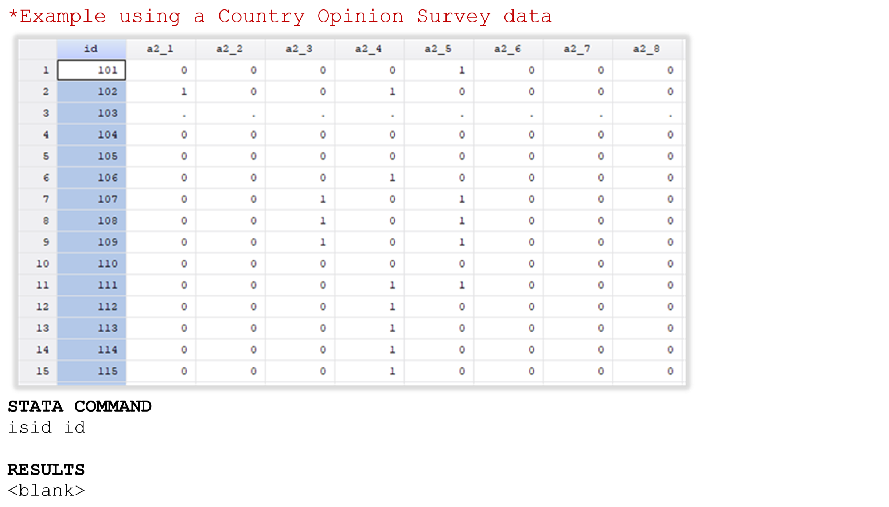
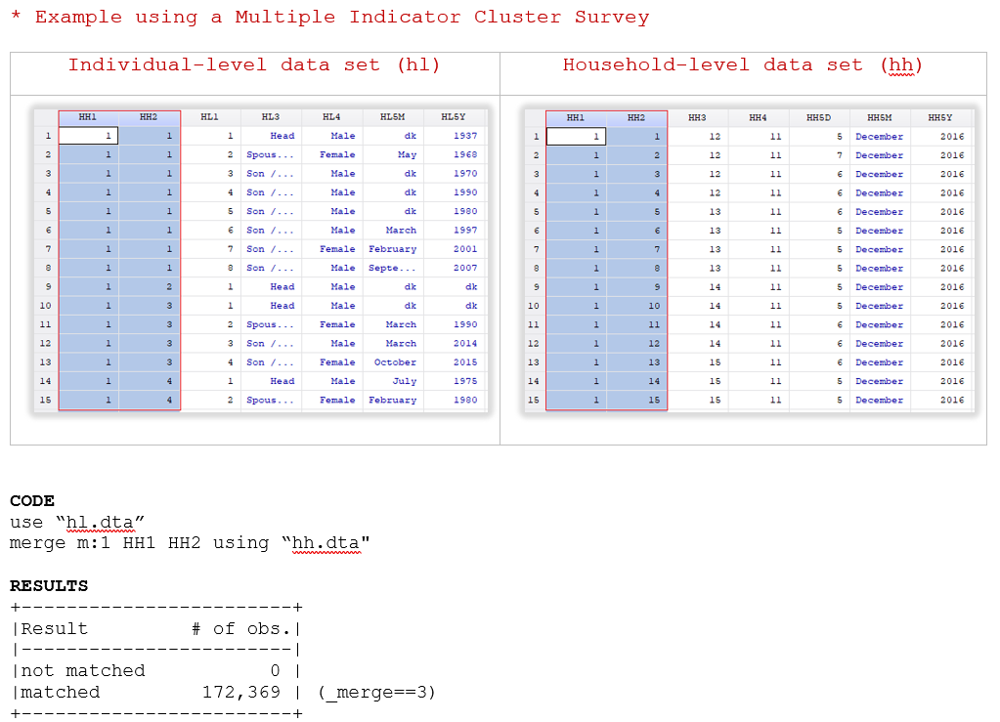
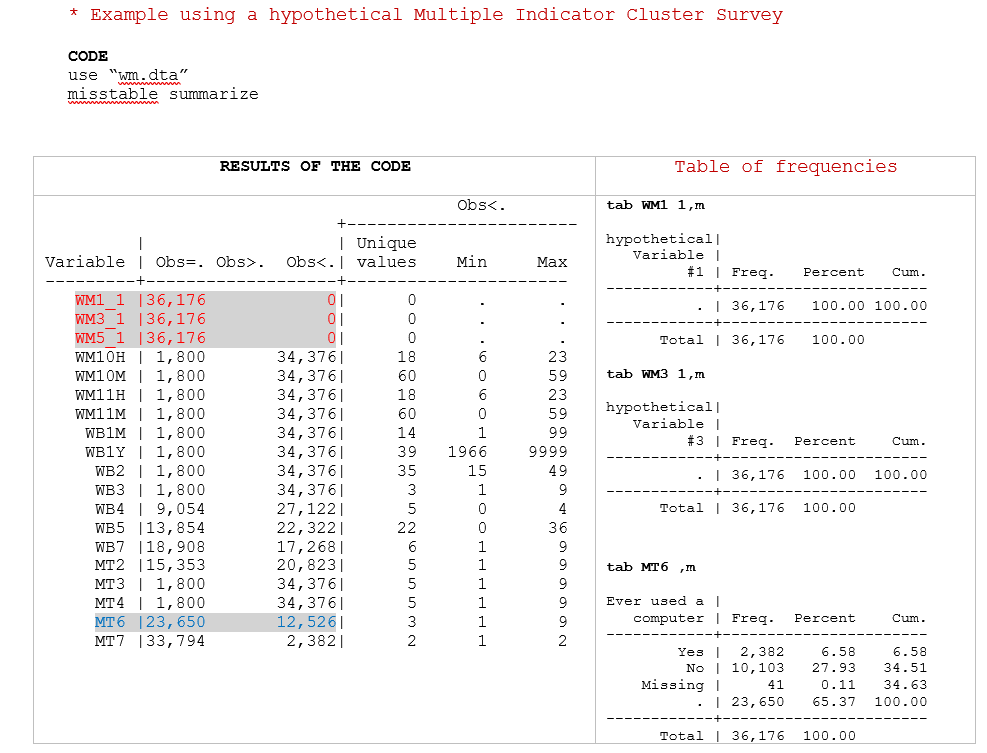
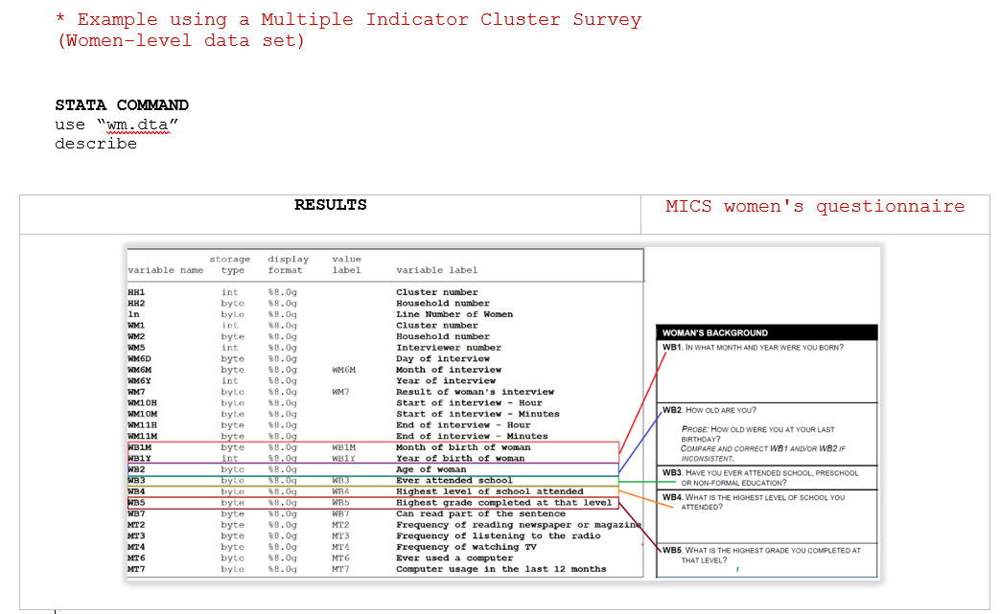
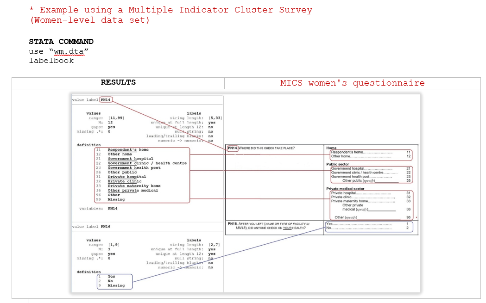

Section A . Data Validations in Stata: Practical Examples
=========================================================

**Example 1 . Check for unique identifiers (single variable)**

This example uses a Country Opinion Survey and uses the Stata command
*-isid-* to check whether the variable “id” uniquely identifies the 
observations. Each row of the data represents a different Country’s 
Stakeholders and the variable that identifies each one is named “id”.

If, after running the *-isid-* command you have not got an error
message, it indicates that the “id” is unique and identifies each
unit of analysis.

**Example 2 . Check for unique identifiers (single variable)**

For this example, we use the same data than *Example 1*, but in this
case, there are some hypothetical observations with the same values
for the variable “id”. The highlight observations are the duplicates
IDs. 

.. image:: media/Pag50_2.png

Since there are not unique IDs in the data, it is also useful to see
the list of all duplicates. To do that, we can use the Stata command
*-duplicates list-*. 

.. image:: media/Pag51_1.png

**Example 3 . Check for unique identifiers (ID made of multiple variables)**

The Multiple Indicator Cluster Survey at Women-level data is used in this
example. According to the study’s metadata, the unique identification of
each woman is the combination of variables HH1 (Cluster Number), HH2
(Household Number) and Ln (Line Number of women), so instead of checking
the unique identifier in just one variable, we are checking this condition
in this group of variables.

.. image:: media/Pag51_2.png

After running this validation, it is possible to see that the combination
of “HH1”, “HH2” and “ln” generates a unique ID.

**Example 4 . Check for duplicate observations**

This example uses the dataset mentioned in example 2, in which there are
3 duplicated identifiers. 

.. image:: media/Pag52_1.png

As shown, 446 records are unique in the database, but there are six
observations for which there are two copies of each one. Now, it is
necessary to identify duplicates. The code below allows one to generate
a variable that tags the duplicates with a value 1 or more, depending
on the number of times a record is duplicated.

.. image:: media/Pag52_2.png

The table above shows that records with the IDs 101, 104 and 111 each
have one duplicate.

**Example 5 . Check the merge between datafiles**

The code below helps us combine the data collected at the
individual-level with the data collected at the household-level.
In this case, we have two hierarchical datasets, in the household data
each row represents one household, and each household has members or
individuals. So, we need to combine many observations from one data set
(individual-level) with one observation from the other (household-level).
The ID of the household data set is the unique identifier that we are
using for the merge (“HH1”and “HH2”).

The report shows that all observations in the Individual file have a
corresponding household in the household data set and that all households
have at least one member. However, let’s consider a hypothetical example
that contains some records that do not match, below the results of the merge:

.. image:: media/Pag53_2.png

The merge command resulted in: 15 nonmatched observations originated from
the master data and 2 from the using data. The inconsistencies between
databases could be the result of a data entry error or processing errors
and these also need to be referred to the data producer before documentation
begins.

**Example 6 . Check variables full of missing values**

In the example above, there are 3 variables (WM1_1, WM3_1 and WM5_1) full
of missing values. As shown in the table, the *-misstable summarize-* command
allows one to identify all those cases at once. It is like tabulating every
single variable to identify missing values but more efficiently.

**Example 7 . Check the completeness of the data files**

This example shows how you can check for discrepancies (if any) between
the variables from the MICS women's questionnaire and the data set.

As shown, this dataset contains all variables from the section “Woman’s
background,” and they are organized according to the questionnaire. 
The comparison between variables in the questionnaire to those in the
data set should be made for every section in the questionnaire.

**Example 8 . Check all variables are labelled**

The following Form is available at www.surveynetwork.org

.. image:: media/image16.png

.. image:: media/image17.png

.. image:: media/image18.png

.. image:: media/image19.png

.. image:: media/image20.png

.. image:: media/image21.png

.. image:: media/image22.png

.. image:: media/image23.png

.. image:: media/image24.png

.. image:: media/image25.png

.. image:: media/image26.png

.. image:: media/image27.png

.. image:: media/image28.png

.. image:: media/image29.png

.. image:: media/image30.png

.. image:: media/image31.png

.. image:: media/image32.png

.. image:: media/image33.png

.. image:: media/image34.png

.. [1]
   DDI (Data Documentation Initiative) and DCMI (Dublin Core Metadata
   Initiative) are international XML metadata specifications. For more
   information on these standards and on the IHSN Toolkit, please visit
   `www.surveynetwork.org <http://www.surveynetwork.org>`__.

.. [2]
   See section 3 – *Importing data and establishing relationships* for
   more information on key variables.

.. [3]
   In Stata, this can be done through the use of the *group* function
   from the *egen* command. For example, to create a variable hhid based
   on a combination of variables *province*, *district*, *ea* and
   *hhnum*, use the command “egen hhid=group(province district ea hh_num
   )”.